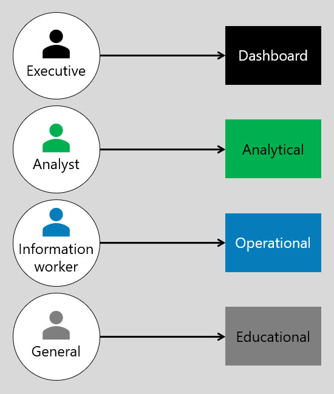
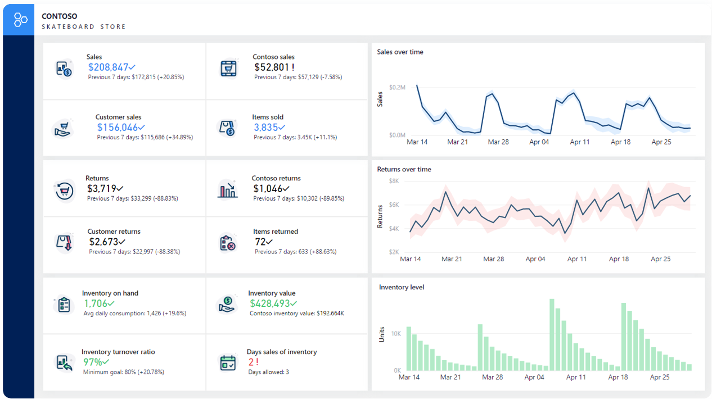
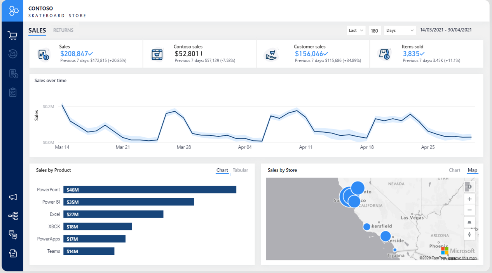
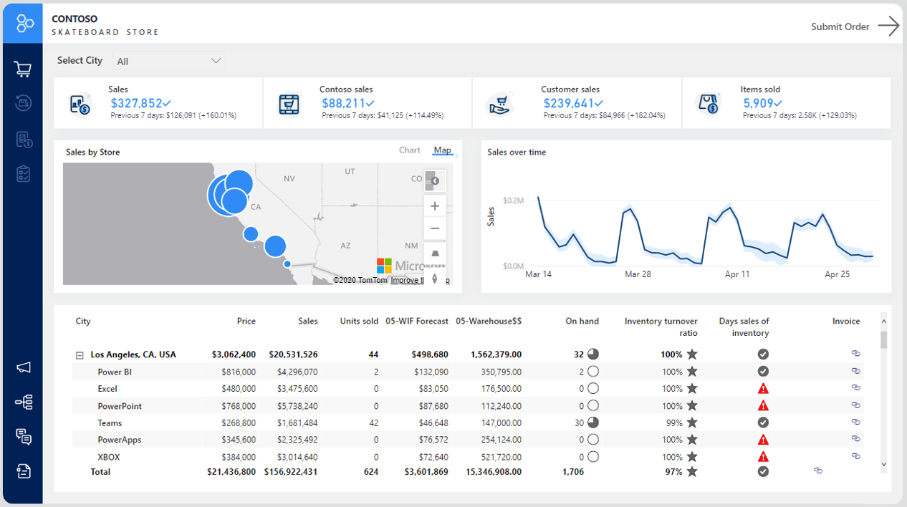
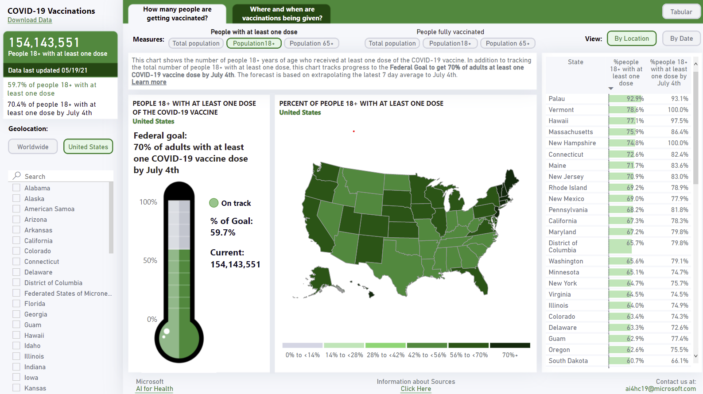

Generally, report design can be classified by report type. Often, a direct mapping between the report audience and the report type occurs. Audience needs can be met by one, or possibly a combination, of four report types:

- Dashboard

- Analytical

- Operational

- Educational

Commonly, executives work with dashboards, analysts work with analytical reports, and information workers work with operational reports.

> [!div class="mx-imgBorder"]
> 

Each report type has a different approach to the user interface (UI) and user experience (UX) requirements. These requirements are described in more detail later in this module.

## Dashboard

The primary goal of a dashboard is to interpret the story as quickly as possible. User interactions are limited by insights that are highly curated toward the audience. Report visuals are focused, self-explanatory, and clearly labeled. A dashboard directly communicates the meaning behind the data to minimize misinterpretation or confusion.

A good example of a dashboard is an *executive dashboard,* which often presents high-level metrics that are displayed on a single page. Dashboards help answer questions such as "How are we doing?" or "Are we there yet?"

At the Contoso Skateboard Store, a dashboard is a report that allows users to view several analytics values, targets, statuses, and trends.

> [!div class="mx-imgBorder"]
> 

## Analytical reports

An analytical report is the most common type of report that can serve various report consumer use cases while providing a structured space for analysis.

The primary goal of an analytical report is to help report consumers discover answers to a broad array of questions by interacting with the report and its visuals. Analytical reports often have many slicers to filter report data, and they often contain complex visuals that expose in-depth detail of the data.

Report pages are often expressly designed for interactivity with a focus on UX features. Multiple pathways are often provided for the report consumer to follow, which allows them to explore a topic of interest, share their findings, or return to where they started. Report consumers can remove layers and add context and detail by incorporating interactive features. Common interactive features include drill down, drill through, and tooltips.

A good example of an analytical report is one that extends beyond the "How are we doing?" type of question to answer the "Why did that happen?" or "What might happen next?" type of questions.

An example of an analytical report at the Contoso Skateboard Store would be a sales analysis report that allows drilling into sales revenue from year, down to quarter, month, and day.

> [!div class="mx-imgBorder"]
> 

## Operational reports

Operational reports are designed to give the report consumer the ability to monitor current or real-time data, make decisions, and act on those decisions. Operational reports can include buttons that allow the report consumer to navigate within the report and also beyond the report to perform actions in external systems. Frequently, operational reports serve as a hub for action that is used by report consumers as part of their daily activity and workload.

This type of report should minimize the number of analytical features to ensure that focus remains on the operation that it's designed to serve. A streamlined user experience is the primary aim for this report type because excessive clicking or illogical flow can lead to high dissatisfaction.

A good example of an operational report is one that allows monitoring of a manufacturing production line. When an unexpected event arises, such as equipment malfunction, a button could allow workers to start a maintenance request.

An example of an operational report at the Contoso Skateboard Store would be an inventory report that informs the report consumer of current stock levels, and highlighting low stock levels or back orders. It also includes a **Submit Order** button that allows users to create a purchase order.

> [!div class="mx-imgBorder"]
> 

## Educational reports

Educational reports assume that the report consumer is unfamiliar with the data or context. So the reports must provide clear narrative detail and guidance to help with understanding. This type of report is often used in journalism and by governments to disseminate information to large audiences that have varying levels of understanding of the subject.

A good example of an educational report is one that describes the rollout of COVID-19 vaccination progress and that can be filtered by the home geographic region of the report consumer.

> [!div class="mx-imgBorder"]
> 
