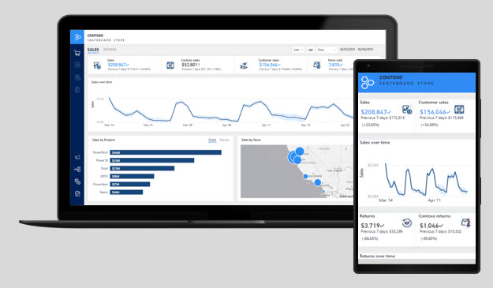

UI requirements relate to how reports are consumed and to the appearance and behavior of reports. Aspects to consider include form factor, input method, style and theme, and accessibility.

## Form factor

In the context of report design, form factor describes the size of the hardware that is used to open reports, and to page orientation (portrait or landscape).

> [!div class="mx-imgBorder"]
> 

Generally, today's computers are accompanied by large-sized monitors and, occasionally, multiple monitors. Large monitor screen sizes are ideal for viewing reports in web browsers, especially when they include several visuals or complex visuals by using landscape orientation.

Mobile devices, which are typically used when the report consumer is away from their desk, have a smaller form factor. Phones and tablets display content in portrait orientation by default. Smaller form factors demand a different design approach compared to reports that are designed for larger form factors. Accordingly, when you design for a smaller form factor, strive for fewer and less complex visuals. Also, visuals should be large to help ease viewing and interactivity.

Mobile devices encompass augmented or mixed reality technologies, allowing head-mounted devices to display reports that are superimposed over the reality of the surroundings.

> [!div class="mx-imgBorder"]
> 

Occasionally, the design of a report that is intended for a large form factor can be refactored to create a mobile view. The mobile view might contain a subset of visuals from the full-sized report.

## Input method

When defining UI requirements, also consider input methods that are supported by devices or applications.

While a computer has a keyboard and pointing device (mouse), mobile devices rely on common gestures, such as tap, double-tap, drag, pinch, spread, or press. Report consumers who are using mobile devices can also use on-screen keyboards, voice control, or barcode and QR code readers. Augmented or mixed reality devices rely heavily on hand gestures or body movement.

Knowing how your report consumers are likely interacting with reports should influence your report designs. Consider the number of visuals that display together on the page, the complexity of visuals, spacing between visuals, and the use of interactive design elements such as tooltips, slicers, buttons, or filters.

When a report is embedded in an application, input can be received programmatically from the application. For example, when the application user opens a page to view history for a specific customer, a filter automatically passes to an embedded report to filter and display sales history for that customer.

## Style and theme

UI requirements should also consider style and theme. Strive to design reports with a consistent and distinctive appearance that is determined by a deliberate theme.

The report theme should express your organizational branding or aim to complement it. At a minimum, the theme should include the following elements:

- A brand mark or logo symbol.

- A palette of colors that align to, or complement, organizational branding. The colors should also be sufficiently different so that, when applied to visuals, they provide appropriate contrast when appearing side by side.

- Text settings, including font selection, sizes, and color.

To manage style and theme changes effectively and efficiently, design reports that use images and themes that are stored in a central repository. This approach improves change management: Changes that are applied to the repository can automatically cascade through to reports.

## Accessibility

UI requirements should also factor in accessibility. Reports need to communicate to the broadest audience possible. So you should consider how report consumers with no-to-low vision or other physical disability can fully experience the reports.

While you might not be aware of report users with accessibility issues today, it's a good idea to design for accessibility from the outset. Accessibility requirements can influence your report designs in terms of form factor, input method, and style and theme.

To support people with low or no vision, consider using:

- clear and large-sized fonts,

- well-spaced and large visuals,

- sufficiently contrasting colors,

- and intuitive report navigation that can be understood by keyboard and screen readers.

Some physical disabilities can inhibit or prevent report consumers from fully interacting with reports in the way that you intend. When possible, ensure that you offer alternative paths for consumers to follow to achieve the interactive design outcomes. For example, adding alt text to visuals for screen reader support, and setting tab order for keyboard navigation.
