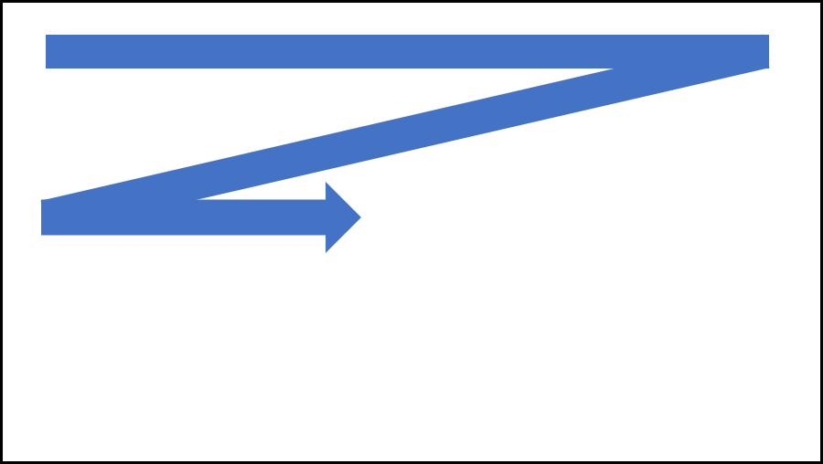
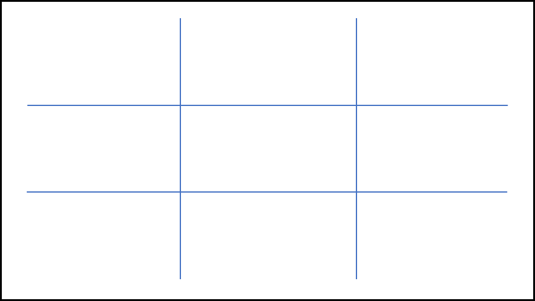
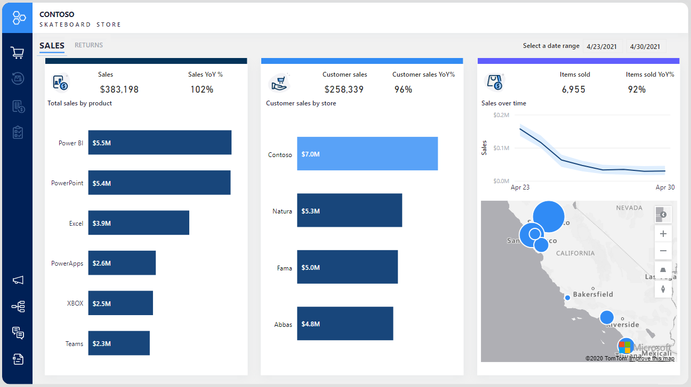
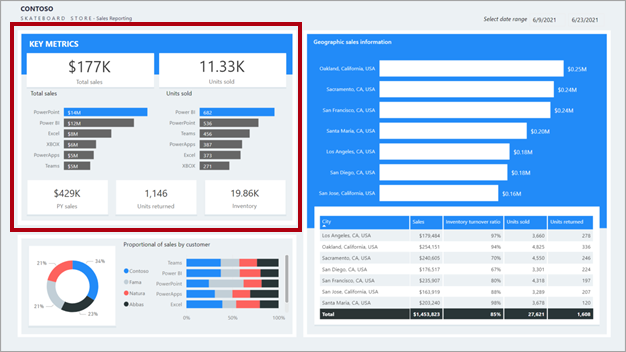
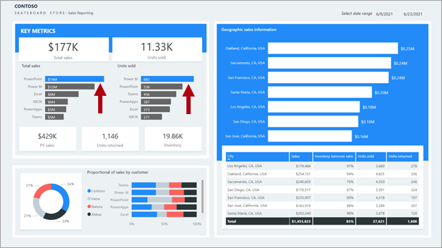
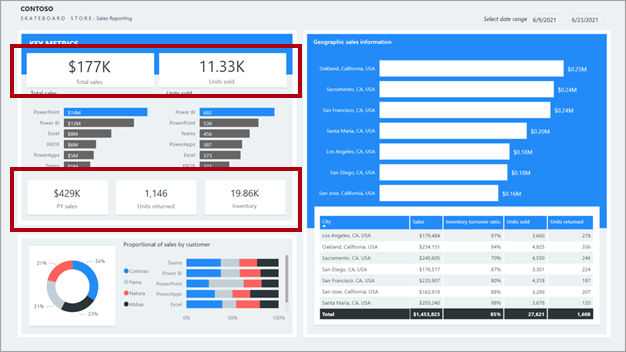

When report consumers look at a report, an automatic and unconscious process occurs when they comprehend what they see. Therefore, you should adhere to basic report design principles to support this process to help effectively communicate meaning from data.

> [!NOTE]
> Report design is a blend of science and art, and many possible report designs are available that help achieve the audience and interface requirements. What matters most is that the report design effectively communicates the data to meet requirements.

An analytical report can consist of one or more pages, and pages comprise report objects. Report objects can be data visuals, which represent query results, or decorations like images, background shapes, or text. You can begin to design a report layout by determining the number, sequence, and purpose of the pages. Make sure that you avoid combining subjects or opposing objectives on the same page. Then, design each page layout with specific report objects that are relevant to the requirements.

Additionally, good report design layouts should consider design principles of placement, balance, contrast, proximity, and repetition.

> [!TIP]
> Always keep in mind that the *less is more* adage applies; simplicity and clarity lead to good design.

## Placement

Good placement of report objects contributes to an ordered report design. Generally, you should place the most important information in the upper-left corner of the page and arrange the report elements from left to right and top to bottom.

> [!div class="mx-imgBorder"]
> 

> [!NOTE]
> This placement applies to audiences who predominantly read left to right (LTR). When your audience reads right to left (RTL), as is the case with some written languages such as Arabic and Hebrew, place the most important information in the *upper-right* corner and arrange the report elements from *right to left*.

Arrange report objects so that the vertical and horizontal edges align because it looks ordered and is pleasing to the eye. Position-related report objects in logical groups. An ordered report layout creates a connection between visual elements and avoids clutter that can result from a seemingly random placement of report objects.

Additionally, aligning report objects in a visually pleasing layout can convey more energy and interest than simply centering or randomly placing report objects. Consider applying the *rule of thirds*, which is a visual arts rule that can be applied to report object placements in an analytical report. The rule proposes that a page layout should be divided into an invisible grid of nine equal parts. The grid is formed by two equally spaced horizontal lines and two equally spaced vertical lines. Then, report objects can be placed within the cells of the grid.

> [!div class="mx-imgBorder"]
> 

At the Contoso Skateboard Store, a proposed report design for analyzing sales presents three equally sized vertical regions. The first region shows sales broken down by product, the second region shows sales broken down by customer store, and the third region shows items that have been sold.

> [!div class="mx-imgBorder"]
> 

## Balance

Another important consideration when you are laying out report objects is *balance*. Balance is concerned with stability and structure in design. In the context of a report layout, balance refers to the weight that is distributed across the report page by the placement of objects of the same or different sizes.

Balance can be *symmetrical* or *asymmetrical*. Symmetrical balance is achieved by distributing the weight evenly on both halves of the page. Asymmetrical balance is achieved through contrast.

Consider using the *golden ratio* as a guide to produce asymmetrical balance. The ratio is based on the Fibonacci Sequence, where two quantities are in the golden ratio if their ratio is the same as the ratio of their sum to the larger of the two quantities. For centuries, the golden ratio has influenced art and architecture to produce works that are harmonious and balanced. If applied to report design, the golden ratio will align a page to have one large visual to draw initial attention, which is then supported by smaller visuals that provide context.

In the following animated image, notice how the report layout initially draws your eye to the larger charts. After you've comprehended the larger charts, observe that your eye is likely drawn to the bar chart and then to the values in the cards.

> [!div class="mx-imgBorder"]
> 

## Proximity

In a report layout, proximity is concerned with the nearness of report objects. When a report page consists of multiple groups of related objects, you should use space to visually separate them.

In the following report design, notice the top-left section labeled key metrics. Related visuals are placed near one another. They are also purposefully and consistently aligned forming a clear section.

> [!div class="mx-imgBorder"]
> 

## Contrast

Contrast can be used to combine two opposing objects. The use of contrasting colors, fonts, font properties, or lines can emphasize important objects of the report design. Use this principle to direct report consumers to where they should look or which data visual they should interact with first.

> [!div class="mx-imgBorder"]
> 

## Repetition

Repetition in a report design creates association and consistency. Good use of repetition can help strengthen a report layout by tying related report objects together.

In the following report design, notice the top-left section labeled **Key metrics**. Many key metrics are presented in single-value cards. This repetitious design allows report consumers to quickly understand and interpret the metrics.

> [!div class="mx-imgBorder"]
> 