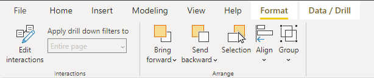
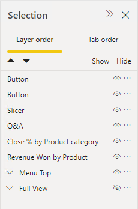
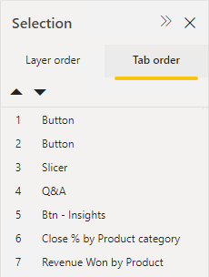
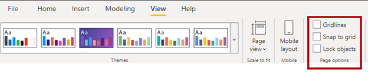
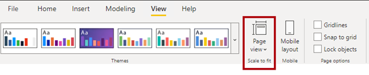

Microsoft Power BI provides numerous design tools to help you with report layout. Knowing about these tools and how to use them will help you reduce report creation time and produce more visually appealing results. 

The report design tools include:

-   Format commands

-   **Selection** pane

-   Report layout options

-   Page view

-   Undo/redo

## Format commands

The **Format** contextual ribbon tab, which is available when you select one or more report objects, contains several commands to help you arrange objects on the page.

> [!div class="mx-imgBorder"]
> 

You can use this tab to manage the layer order for one or more objects, with options to move objects forward or backward or directly to the upper or lower layer. You might overlap visuals when switching visibility state with bookmarks or when superimposing objects, like text boxes or visuals, on background shapes.

Various options are available to help you align objects horizontally or vertically. Well-aligned objects result in a balanced and visually appealing page layout. When you select a single object, you can align it with the report page. When selecting multiple objects, you can align them among one another. You can also distribute multiple selections of objects horizontally or vertically, ensuring that equal spacing separates the objects. The distribution options require that at least three objects are selected.

Grouping options lets you treat the group like a single object, making the process of moving, resizing, and working with layers in your report simpler, faster, and more intuitive. Additionally, you can group, ungroup, or merge other objects into an existing group.

For more information, see [Group visuals in Power BI Desktop reports](/power-bi/create-reports/desktop-grouping-visuals/?azure-portal=true).

## Selection pane

The **Selection** pane has two tabs: **Layer order** and **Tab order**.

### Layer order

The **Layer order** tab contains a list of all objects and groups of objects that are found on the page, together with the visibility state. When the name of each item in the list is set, it can have a generic label, such as **button** or **slicer**, or the object title property. Renaming an object in this pane will update the title property.

> [!div class="mx-imgBorder"]
> 

You can complete several tasks in the **Layer order** tab. You can use the tab to select a single or to select multiple objects or groups. Often, you might find it simpler and quicker to select objects by using in the pane instead of selecting the objects on the page, especially for complex, multilayered layouts.

You can set the visibility state to hide or unhide individual objects or groups. Hiding objects can help unclutter a report page at design time. Bookmarks can capture the visibility state, allowing report consumers to control visibility with buttons.

You can also modify the layer order, often referred to as *z-order*. Because you can overlap objects (or groups) on the page, the higher an object appears on the list, the closer it is to the front. Therefore, when you have overlapping objects, the one that is listed first is on top. To change order, drag an object or group to a new position.

Similar to how you would summarize a smart narrative visual, you can summarize an object, which adds a text box that contains a text description of the visual to the report page.

### Tab order

In the **Tab order** tab, you can manage tab order.

> [!div class="mx-imgBorder"]
> 

By pressing the **Tab** key, you can configure the tab order to ensure that keyboard navigation follows a logical sequence. The **Tab order** tab also allows screen readers to read aloud the objects in a logical order. Additionally, you can remove an object from the tab order by selecting the numeric value in the upper left of the object.

> [!NOTE]
> Accessibility is described in Unit 5.

## Report layout options

On the **View** tab, you can enable gridlines, snap to grid, and lock objects. These three options apply to all report pages and aren't persisted, so you will need to re-enable them each time that you edit the report.

> [!div class="mx-imgBorder"]
> 

When you enable the **Gridlines** feature, visible guides appear that can help you align visuals. The gridlines can help make it easier for you to determine whether two (or more) visual borders are aligned horizontally or vertically.

You can enable the **Snap to grid** feature to align visuals on the page, resulting in a more visually pleasing layout. When you move or resize visuals, the report designer will align them to the nearest gridline.

If the **Lock objects** feature is enabled, you can't resize or move visuals. You might find this option helpful when you want a report reading experience and you want to avoid accidentally modifying the visual layout. When objects are locked, you can modify the position and size of visuals by using the **Format** options (in the **General** section).

> [!TIP]
> Occasionally, the **Snap to grid** feature will try to align visuals in an unintended way. While moving or resizing a visual, you can temporarily override the snap-to-grid behavior by pressing the **Windows** key.

## Page view

You can scale the report canvas to fit to page, fit to width, or show actual size. Full screen mode isn't an option during report design; it's only supported for report consumers when the report is viewed in Power BI service or a Power BI mobile app. Zoom control isn't available to enlarge or reduce the report canvas.

> [!div class="mx-imgBorder"]
> 

> [!TIP]
> Whenever possible, use the largest available monitor size and then maximize the Power BI Desktop window. To maximize the report canvas, consider closing or minimizing panes, such as the **Fields** pane. You can also collapse the ribbon to the condensed view.

## Undo/redo

Similar to many Microsoft products, you can undo or redo actions by pressing the **Ctrl+Z** or **Ctrl+Y** keyboard shortcuts, respectively. In Power BI Desktop, these options are also available in the quick access area, which is located in the upper-left corner. Try experimenting with these different methods because it's simple to undo the last action(s) that you made.

> [!div class="mx-imgBorder"]
> 

> [!TIP]
> Many other shortcuts are available in Power BI Desktop. You can use the **Shift+?** keyboard shortcut to view a list of keyboard shortcuts.
