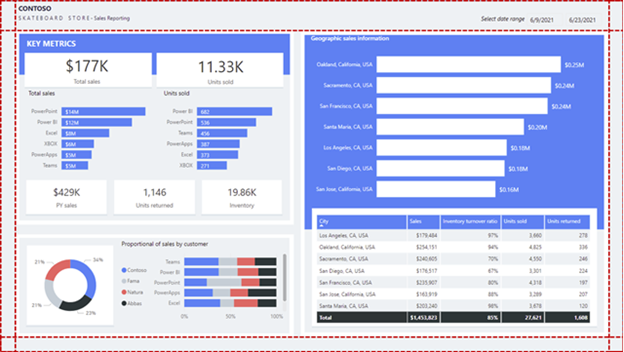
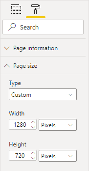
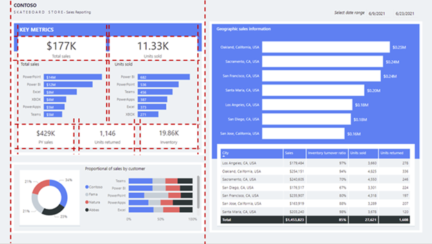
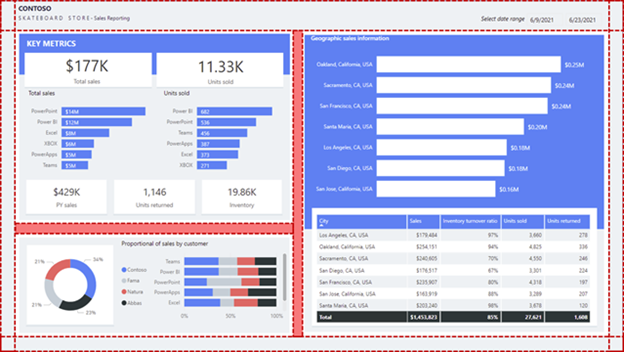
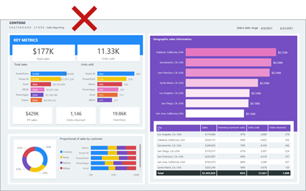
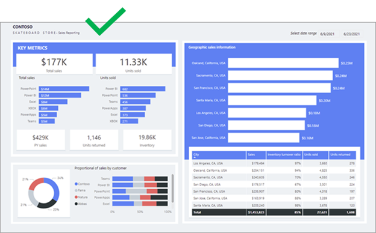
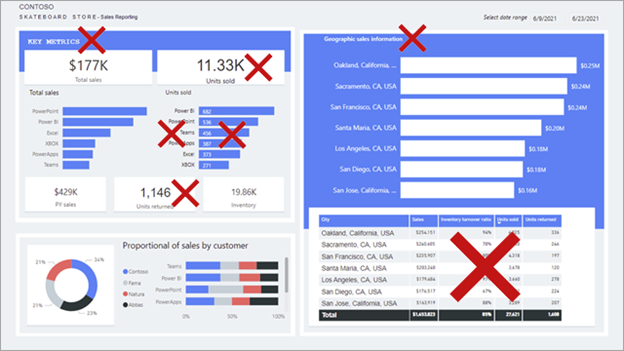

Having the correct data and selecting the correct visuals is important. Equally as important is ensuring that the report is visually appealing. A well-designed report should guide the report consumer to quickly find and understand the answers to their questions.

While striving to produce an appealing report, bear in mind that the report should be user-friendly. Moreover, it might be possible to add more visuals to a well-designed report page without it appearing cluttered.

## Space

Space is essential for an effective report design because it helps reduce clutter and increase readability. Spacing applies to the report page margins and the spacing between report objects.

### Margins

Margins include the border area, or edge, around each page. Having a consistently spaced border area frames the report objects.

Because there isn't a report page property to set margins, it's up to you to lay out objects in way that results in a consistent border area. Margin sizes should be equal on the left and right, with possible variation on the top and bottom. Space across the top or bottom can show branding, titles, slicers, or other information that needs to be separated from the visuals.

The following report shows the consistent spacing (highlighted with dashed lines) around the border area of the page.

> [!div class="mx-imgBorder"]
> 

### Object spacing

Ensure that you provide sufficient space surrounding, or within, report objects.

> [!NOTE]
> When visual headers are enabled, be sure to test that they don't overlap with nearby objects because overlapping objects can make interacting with visual header icons difficult. Appropriate spacing between visuals will help you avoid this problem.

Consider using different space depth to visually separate sections of related objects.

However, keep in mind that too much space can result in an unbalanced report layout and could draw the report consumer's attention away from what matters. Moderation is key: Always strive to produce an evenly spaced and balanced report.

Spacing is described in more detail in the **Alignment** topic.

## Size

Size can relate to the page size and visual size.

### Page size

You can set the page size to predefined or custom dimensions. Additionally, you can set custom dimensions that are larger than the available screen size so that the report consumer will need to interact with scrollbars to view the entire page.

> [!div class="mx-imgBorder"]
> 

However, a large page size that is filled with visuals might take time to render, and visuals might not render in a top-to-bottom order.

### Visual size

Generally, the more important the visual, the larger its size. Report consumers will quickly focus on larger visuals. When similar visuals are on the page, such as a series of card visuals, they should be equally sized.

Many visuals are responsive to size, so the visual will look appealing in either a small or large size. Consider that a line chart visual might appear like a sparkline when it's sized as small. In this case, only a few axis and data labels might appear. When the line chart visual is sized larger, more detail will be revealed, including many more axis and data labels.

While report consumers can use focus mode to enlarge a single visual, the visual should still clearly communicate its data when viewed at actual size on the report page. Focus mode can help consumers better interpret the data or more easily interact with the visual, such as expanding into levels of a matrix or decomposition tree visual.

## Alignment

When multiple visuals are on the report page, ensure that they're properly aligned, meaning that the edges of visuals should be in alignment and the spacings between visuals are consistent.

Alignment also relates to format options. For example, the alignment of titles and legends *within visuals* should be consistent.

Consider laying out the report page with different sections and aligning visuals appropriately within the sections. Sections can be *implied* or *explicit*.

### Implied sections

Define implied sections by aligning groups of visuals in close proximity. The following example shows how spacing separates the visuals. This example demonstrates how well-applied spacing (highlighted with dashed lines) can convey association, and guide the report consumer's attention while providing balance and structure to the report page.

> [!div class="mx-imgBorder"]
> 

### Explicit sections

You can define explicit sections by using colored shapes and overlaying aligned visuals on those shapes. The following example shows how the colored background shapes and spacing (highlighted with shading) separate the visuals into three sections.

> [!div class="mx-imgBorder"]
> 

> [!TIP]
> Use the alignment commands on the **Format** tab, which will help you quickly and accurately align visuals.

## Color

Use color sparingly and meaningfully because overusing it can be distracting. Stick to a few softer colors as a base, possibly aligned with corporate colors. Softer colors ensure that the data is the focus in your report. Reserve the use of bolder colors to highlight exceptions.

Ensure that colors are sufficiently contrasting. Color contrast is especially important to create accessible reports for report consumers who have low vision. This topic is described in more detail in Unit 5.

The following example shows several issues that are related to color. The colors that are applied on the left side of the page are different from those that are applied on the right side. Also, the colors are bright and can possibly distract the report consumer. Some colors, such as yellow, don't provide sufficient contrast with the white data labels.

> [!div class="mx-imgBorder"]
> 

In the following image, the report layout is improved with the use of better colors. The colors are now consistent and provide suitable contrast with the white data labels.

> [!div class="mx-imgBorder"]
> 

## Consistency

Strive for consistency when you are laying out and configuring report objects. Consistency should apply to everything in your report design, including spacing, margins, size, alignment, and especially to object format options. Format options include the selection of font, font size, font weight, colors, and many other styling options. Format options also include the enabling of visual features like axis labels and data labels.

The following example shows many inconsistencies, including mixed fonts, different font sizes, and inconsistent titles. At first glance, the report appears unbalanced.

> [!div class="mx-imgBorder"]
> 

The quickest way to enforce consistency is to use a *report theme*. A report theme applies format settings to your entire report, ensuring consistent application of colors, fonts, pages, and visual format options, including the **Filters** pane styles.

Consider using one of the many built-in themes from the theme gallery. You can use one as a starting point and then customize it to better meet your requirements. Alternatively, you can create a new theme, which can be considerable work initially, but will provide you with granular control.

> [!NOTE]
> Be aware that the theme will be overridden when you explicitly configure a format option. For example, you can explicitly set a color by entering a HEX value instead of selecting a color from the palette. Try to limit overriding the report theme to an exception basis because if you switch themes, overridden properties won't update.

Be sure to export the report theme, which is a JSON file, and then apply it to other reports to ensure consistency across all reports.

> [!TIP]
> You can use an external site like [powerbi.tips](https://powerbi.tips/?azure-portal=true) to generate a theme. The site will guide you through building a color palette and setting property values for all core visual types.

For more information, see [Use report themes in Power BI Desktop](/power-bi/create-reports/desktop-report-themes/?azure-portal=true).
