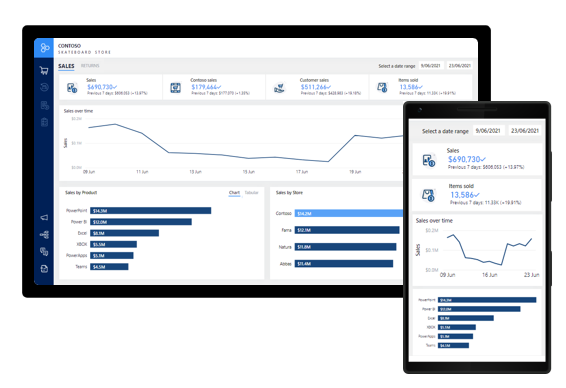
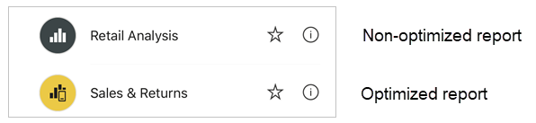

Power BI offers a set of mobile apps for iOS and Android mobile devices. The app allows consumers to connect to, and interact with, Power BI reports.

While report consumers can view any Power BI report page in landscape orientation, you can provide an improved consumption experience in portrait orientation. You can do this by creating a mobile view for each report page that's designed for mobile devices when in portrait view.

Any page visual, including slicers, can be added to the mobile view. What's more is that visuals are responsive, meaning that they change dynamically to display the maximum amount of data, no matter their size.

> [!div class="mx-imgBorder"]
> 

In the Power BI mobile app, report consumers can identify mobile-optimized report by a special icon. In the following example, the Power BI mobile app lists two reports. Each report is accompanied by a different icon. The first report is the **Retail Analysis** report, and it's not optimized for mobile view. The second report is the **Sales & Returns** report, and it's a mobile-optimized report.

> [!div class="mx-imgBorder"]
> 

When report consumers open a mobile-optimized report, the report opens in mobile-optimized mode. If they hold their phone in landscape orientation, the report opens in unoptimized view.

For more information about mobile view, see [Optimize Power BI reports for the mobile app](/power-bi/create-reports/desktop-create-phone-report/?azure-portal=true).
