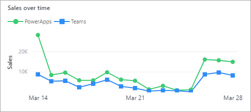
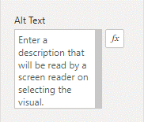
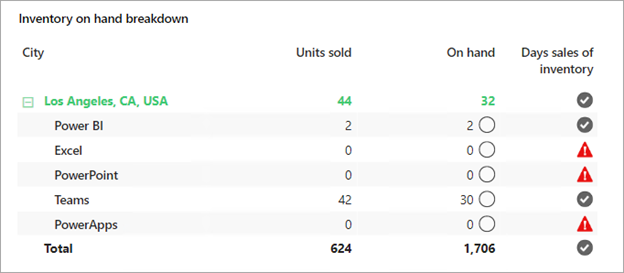

Currently, over 1 billion people in the world live with a disability. Accessibility is about ensuring that all people, regardless of ability, have equal access to physical and electronic environments and resources.

Some people with disabilities use assistive technology such as screen readers, screen magnifiers, and speech recognition tools. Microsoft ensures that its products, apps, and services offer exceptional experiences to people who are using assistive technology.

Power BI supports certain accessibility features that you can factor into your report designs. The product allows you to create reports that are usable by the widest possible audience without the need for them to adapt for special accessibility requirements. Therefore, you should always design with accessibility in mind and avoid creating a new report version that addresses a particular accessibility requirement. Make sure that you consider report consumers who have visual impairments or who rely on keyboard or voice-activated interaction.

You can meet accessible report designs by using suitable format options or by applying built-in accessibility features.

## Styling

To help report consumers who have low vision, use non-serif fonts and lean toward larger font sizes. To support report consumers with color blindness, use high contrast colors. Consider using a built-in theme, like *Color blind safe* or *High contrast*.

> [!NOTE]
> When the high contrast option is enabled in Windows, Power BI automatically applies those settings to reports. However, in some cases, Power BI can't automatically detect this setting. In that case, the report consumer can manually apply contrast colors by using the **View** menu.

By default, data series are distinguished by different colors. You can further distinguish the data series by using line styles or markers.

In the following line chart visual, shapes help distinguish the two data series.

> [!div class="mx-imgBorder"]
> 

In the following line chart visual, line styles help distinguish the two data series.

> [!div class="mx-imgBorder"]
> 

## Alt text

Alternative text descriptions, or *alt text*, can describe the appearance and function of report objects to screen reader users. Every report object has an alt text property, which is set in the **General** section of the **Format** options.

> [!div class="mx-imgBorder"]
> 

For data visuals, don't describe specific data points in alt text because data values are likely to change. However, it's possible to assign a measure, which uses Data Analysis Expressions (DAX), to the alt text property. That way, the measure could evaluate the filter context and return a text description of the data.

> [!TIP]
> To learn more about DAX, see [Use DAX in Power BI Desktop](/learn/paths/dax-power-bi/?azure-portal=true).

## Tab order

Ensure that the tab order (which is set in the **Selection** pane) for each page follows a logical sequence. Additionally, make sure that you remove report objects from the tab order if they're purely decorative, such as a background shape or image. A well-configured tab order allows screen readers to read aloud relevant objects in a logical order. For data visuals, screen readers always read aloud the title, visual type, and any alt text.

> [!TIP]
> To enhance the screen reader experience, keep titles concise yet friendly, and avoid using acronyms and abbreviations.

## Conditional formatting

Several conditional formatting options are available for you to use to highlight values in grid data visuals, such as the table and matrix visuals. The *icon* option is especially useful. It helps you convey status with color and icon.

The following matrix visual shows that the **Days sales of inventory** column communicates zero on-hand stock by using an icon (exclamation mark) and color (red).

> [!div class="mx-imgBorder"]
> 

## Report consumption experience

Report consumers should be able to fully use and interact with your reports. Be sure that you educate them on how to:

-   Apply high contrast color themes (use the **View** menu).

-   Use the **Tab** key to navigate between report objects on the page.

-   Use many different keyboard shortcuts to shift focus into visuals, navigate between data points, select one or more data points, or clear selections (use **Shift+?** for a complete list).

-   Use focus mode to zoom into a visual.

-   Show the data table to view the underlying data of a visual in tabular format (use **Alt+Shift+F11**).

For more information, see [Design Power BI reports for accessibility](/power-bi/create-reports/desktop-accessibility-creating-reports/?azure-portal=true).
