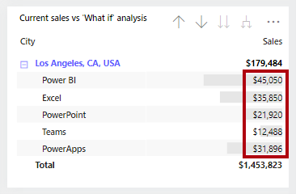

An analytical report layout can integrate a guided analytical experience. That way, the report design is aligned to the automatic and unconscious processes that take place when the report consumer looks at the report.

The guided analytical experience allows navigation between three levels:

- High-level metrics
- Supporting visuals
- Details, when required

You can show details by using four different techniques:

- Use drillable visuals
- Add tooltips
- Add drillthrough
- Embed paginated reports

For a demonstration of the four different techniques, watch the following video.

&nbsp;

> [!VIDEO https://www.microsoft.com/videoplayer/embed/RWObCc]

### Use drillable visuals

The simplest way to show details is to use drillable visuals. The matrix visual is an excellent choice because it allows drilling on rows and/or columns. Therefore, by assigning hierarchies or multiple fields, report consumers can drill to the level of detail that they want. For example, the matrix rows could show years, and the report consumer could drill down to quarter, month, and date levels.

> [!div class="mx-imgBorder"]
> 

> [!TIP]
> Ensure that the visual size is sufficient for consumers to view drill-down details, or you can teach your report consumers how to use focus mode to enlarge the visual. Also, you can add buttons to provide a quick way for report consumers to drill to specific levels. This scenario is covered in Unit 4.

### Add tooltips

Adding tooltips is a simple way to reveal details or provide supporting metrics. In Power BI service, tooltips appear when the report consumer hovers the cursor over an element of a report object. An element could be a column of a column chart or a bubble or region in a map. In a mobile app, tooltips appear when consumers are using the tap-and-hold gesture.

Power BI reports support two types of tooltips: visual and page.

#### Visual tooltips

Many Power BI visuals include a **Tooltips** well. Fields that are added to this well is summarized in a tooltip. For example, a column chart visual that shows sales revenue by month could include order quantity as a tooltip. While the height of the column reveals the monthly revenue amount, when a report consumer hovers over the column, a tooltip describes the order quantity for that month.

> [!div class="mx-imgBorder"]
> 

#### Page tooltips

Page tooltips allow your report consumers to gain deeper insights quickly and efficiently from visuals. As its name suggests, a page tooltip is a report page that receives the filter context of the source element. In this way, they are closely related to drillthrough pages, with the difference being that the page tooltip overlays a small page of visuals.

> [!div class="mx-imgBorder"]
> 

You can associate page tooltips with different report objects, such as:

- **Visuals -** On a visual-by-visual basis, you can configure which visuals will reveal your page tooltip. For each visual, you can have the visual reveal no tooltip, default to the visual tooltips (which is configured in the visual **Fields** pane), or use a specific page tooltip.

- **Visual headers -** You can configure specific visuals to display a page tooltip. Your report users can reveal the page tooltip when they hover the cursor over the visual header icon. Make sure that you educate your users about this icon.

> [!NOTE]
> Page tooltips don\'t support interactivity. If you want your report consumers to interact with the visuals, create a drillthrough page instead.
>
> For more information, see [Extend visuals with report page tooltips.](/power-bi/guidance/report-page-tooltips)

### Add drillthrough

Drillthrough will navigate the report consumer to a different page, possibly in a different report, and it can show details. The main benefit of drillthrough is that you don't need to clutter a report page with details. Instead, the details are available when required.

A common use case for drillthrough is to allow report consumers to achieve the following flow:

1. View a report page.

1. Identify a visual element to analyze in depth.

1. Right-click the visual element to drill through.

1. Perform complimentary analysis.

1. Return to the source report page.

To enable drillthrough, you can create a report page that provides details. This design approach allows consumers to view supporting transactions and only when needed

> [!NOTE]
> Report consumers might not be aware that drillthrough is supported by a visual. To promote visibility, you can add a button that performs drillthrough. This topic is covered in Unit 3.

For more information, see [Set up drillthrough in Power BI reports](/power-bi/create-reports/desktop-drillthrough).

### Embed paginated reports

Use the **Paginated report** visual to embed a Power BI paginated report in your report. Paginated reports can connect directly to source databases, providing you with the ability to present transaction-level detail that's not stored in the Power BI dataset.

You can map fields from your Power BI dataset to report parameter values for your paginated report visual, allowing report consumers to cross filter the paginated report. This way, it can behave like a drillthrough page.

> [!TIP]
> In the visual format options, you can enable the toolbar so that report consumers can use the export command. This command can export the paginated report in many different formats, including Microsoft Excel, PDF, Accessible PDF, CSV, PowerPoint, Microsoft Word, MHTML, and XML. Also, unlike the 150,000-row limitation that is imposed by Power BI reports, paginated reports can export up to 1,000,000 rows to Excel while retaining all formatting of the paginated report.

For more information, see [When to use paginated reports in Power BI](/power-bi/guidance/report-paginated-or-power-bi).

For more information, see [Create and use the paginated report visual](/power-bi/visuals/paginated-report-visual).
