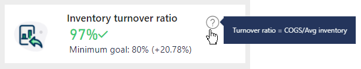

Training report consumers on how to use and navigate your reports can be difficult because every report that you create will be different. Features and functionality that are present in one report might not be present in another. Creating intuitive and simple-to-navigate reports is important. When approaching a report design project, you should always aim to provide "no training required" experiences. Strive to add built-in assistance whenever possible.

Several design techniques that can provide built-in assistance include:

- Information page

- Visual header tooltip icon

- Button with overlay

> [!TIP]
> Every report consumer will approach a report with a different expectation of how to interact with it. Therefore, to avoid handling support requests, take extra initial effort to ensure that the functionality is as discoverable as possible.

### Information page

Adding an **information page** is the most simplistic technique. Dedicate an entire report page that includes instructions and definitions.

> [!TIP]
> Consider adding a back button to the page. Then, add a button in a consistent location on each page that navigates to the information page. Configure these buttons to use the **Information** or **Help** icon.

### Visual header tooltip icon

Within the visual header options, you can enable the visual header tooltip. It adds the **Help** (**?**) icon to the visual header. Then, you can assign a page tooltip or text. This technique is beneficial for providing visual-specific guidance, such as more detail that describes definitions, calculation logic, or the source of data.

> [!div class="mx-imgBorder"]
> 

### Button with overlay

You can use buttons and bookmarks to overlay an image, shape, or text box that provides built-in assistance. Unit 4 of this module provides an explanation of how to create the bookmarks to support this scenario.

> [!div class="mx-imgBorder"]
> 
