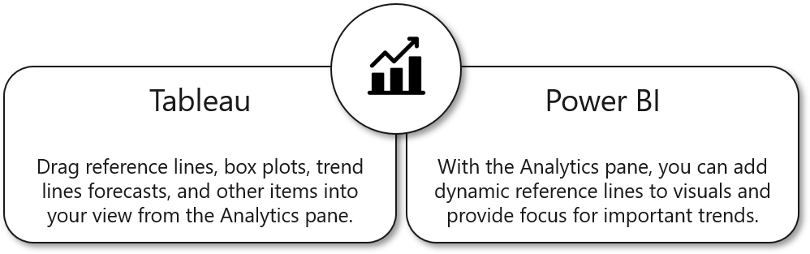

With the **Analytics** pane in Power BI, you can add dynamic reference lines, such as the min line, max line, and average line. The **Analytics** pane also forecasts your data and gives you control over how the forecast is conducted. One main difference is the option for symmetry shading, which allows for data-driven background shading of scatter plots. This feature is helpful if you intend to truncate an axis but want to call the user's attention to it.

> [!div class="mx-imgBorder"]
> 
