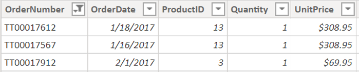
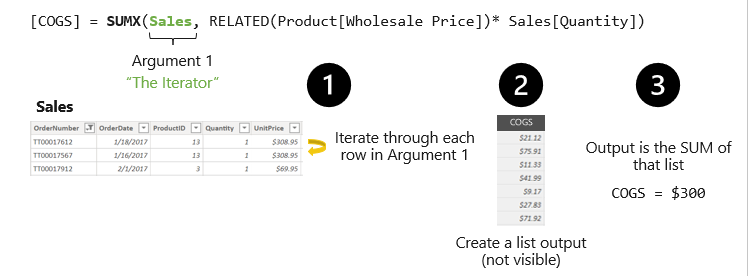

Both calculated columns and measures have a context on which they are evaluated. Context defines the grain at which the calculations are going to be performed. Understanding context and using context effectively are important for building high-performing formulas, dynamic analyses, and for troubleshooting problems in formulas.

Before talking about iterator functions, you need to go over two important context concepts: row context and filter context.

## Understand row context

Row context is the grain or the current row; it's the row breakdowns on which to evaluate your data. All iterator functions evaluate by row context. Calculated columns evaluate by row context - that is how they have a column value for every single row.

Row context automatically follows the relationships between tables to determine which rows (in related tables) are associated with the current row.

> [!div class="mx-imgBorder"]
> 

For example, let's have a look at the following code:

`ActualSales = Sales * RELATED( Product[Discount] )`

The previous formula simply uses the RELATED function to get the discount rate for the current product, from the Product table. You don't need to specify the field that connects the two tables.

## Understand filter context

Filter context is the set of values allowed in each column, based on filter constraints that were applied to the row. These can also be thought as the filters applied to your report via slicers or interactions.

Let's look at a filter context example:

> [!div class="mx-imgBorder"]
> 

The highlighted cell has a filter context for the year 2018, state equals Alabama, and Quarter equals Q1. Any other value in the Pivot Table will be different because they have a different filter context for the year, state, and quarter.

> [!TIP]
> CORRELATING TO TABLEAU: How Tableau and Power BI decide to calculate measures are similar; it is based on what you have on the page, what filters you have applied, etc. Context in Tableau calculations is most commonly associated with Level of Detail (LOD) expressions and table calculations.

## Understand iterator functions

When talking about iterator functions, you're focusing on the concept of row context.

Here's an example of a simple iterator function:

`COGS = SUMX( Sales, RELATED( Product[Wholesale Price]) * Sales[Quantity] )`

In the previous formula, you're using the same COGS formula as before, but wrapping it in the SUMX iterator function.

> [!div class="mx-imgBorder"]
> 

1. The first part in the SUMX function is the iterator table, or what grain it should evaluate on. In this instance, the iterator table is the Sales table. To perform this calculation, you need to evaluate every row in the Sales tables.

1. Next, it's creating a list output in a temporary table.

1. Finally, it's performing the aggregation specified at the start of the function.

> [!VIDEO https://www.microsoft.com/videoplayer/embed/RWy75C]

### Reference links

For more information on context, see: [Context in DAX Formulas](https://support.microsoft.com/office/context-in-dax-formulas-2728fae0-8309-45b6-9d32-1d600440a7ad)

For more information on row and filter context, see: [Row Context and Filter Context in DAX](https://www.sqlbi.com/articles/row-context-and-filter-context-in-dax/)
