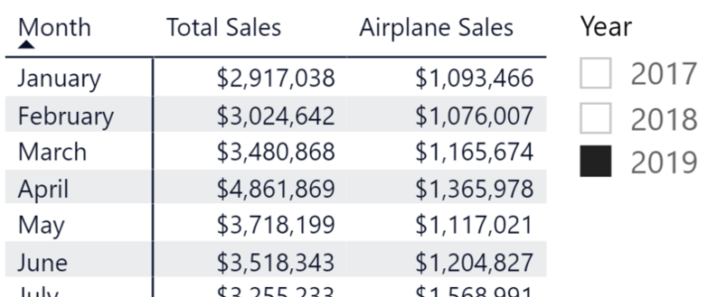
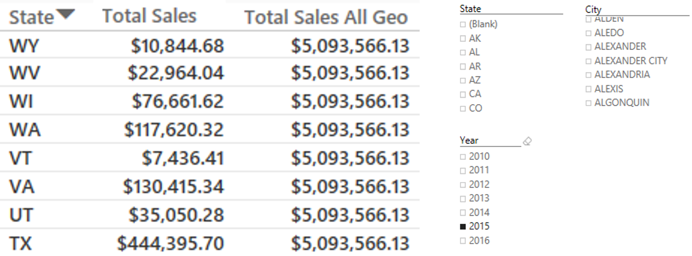
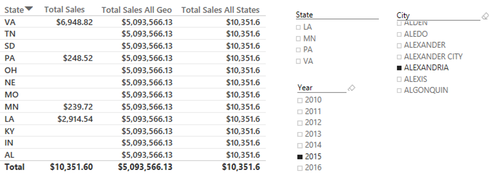
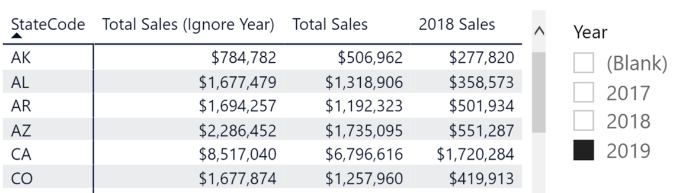

By the end of this unit, you will have a strong understanding of how the CALCULATE function is one of the most versatile functions in Power BI.

At a high level, you have control over row and filter context. With the CALCULATE function, you can add filters, you can take them off, and you can update them. That is a lot of power in one function!

## Add a filter with CALCULATE

First up, how to add a filter with the CALCULATE function.

> [!div class="mx-imgBorder"]
> 

You have the total sales in the previous data table:

`Total Sales = SUM( [Sales Amount] )`

You also have a filtered version of total sales, where you're evaluating the total sales and applying an airplane filter context:

`Airplane Sales = CALCULATE( [Total Sales], 'Product Details'[ItemGroup] = "Airplane" )`

> [!TIP]
> CORRELATING TO TABLEAU: The following snippet of code shows how you would make the same calculation in Tableau: `Airplane Sales = IF [ItemGroup] = "Airplane" THEN SUM([Sales Amount] ELSE 0 END)`

## Ignore a filter with CALCULATE

Next, how to ignore a filter with the CALCULATE function.

> [!div class="mx-imgBorder"]
> 

In the previous data table, you have total sales by state in one column and total sales by all geography in the next column. This column will be useful when you're looking to do analysis on the percent of total for each state (or row).

The most common way to do a percent of total in DAX is through the ALL function.

`Total Sales All Geo = CALCULATE( [Total Sales], ALL( Geography ) )`

In the above code, you're looking at the Geography table and including all the values in it; don't narrow the filter context.

> [!TIP]
> CORRELATING TO TABLEAU: The following snippet of code shows how you would make the same calculation in Tableau, using the EXCLUDE LOD expression: `Total Sales All Geo = { EXCLUDE [State], [City] : SUM([Total Sales]) }`

A different ignore filter example would look something like this:

> [!div class="mx-imgBorder"]
> 

In the previous table, you have total sales by state, total sales by all geography (with all the geography filters excluded), and finally, you have the total sales by all states but with the city filter still being applied.

Based on the image, the city of Alexandria exists in multiple states. So, you just want to find the total sales of those states that have Alexandria as a city:

`Total Sales All States = CALCULATE( [Total Sales], ALL( Geography[State] ) )`

> [!TIP]
> CORRELATING TO TABLEAU: This is how you would make the same calculation in Tableau, using the EXCLUDE LOD expression. You will notice that this LOD expression is different from the other one by its granularity. With this expression, you just want to exclude the state from the view, instead of the state and city: `Total Sales All States = { EXCLUDE [State] : SUM([Total Sales]) }`

## Update a filter with CALCULATE

Lastly, the final walkthrough to highlight the usefulness of the CALCULATE function will be through updating a filter.

> [!div class="mx-imgBorder"]
> 

In the previous data table, you have the total sales overall (ignoring the year), the total sales taking in the filter context applied by the slicer in the visual, and then the last column is the total sales only for the 2018 year.

To get the "2018 Sales" column, you would need to write something like this:

`2018 Sales = CALCULATE( [Total Sales], DATE[Year] = 2018 )`

> [!TIP]
> CORRELATING TO TABLEAU: This one is interesting because there does not seem to be a direct Tableau comparison. To do this in Tableau, you would need to duplicate fields, bring in supplementary data sources, or perform calculations on each column.

> [!div class="mx-imgBorder"]
> 

Let us summarize what you reviewed in this CALCULATE unit:

- Any expression can be put as the first argument.

- The expression looks at all the filter context on the page (the slicers for the visualization).

- If filters are present, it will be added.

- If there's a filter that is already in the filter list and it's the same as the page context, it will override that.

- After all those nuances (listed above), it will finally evaluate the expression.

> [!NOTE]
> Obviously, this is not something you should do without checking your answers to really understand the order of operations. You should be asking yourself "Did my filters get cancelled out or not?"
