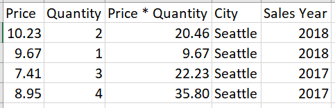
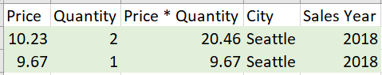
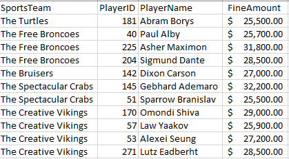
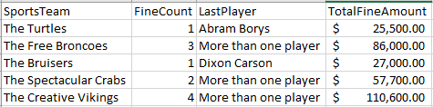
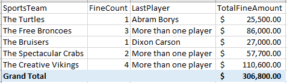

Most of the time in Power BI, you create tables by importing data into your model from an external data source. With table functions, instead, you add new tables based on the data you have already loaded into the model.

## Overview

Table functions allow Power BI users to create an intermediate table, which is viewed in the data model and can be used in other DAX expressions. Table functions are temporary tables that you can use, but they are not visible because they are not outputted.

FILTER, VALUES, and ALL are some common intermediate tables often used inside DAX measures.

## Apply the FILTER function

The FILTER function sets the filter for a specific table and then uses a condensed version of a table in a calculation. In other words, it returns a table that represents a subset of another table or expression.

For example, let us say you have the following data table:

> [!div class="mx-imgBorder"]
> [](../media/filter-function-table.png#lightbox)

In the previous table, you have some rows that highlight the sales of Seattle. The total sales for Seattle in 2018 is 30.13 (20.46 + 9.67). To get this result with the FILTER function:

```dax
2018 Sales = SUMX(
  FILTER(
    Sales,
    YEAR( Sales[SalesDate] ) = 2018
  ),
  [Price]*[Quantity]
)
```

> [!TIP]
> CORRELATING TO TABLEAU: To create the same calculation in Tableau, you would use the IF/THEN syntax: `2018 Sales = IF YEAR([SalesDate]) = 2018 THEN SUM([Price]*[Quantity]) END`

In the previous snippet of code, you first retrieved the data for the filter context, which is the Sales fact table:

> [!div class="mx-imgBorder"]
> [](../media/filter-function-table.png#lightbox)

Next, you filtered the Sales data to include only 2018 sales.

> [!div class="mx-imgBorder"]
> [](../media/filter-function-step-1.png#lightbox)

Finally, you evaluated the expression but only for the records in the temporary table.

> [!div class="mx-imgBorder"]
> [](../media/filter-function-step-2.png#lightbox)

## Apply the VALUES function

VALUES returns a one-column table that contains the distinct values from the specified table or column; duplicate values are removed and only unique values are returned.

For example, you just got handed a task where you need to show which player on a sports team has the last outstanding fine balance that needs to be paid off.

Below is the data table (called Team Fine Details) you'll be using:

> [!div class="mx-imgBorder"]
> [](../media/team-fine-details.png#lightbox)

What you will need to do is test whether there's only one player left to pay off their fine. If so, show their name. Otherwise, display the message "more than one player."

You can accomplish this with the VALUES function:

```dax
LastPlayer = IF(
  COUNTROWS( VALUES( 'Team Fine Details'[SportsTeam] ) ) = 1,
  VALUES( 'Team Fine Details'[PlayerName] ),
  "More than one player"
)
```

> [!TIP]
> CORRELATING TO TABLEAU: This is how you would make the same calculation in Tableau: `LastPlayer = IF COUNTD([SportsTeam]) = 1 THEN [PlayerName] ELSE "More than one player" END`

This measure would look something like the report / visualization below:

> [!div class="mx-imgBorder"]
> [](../media/team-fine-report.png#lightbox)

## Apply the ALL function

The ALL function tells Power BI to look at a specific table, take all the values from it (don't filter the table) and use that subset of values in an expression.

A common use for the ALL function is when you want to know the percent of total of an aggregated measure.

For example, consider the sports team fine amount scenario. Your boss is happy with your findings from the previous task, but they want to know which team has the highest percentage of outstanding fines.

> [!div class="mx-imgBorder"]
> [](../media/team-fine-report-2.png#lightbox)

The first step is creating a measure for the grand total of outstanding fines:

`TotalAllFineAmount = CALCULATE( [TotalFineAmount], ALL( 'Team Fine Details'[SportsTeam] ) )`

> [!TIP]
> CORRELATING TO TABLEAU: This is how you would make the same calculation in Tableau using the FIXED LOD expression. You are aggregating the total TotalFineAmount at the table level: `TotalAllFineAmount = { FIXED : SUM([TotalFineAmount]) }`

The second and final step is to create the percent of total measure using the DIVIDE function:

`FineAmountPercentOfTotal = DIVIDE( [TotalFineAmount], [TotalAllFineAmount] )`

> [!TIP]
> CORRELATING TO TABLEAU: This is how you would make the same calculation in Tableau: `FineAmountPercentOfTotal = SUM([TotalFineAmount]) / SUM([TotalAllFineAmount])`
