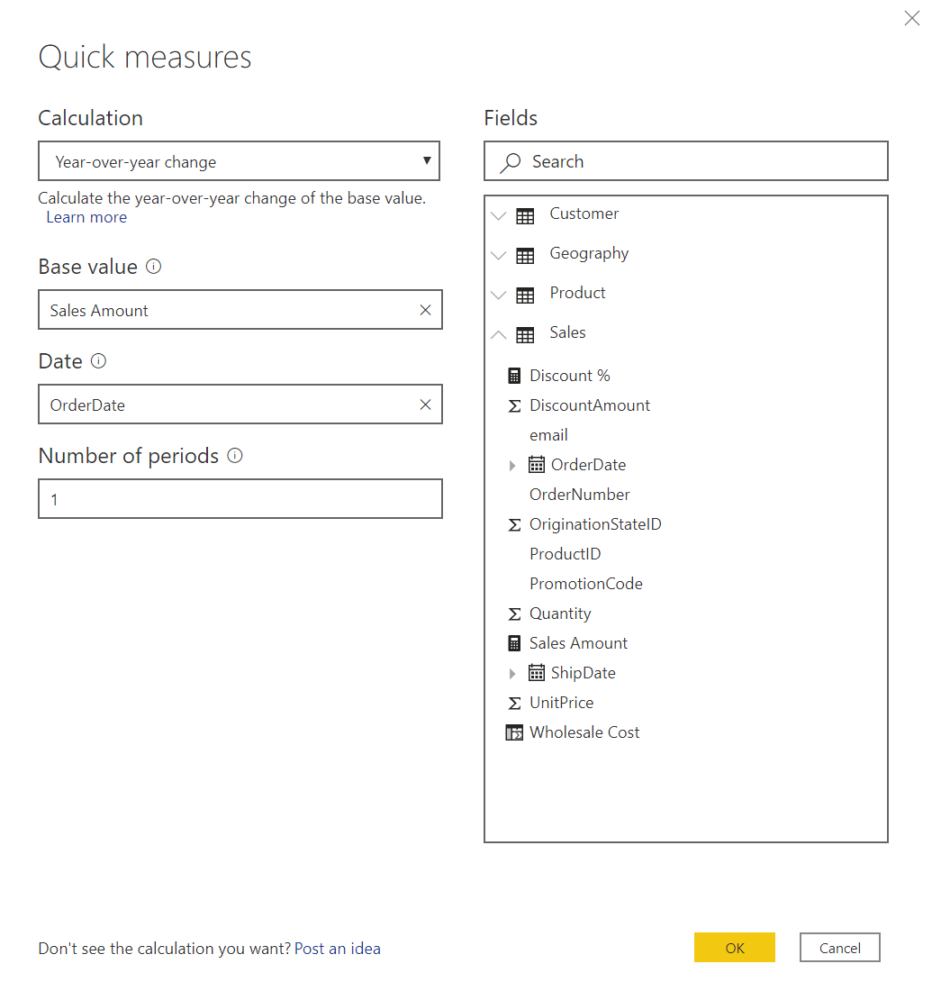
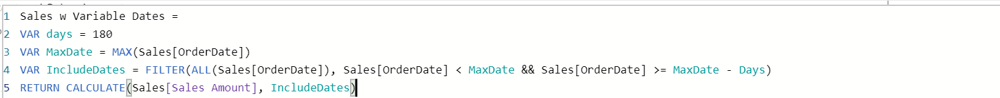

## Overview

The estimated time to complete this lab is 20 minutes.

In this lab, you'll create a column, a simple measure, a measure using var, a quick measure using time intelligence, and measure of distinct count.

## Task 1: Create a column for total wholesale amount

In this task, you'll create a new column using two different tables.

1. From the **FIELDS** section, select the **Sales** table. This ensures that the new measure is placed in this table.

1. From the **RIBBON** under **Table Tools > Calculations** select **New** **column**.

1. Create a column titled **Wholesale Cost**. Wholesale Cost is the quantity of units sold as recorded in the Sales table * the Wholesale Price in the product table.

1. Use the DAX formula **RELATED**, the **Wholesale Price** field from the **Product** table, and the **Quantity** field from the **Sales** table to create an amount for the total wholesale cost.

1. Check your answer by looking at the Sales table in the data preview.

## Task 2: Create a Measure for Sales Amount

1. From **FIELDS** section, click on **Sales** table. This ensures that the new measure is placed in this table.

1. From the **RIBBON** under **Home > Calculations** select **New** **measure**.

1. Create a measure titled **Sales Amount**.

1. Use the DAX formula **SUMX** and the **UnitPrice**, **DiscountAmount**, and **Quantity** fields from the **Sales** table to create an amount for the total sale.

    > [!TIP]
    > The Amount is the Unit Price minus the Discount and then multiplied by the Quantity.

## Task 3: Calculate Discount Percentage

1. Create a measure titled **Discount %** in the **Sales** table.

1. Using the DAX formula **DIVIDE**, use the Discount Amount and **Unit Price** fields from the **Sales** table to create a ratio of the two demonstrating the percentage that is discounted from the original unit price.

## Task 4: Calculate the Change in Sales Amount Year over Year

In this task, you will calculate the year over year change for the Sales Amount.

1. From the **RIBBON** under **Home>Calculations**, select **Quick Measure**.

1. From the **Quick measures** screen, create a year-over-year change calculation using the **Sales Amount** field in the **Sales** table.

    > [!TIP]
    > In the **Quick measures** screen under **Calculation** look at **Time intelligence**.

    > [!div class="mx-imgBorder"]
    > 

## Task 5: Calculate the Count of Orders

1. From **FIELDS** section, click on **Sales** table. This ensures that the new measure is placed in this table.

1. From the **RIBBON** under **Home > Calculations**, select **New** **measure**.

1. Create a measure titled **Order Count**.

1. Use the DAX formula **DISTINCTCOUNT** and the **OrderNumber** field from the **Sales** table to create a distinct count of orders.

## (BONUS) Task 6: Calculate Sales using a Variable for day count

How can you create a measure to control Sales to calculate only for a specific time frame?

1. Create a measure titled **Sales w Variable Dates** in the **Sales** table.

1. In DAX, you can create variables placeholders within your expressions. Create a VAR where `DAYS = 180` (this will account for the last 180 days of the year) within the Sales w Variable Dates expression. Variable names will show up turquoise within the formula bar.

    > [!div class="mx-imgBorder"]
    > 

    > [!TIP]
    > Hit Alt+Enter to put line breaks in your DAX expressions.

1. Create a VAR where MaxDate = `MAX(Sales[OrderDate])`. This provides our end date.

1. Create one more VAR where IncludeDates =

    `FILTER(ALL(Sales[OrderDate]), Sales[OrderDate] < MaxDate && Sales[OrderDate\] >= MaxDate - Days)`

    This uses the two previously created variables to set our date limits.

1. Lastly, create the **RETURN** where **CALCULATE(Sales[Sales Amount],IncludeDates)**

1. The end measure should look like this:

    > [!div class="mx-imgBorder"]
    > 

1. Test out the new measure by creating a line graph with it and Order Date.

    > [!NOTE]
    > We could also set our DAYS variable equal to a parameter value to give the end user the option to change the number of days in question.

## Summary

In this lab, you created a column, a simple measure, a measure using var, a quick measure using time intelligence, and measure of distinct count.
