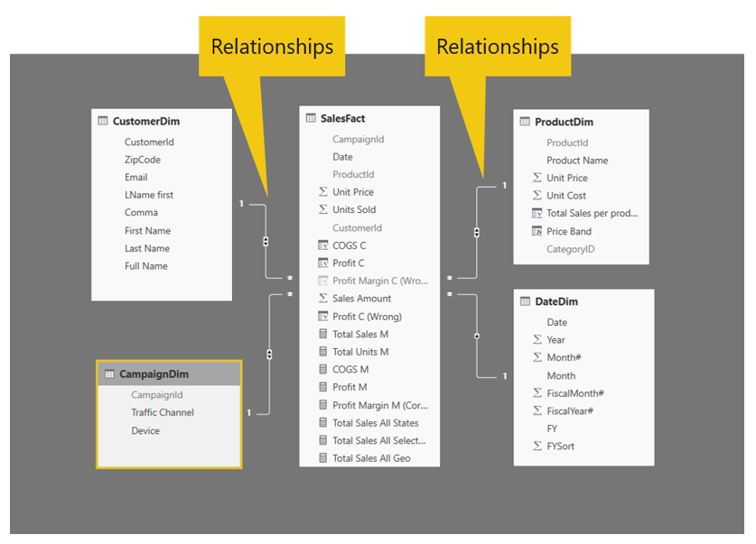
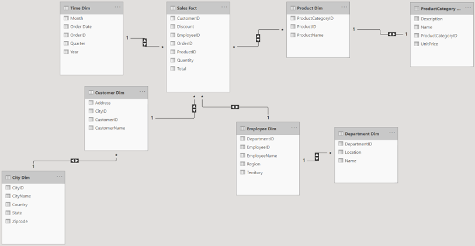

## Overview

Relationships matter, especially when it comes to your data.

Relationships allow users to query data from multiple tables. The only way for this approach to work is through a matching field between the multiple tables. Power BI refers to this field as a relationship field.

> [!div class="mx-imgBorder"]
> 

**Video**: Demo of Advanced Editor
> [!VIDEO https://www.microsoft.com/en-us/videoplayer/embed/RWy75u]

Before you further explore the importance of the relationship field, you need to learn more about dimensional modeling, which will help you better structure your relationship model. By now, you should have hands-on experience creating a snowflake branch on your model, in addition to an understanding of the difference between dimension and fact tables and between normalized and de-normalized tables.

If you haven't yet had the opportunity to learn these dimensional modeling concepts, the following sections provide a refresher.

### Snowflake schema

A snowflake model, or snowflake schema, is when many relationships occur between tables and you must pass through multiple relationships to get from one table to another. This model usually resembles a snowflake shape with fact tables (usually in the middle) that are connected to multiple dimension tables. The principle behind a snowflake model is the normalization of the dimension tables, removing low cardinality attributes and creating their own tables. The following screenshot shows an example of a snowflake model.

> [!div class="mx-imgBorder"]
> 

### Fact tables

The previous schema has only one fact table: Sales Fact. This Sales Fact table contains measures, or the quantitative attributes, such as the **Discount**, **Quantity**, and **Total** fields. The Sales Fact table also contains the relationship fields (foreign keys) that allow users to refer to other dimension tables in the schema. For example, if you need to find out the total sales for a customer, you'll need to use the **CustomerID** fields in the Sales Fact table and the Customer Dim table.

### Dimension tables

Notice that the snowflake schema includes seven dimension tables:

- Time Dim

- Product Dim

- ProductCategory Dim

- Customer Dim

- City Dim

- Employee Dim

- Department Dim

Each dimension table contains unique, descriptive attributes that provide more meaning to the measures in the Sales Fact table, such as **CustomerID**, **EmployeeID**, and **ProductID**. With these fields, you could find out which product is purchased the most by distinct customers.

### Normalized tables

A normalized table is a table that was created in line with a series of normal forms to reduce data redundancy and improve data integrity. In the same snowflake model, notice that the data redundancy is not present in the dimension tables; each dimension table has its own unique attributes.

Power BI-specific relationships are the link, or communication channel, between your created tables. You have control over them; you can control the direction of the relationship and the field(s).

### Relationship types

The three relationship types are one-to-one (1:1), one-to-many (1:\*), and many-to-many (\*:\*).

A one-to-one relationship means that each record in a table relates to one, and only one, record in another table. For example, in the snowflake model, each customer has only one customer ID.

A one-to-many relationship means that a record in one table can relate to zero, one, or many records in another table. For example, in the snowflake model, one customer could have multiple addresses, depending on if the customer has moved multiple times and if the customer has made purchases using the different addresses.

A many-to-many relationship means that zero, one, or many records in one table can relate to zero, one, or many records in another table. In reference to the previous snowflake model, the example would be that customers can purchase various products, and many customers can purchase products.

### Tableau compared to Power BI

Typically, Tableau uses one, large normalized table. You can set up joins ahead of time, but your joins will magnify your table, making it bigger and longer. The result is a de-normalized table. Until 2018, if you wanted to do pseudo-dimensional modeling, the only way that you could accomplish that task was through data blending. If you had an ID field in a dimension table, and you had an extensive de-normalized table, you could link them through what Tableau calls a "relationship." This relationship would create a link icon in the dimensions pane in Tableau Desktop, which would indicate which fields are being used in the data blend. Though this feature is convenient, ultimately, it is not common practice in the Tableau Community.
