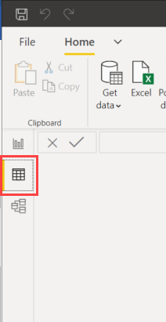
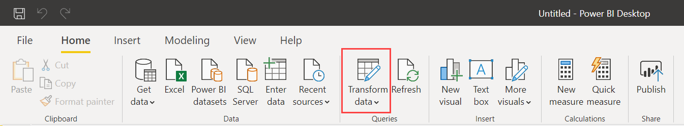
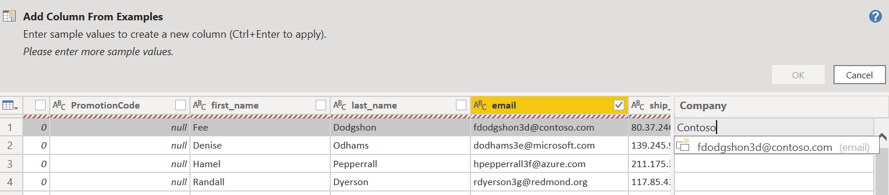
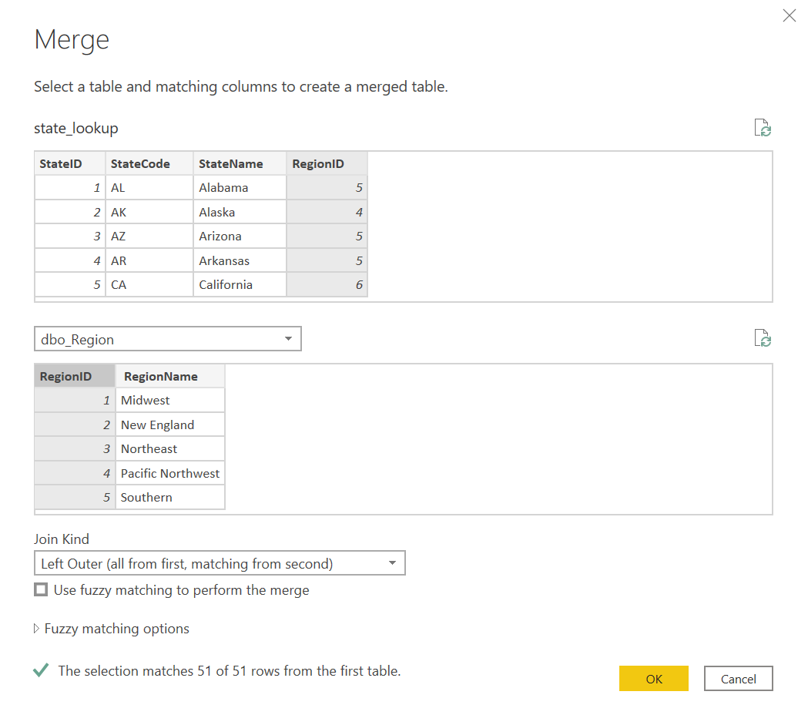
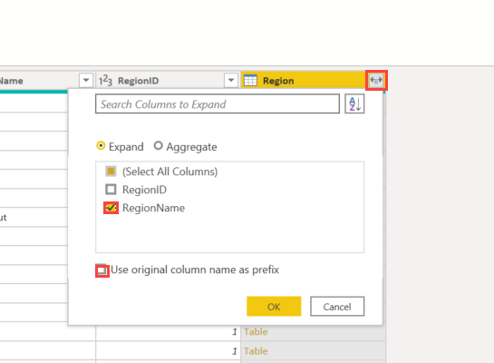
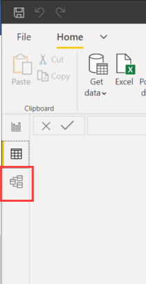
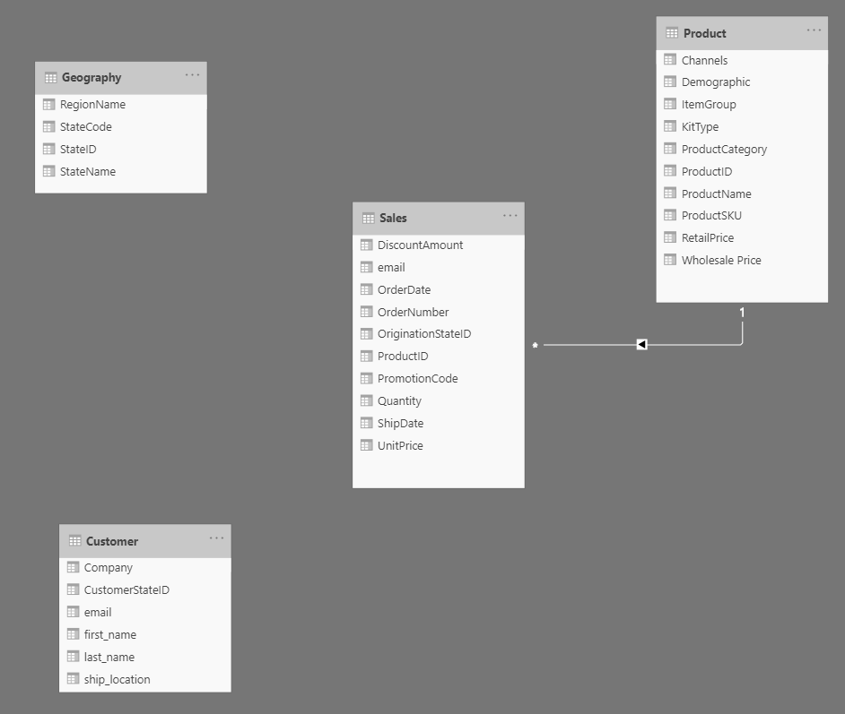

The estimated time to complete this lab is 35 minutes.

## Connect to data

1. Open Power BI Desktop.

1. Select "Get Data" from prompt.

1. Highlight Excel and select the Connect button.

1. Navigate to D:\Power-BI-Tableau\Lab-02\Data

1. Open raw_TailspinToys2019-US.xlsx.

1. Check the box for the following tables and select Load.

    - Dbo_Region

    - 2017_Sales

    - 2018_Sales

    - 2019_Sales

    - Product Details

    > [!NOTE]
    > What is the difference between dbo_Region and Region? dbo_Region was defined in Excel as a table. Region refers to the entire Excel tab named Region.

1. Note that the tables loaded underneath the Fields pane.

1. Open the Data Preview pane by clicking on the table on the far left-hand side. Look through each data table you loaded to familiarize yourself with the data. Is there anything you would change?

    > [!div class="mx-imgBorder"]
    > 

## Transform data

1. Select Transform Data on the top ribbon. This will open Power Query Editor.

    > [!div class="mx-imgBorder"]
    > 

1. Select the Product Details Query on the left-hand side. On the right-hand side, take note of the Query Settings. Note that there are already applied steps. By default, when an Excel file is loaded, M code is written to load the data correctly and read the headers.

### Clean and pivot product table: transpose and trim

1. The product data doesn't have column headers, it has row headers. This is hard to work with.

1. Under the Transform ribbon, select Transpose.

1. Under the Home ribbon, select Use First Row as Headers. Now you have a dimension table for product. Rename the table and query "Product" under Properties on the right-hand side.

1. Something doesn't look quite right about the "Product Category" data. Can you clean this?

1. There are leading spaces. Remove leading or trailing spaces in your data by selecting the column, right-clicking and selecting Transform > Trim data.

### Sales data: append

It's easier to plot time trends and perform year-over-year calculations when all your historical sales data is in one location.

1. Click on Sales 2019, go to the Home tab, select "Append Queries" towards the right of the ribbon, and select Three or more tables.

1. Add Sales 2018, Sales 2017 under "Tables to Add" and select OK.

1. Ensure that you have all three years of data by clicking on the dropdown for **Order Date** and clicking Load More. You should see dates for 2017, 2018 and 2019 in the same data source.

1. Rename the Query "Sales."

1. Right click on 2017 Sales and select "Enable Load" so that it's unchecked. Do the same for 2018 Sales. Select "Continue" if a warning window pops up. There's no need to load the 2017 and 2018 data into the report multiple times. All the information is available in the new Sales table.

### Create a customer dimension table from sales data: duplicate, remove duplicates, rename columns

There are customer details on the Sales table. These details are generally long text string data repeated for every customer. This is when a dimension table is useful, eliminating the need to store duplicate information.

1. Click and drag the CustomerStateID column to the left of the column first_name.

1. Duplicate the Sales table. Rename Sales (2) to Customer. Look for the duplicate option in the same place where you unchecked Enable Load.

1. Hold down Ctrl and select the following columns: CustomerStateID, first_name, last_name, and email.

1. Right-click on the column headers and select Remove Other Columns.

1. Under-select the email column, right-click on the column header, and select Remove Duplicates.

1. On the email drop-down filter, select Remove Empty. This removes blank and null values, which are not good to have in dimension tables.

1. Right-click on the email column header and select "Add columns from examples..."

1. Rename this new column Company.

1. Begin to type in the company name that you assume is associated with the customer's email address. For example, with fdodgson@contoso.com, the assumed company is Contoso.

    > [!div class="mx-imgBorder"]
    > 

1. Now you have a simple table of key customer information.

1. Remove the columns "CustomerStateID","first_name" and "last_name" from the Sales Query. Be sure to leave "email" this is our only unique indicator to join the Customer table to the Sales information.

### Combine state and region dimension: join

We have two references to StateID, but no State name. Customer.CustomerStateID and Sales.OriginationStateID.

1. Load "state_lookup.csv" into Query Editor.

    The dbo_Region and the state_lookup query create simple dimension tables. For simplicity, let's combine them into a new table named Geography.

1. Select the state_lookup Query so the state_lookup table is previewed.

1. Select Merge Queries from the top ribbon.

    > [!div class="mx-imgBorder"]
    > 

1. Select the RegionID column in the state_lookup table. Add a join to the Region_dbo table and select RegionID as well. You should see that 51 out of 51 records in the state_lookup table are matched.

    > [!div class="mx-imgBorder"]
    > 

1. Once the tables are joined, all the fields from "dbo_Region" are in a single column.

1. Add only the Region information you want by selecting the diverting arrows in the column header. Then make sure only "RegionName" is selected. Uncheck "Use original column name as prefix".

    > [!div class="mx-imgBorder"]
    > 

1. Rename the state_lookup table "Geography."

1. Delete the Region ID column.

1. Since the Region information we need is included in the Geography dimension table, we don't have to load Region table. Uncheck "Enable Load". Select "Continue" when the warning box pops up. We have migrated this data to the Geography query. We can't delete this data source entirely because it's an input to our Geography table.

### Set relationships

1. Hit "Close and Apply". This closes the Query Editor and loads your changes into the Power BI Desktop and any reporting in that file.

1. Select the "Data Model" icon on the left-hand side.

    > [!div class="mx-imgBorder"]
    > 

1. Rearrange the tables so they look approximately like the picture below.

    > [!div class="mx-imgBorder"]
    > 

1. In the next demo, we'll establish relationships between these tables.

### If you finish early

- The only unique way to connect the Customer table to Sales is using "email". It's not efficient to set up relationships on long strings. Can you create a Customer ID field to link both tables?

## Summary

As a result of this lab, you should have the following data sources available to use in our report.

- Product

- Geography

- Customer

- Sales

In the data modeling pane, you should see the following tables.

> [!div class="mx-imgBorder"]
> 

If you had any trouble, please ask your instructor. We'll use this Power BI workbook for future labs and activities.

## Data Definitions

In Excel:

ProductDetails.WholesalePrice = What Tailspin Toys paid to make/acquire the product

Sales.UnitPrice = The un-discounted cost of product for customers **per unit**

Sales.DiscountAmount = A discount available that should be subtracted from Unit Price **per unit**

SaleAmt = The discounted price the customer pays [UnitPrice] - [DiscountAmount]
