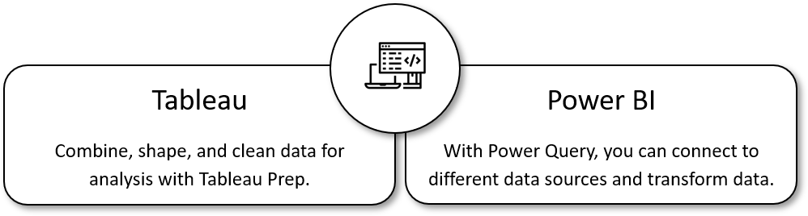
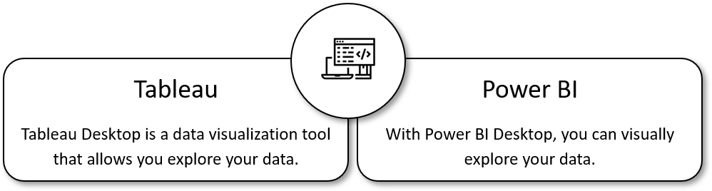
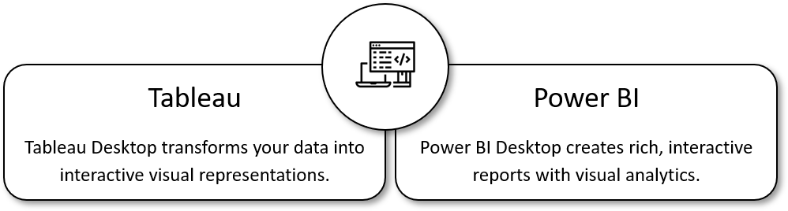
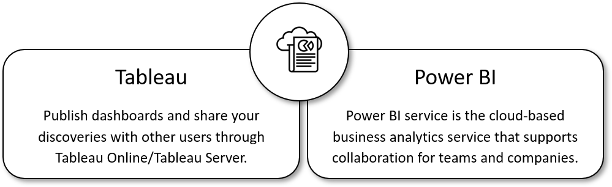

By the end of this module, you will be able to take the first step going from Tableau to Power BI. Tableau and Power BI provide a set of tools that enable analysts and Enterprise Business Intelligence professionals to build visualizations and get insights from their data. These same tools cover the full spectrum of data connectivity, preparation, modeling, creating visualizations, and collaboration.

## Lifecycle comparison

In today\'s modern data world, it is essential for companies to empower as many users as possible to gather actionable insights from quality data. These actionable insights are taken from reports built in tools like Tableau and Power BI. In order to get these insights, you would use these tools (and their features) at different stages in a report building lifecycle: prepare, explore, visualize, and share and collaborate.

| | **Prepare** | **Explore** | **Visualize** | **Share & collaborate** |
|--|--|-- | -- | -- |
| **Power BI Product**   | Power Query Editor | Power BI Desktop | Power BI Desktop or Web-Edit in Power BI service | Power BI service |
| **Definition** | Connect to data sources. Clean and transform | Define relationships. Define DAX calculations. Look for patterns and insights in the cleaned data. | Create visuals and custom visuals. Can also create visuals with R or Python. | Permissions and Security. Embed visuals in other products. Subscriptions. Data flows. |
| **Tableau equivalent** | Tableau Prep Alteryx | Tableau Desktop | Tableau Desktop | Tableau Server  Tableau Online |

**Steps needed to understand your data using the Power BI toolkit.**

## Prepare your data

The goal of data preparation is to make the data accessible for users, analysts, customers, partners, coworkers, etc. In order to prepare the data, you would use the **Power Query Editor**, which has rich formatting capabilities. This tool, built into the Power BI Desktop product, provides the ability to connect to many different data sources and transform your data into the shape you want. This way, you can explore and visualize the data to gain insights. The **Power Query Editor** is intuitive and gives the analyst numerous transformation options.

> [!div class="mx-imgBorder"]
> 

## Explore your data

Once the data is prepared and organized, you would explore the data with **Power BI Desktop**. Like Tableau Desktop, using Power BI\'s desktop service is a great way to familiarize yourself with the data. You can set up calculations using the **Data Analysis Expressions (DAX)** language to keep your reports dynamic. These calculations will further explore the data when you apply filters. You can also define relationships, which allows you to analyze data from multiple, disparate data sources.

> [!div class="mx-imgBorder"]
> 

## Visualize your data

After you have fully explored your data and know the focus areas within your data, it is now time to design a report. With Power BI Desktop, you can create rich, interactive reports with visual analytics. As an analyst and a report designer, you need to choose the best visual that engages your users. The amount of visual choices is limitless with the availability of custom visuals.

> [!div class="mx-imgBorder"]
> 

## Share and collaborate your data

Finally, your report is created. The next step is to publish the report to the Power BI service to share with your audience. Here, you can set the report to automatically refresh the data, apply permissions and security to the reports, and create subscriptions to the report. If necessary, other people can use the same prepared dataset for their own personal exploration.

> [!div class="mx-imgBorder"]
> 
