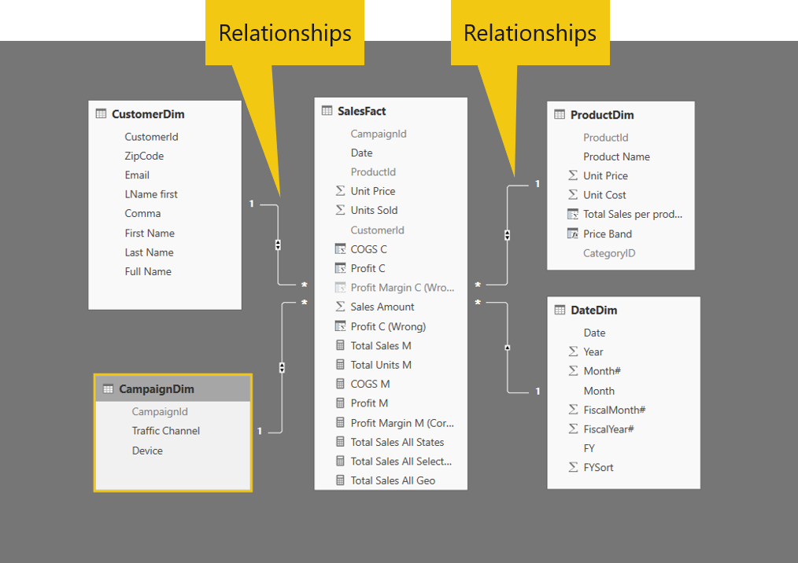

Relationships are extremely important to your data. Relationships make your analyses function correctly between multiple tables. This process is done through a matching field between tables called the relationship field. With a relationship field, you can accurately calculate results from disparate tables and display the correct information in your reports.

> [!div class="mx-imgBorder"]
> 
