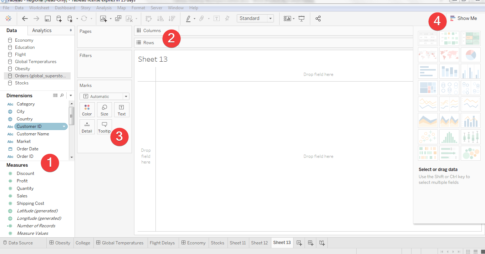

As a Tableau analyst, you would have created a visual by:

1. Selecting the fields that you want to visualize.

1. Dragging the fields to the **Columns** or **Rows** shelf.

1. Refining the visual by adjusting the **Marks** card.

1. By using the **Show Me** drop-down menu.

> [!div class="mx-imgBorder"]
> 

The steps for creating a visual in Microsoft Power BI differ:

1. Start with the visual that you are interested in by selecting one from the **Visualizations** pane (similar to the **Show Me** feature in Tableau).

1. Select the data that you want to visualize (similar to the **Rows**/**Columns** shelf in Tableau).

1. Refine the visual by adjusting the formatting (similar to the **Marks** cards in Tableau).

> [!div class="mx-imgBorder"]
> 
