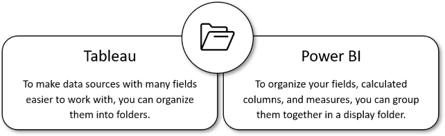
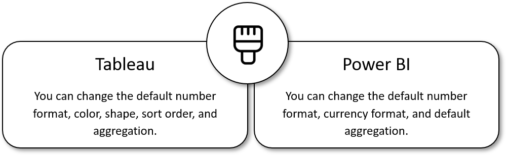
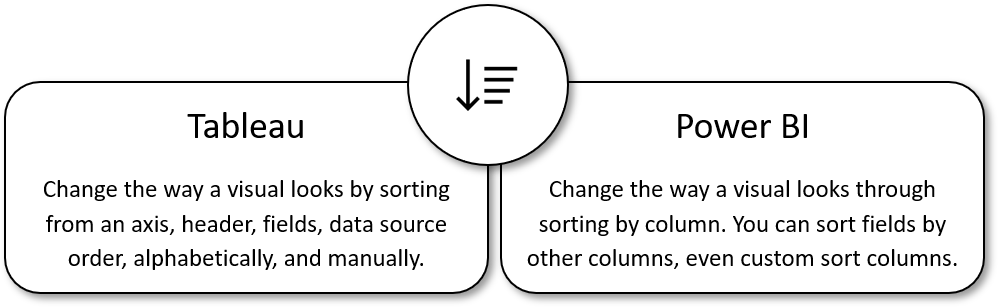
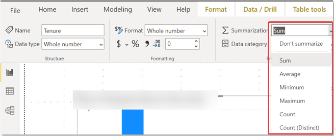

By the end of this unit, you will be able to understand how field properties are at the core of organizing and simplifying your calculations in Microsoft Power BI.

Here are some of the main field properties that every analyst should be including in their Microsoft Power BI workbooks:

- Add a field description

- Create folders

- Change data types

- Change format

- Set **Sort by column**

- Set **Summary by**

> [!div class="mx-imgBorder"]
> 

## Understand your fields with field descriptions

Adding a field description allows users to type in whatever business description fits best. When an end user hovers over the field, it will display the text. If you have multiple users editing your reports, this is a great way for everyone to understand what fields they should use and how measures and calculated columns are being calculated.

> [!div class="mx-imgBorder"]
> 

## Organize your data with a folder

Creating folders within tables can extend the organization of your data. Folders allow you to make logical groupings of fields and measures into a single location. It's a simple task that saves you time and is helpful in the maintenance of your Power BI model.

> [!div class="mx-imgBorder"]
> 

## Correct your data by changing its data type

In many cases, Power BI and DAX will implicitly convert a data type for you, but there are some cases where it won't.

For example, if a DAX function requires a Date data type and the data type of your column is Text, the function won't work properly. It's important and useful to get the correct data type for a column.

> [!div class="mx-imgBorder"]
> 

## Change your data format

Like changing data types, there are a few locations where we can change the formatting and then set it as the default. This functionality will be a time saver in Power BI Desktop. It allows you to change the format once and only adjust later if it deviates from the standard.

For example, you just created a list of percentage measures and every time you visualize the data, you realize the values are displaying as a decimal instead of a percentage. By changing the format, you can make sure that the list of measures is all displaying percentages as their default.

> [!div class="mx-imgBorder"]
> 

## Sort by column to highlight information your way

In Microsoft Power BI Desktop, you can change the appearance of a visualization not only through the visualizations pane but also through sorting by different data fields. By changing how you sort a visual, you can highlight the information you want to portray. By default, when using a field, it will default to sorting A to Z, but that does not always make the most sense. With Microsoft Power BI Desktop, you can set the default sort orders to be based on numeric data (such as sales figures) or text data (such as state names).

> [!div class="mx-imgBorder"]
> 

## Summarize by other fields to control your fields

Like how fields are set to dimensions or measures, in Microsoft Power BI, you have the flexibility to control whether a field should or should not be aggregated. If you decide to aggregate the field, you can set the aggregation type.

> [!div class="mx-imgBorder"]
> 

> [!div class="mx-imgBorder"]
> 

## Reference links

For more information on Power BI datatypes, see: [Data types in Power BI Desktop](/power-bi/connect-data/desktop-data-types)

For more information on sorting by columns in Power BI, see: [Sort by column in Power BI Desktop](/power-bi/create-reports/desktop-sort-by-column)
