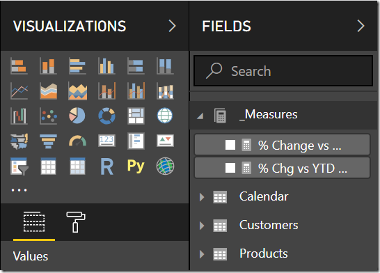
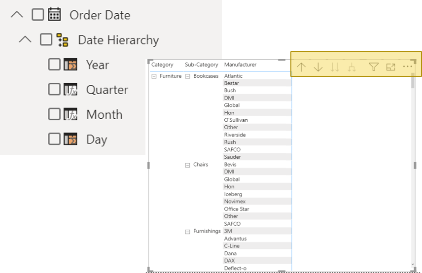
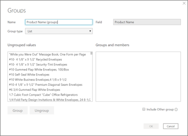
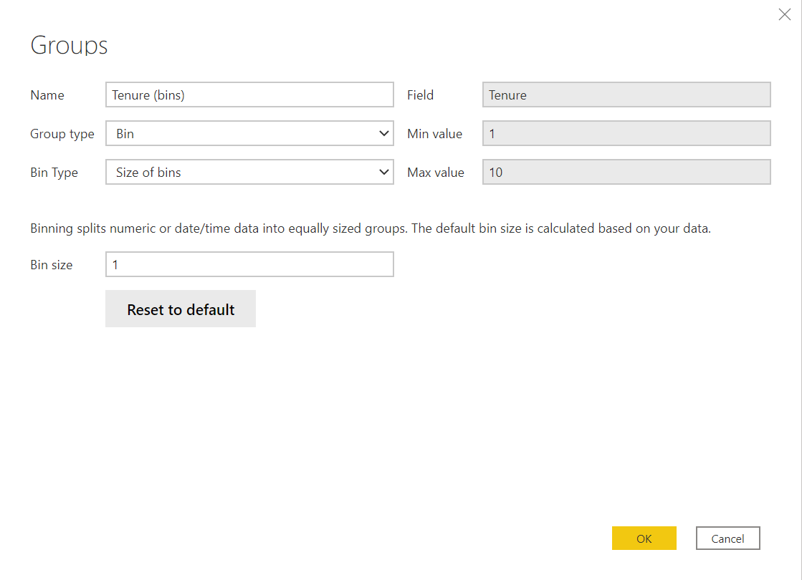
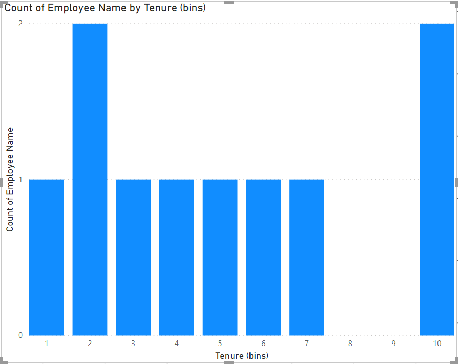

Analysts and developers all have their own processes they like to follow when creating and managing datasets in Microsoft Power BI Desktop. However, as the development process continues, it is far too easy to lose track of that ideal field you had at the beginning, or how you went about naming different things. Some of the new content starts to not make much sense anymore.

In this unit, you will explore different techniques on how to alleviate this issue while also preparing your data for consumption in a way that makes sense to a business user.

## Manage your measures with a measures table

Expanding further on the idea of grouping similar objects together (folders in the previous unit), the creation of a measures table is often used as a best practice to manage all the measures you create on top of your data. Unlike folders, this is accomplished by creating an empty table.

> [!div class="mx-imgBorder"]
> 

This function is a nice way to group calculations and have the measures table be the first table available at the top in the Fields pane.

> [!NOTE]
> We can use a separate table because measures are not tied to specific tables.

## Apply hierarchies

Hierarchies allow for more drill-in functionality and allow for different types of drill-ins. With Microsoft Power BI hierarchies, you can jump levels, use drilling as a filter across all your visuals, and even expand down one level.

> [!NOTE]
> With Tableau hierarchies, you must do the full tree effect; when you traverse through the hierarchy, you must do the full drill-down where you are always keeping parent-child hierarchy.

> [!div class="mx-imgBorder"]
> 

## Cluster your data points with groups

Groups allow analysts to group data points to help you view, analyze, and explore data. It also aggregates data into groups based on values found in the underlying data.

For example, you have a list of store departments and you need to categorize the departments by their performance (high, standard, low). With groups, you can put the departments into their performance category (or group) based on their profit margins.

> [!div class="mx-imgBorder"]
> 

## Create bins

A bin is a type of group that functions similarly, except you define the bin size to put values into equally sized groups.

> [!NOTE]
> You can set the bin size for numerical and time fields only. Also, you can make bins for calculated columns, not measures.

For example, you have an employee list for your company. This list has employee name, department, manager, and their tenure. Your task is to find the number of employees that have been with the company for one to 10 years. The bin size will be one, which will represent one full year and there will be 10 bins.

> [!div class="mx-imgBorder"]
> 

With the new tenure bin field, you can create the following visualization:

> [!div class="mx-imgBorder"]
> 

## Use DAX Studio

The last feature in this unit is DAX Studio, which is a third-party tool that has full integration with Microsoft Power BI.

> [!div class="mx-imgBorder"]
> 

This tool provides analysts a way to execute and analyze DAX queries against Microsoft tabular models. It also provides visibility to the metadata in your model by offering an extract list of your created measures, allows you to see all the tables that are a part of my model, and provides visibility into table functions. When you are creating table functions in Microsoft Power BI, it is that temporary table that you do not have full insight on what that structure looks like. DAX Studio allows you to get the full view of that temporary table, which can improve your calculation.

> [!NOTE]
> Tableau does not have a metadata tool like DAX Studio.

## Reference links

For more information on DAX Studio see: [DAX Studio](https://daxstudio.org/).

For more information on measure tables see: [Measure Tables in Power BI](https://go.microsoft.com/fwlink/?linkid=2162158)
