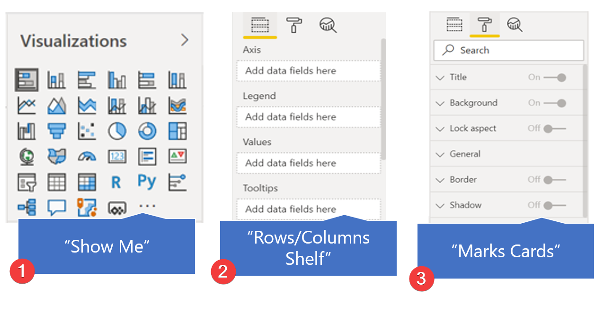

As a Tableau analyst, creating a visual started with:

1.  Selecting the field(s) you would like to visualize.

1.  Next, dragging the field(s) to the Columns or Rows shelf.

1.  Finally, you would refine the visual by adjusting the Marks card.

1.  Or with the "Show Me" dropdown.

> [!div class="mx-imgBorder"]
> 

In Microsoft Power BI, there are different steps to the same visualization process:

1.  Start with the visual we're interested in by selecting one from the Visualization pane (like the "Show Me" feature in Tableau).

1.  Next, you select the data you would like to visualize (like the Rows/Columns shelves in Tableau).

1.  Lastly, refine the visual by adjusting the formatting (like the Marks Cards in Tableau).

> [!div class="mx-imgBorder"]
> 

It's often easiest to start with the visual because each visual will contain different options. The visual itself guides what fields can be used and the subsequent formatting options.

> [!NOTE]
> The steps can be accomplished in any order. These are just the most common.
