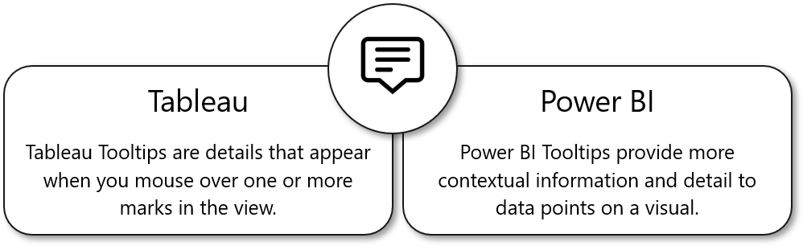
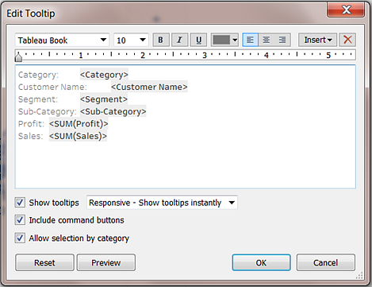
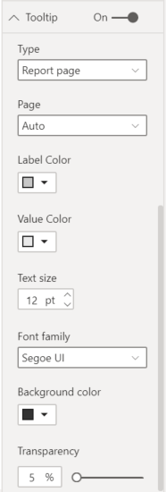
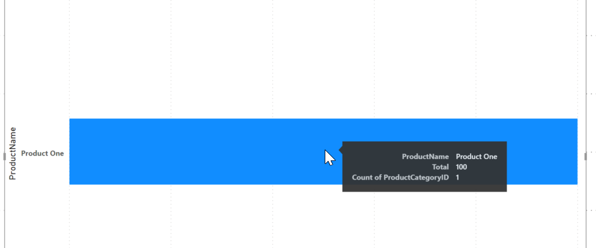

Tooltips in Power BI have the same purpose as Tableau Tooltips.

By default, the Tooltip will show data that is relevant to what is included in the visual for that specific data point. This concept can be expanded by adding more fields that are relevant, just like with the Tableau Tooltips Marks card.

> [!div class="mx-imgBorder"]
> 

Like the Tableau Tooltips mark card, the concept can be expanded by adding more fields that are relevant.

You can also create custom Tooltips from other pages. From there, you can add whatever relevant visuals or text.

> [!TIP]
> Power BI custom Tooltips are most like the Viz in Tooltip functionality in Tableau.

There's one main difference between Tableau and Power BI: the pure text editing.

In Tableau, you have the complete control over the presentation; you can bold, italicize, and/or underline specific words; make different parts of the text varying sizes and colors; create hyperlinks to other sheets/dashboards; modify the alignment of the text. These options are similar to the format options in Word.

> [!div class="mx-imgBorder"]
> 

With Power BI Tooltips, you don't have the same flexibility. You can add multiple fields into the Tooltip, change the font size and color, choose a font family, and apply transparency. However, these are all set options that you must choose through a drop-down.

> [!div class="mx-imgBorder"]
> 

> [!div class="mx-imgBorder"]
> 