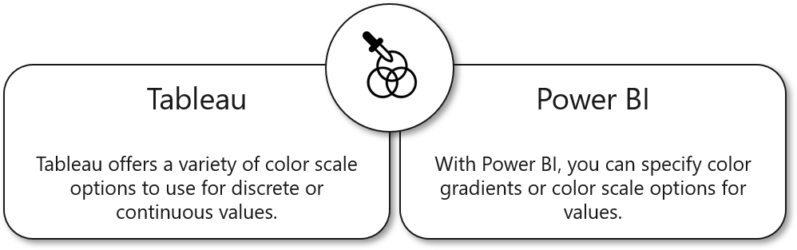
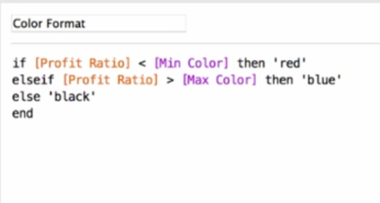
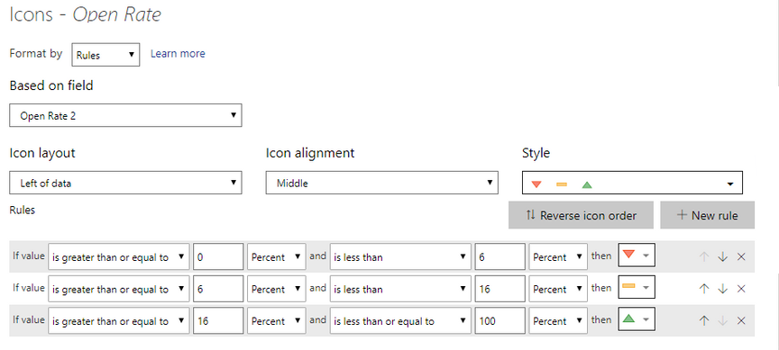

Analysts use conditional formatting to adjust several options in the Format pane, including the color.

> [!TIP]
> The option to edit the title text is built into Power BI.

Colors in conditional formatting work similarly to the Color Marks card in Tableau. It can be broken out into three different types: color scale, rules, and field values.

## Use a color scale

Color scale determines whether the color will be a continuous color or a diverging color. This scale is based upon a numeric value.

> [!div class="mx-imgBorder"]
> 

## Use rules

Rules are a new concept for Tableau analysts. Normally, you would have to create separate calculations with IF/THEN logic applied where you're associating a range of values to strings or numbers. Then, you drop the calculations onto the Marks card to change the color depending on those strings or numbers.

> [!div class="mx-imgBorder"]
> 

In Power BI, this is built straight into the product. You can create a series of IF/THEN statements and associate them to a specific color. On top of that, you can change the order of the rules so that the rules will be evaluated in a specific order.

> [!div class="mx-imgBorder"]
> 

## Use field values

Field values are also a differentiator that allows you to use a color denoted in your data. For example, if you have a column that declares the color, either as natural language (green) or code (#00ff00), it can interpret these values and convert them into color.

> [!TIP]
> You can load companion files that declare certain colors within your data.