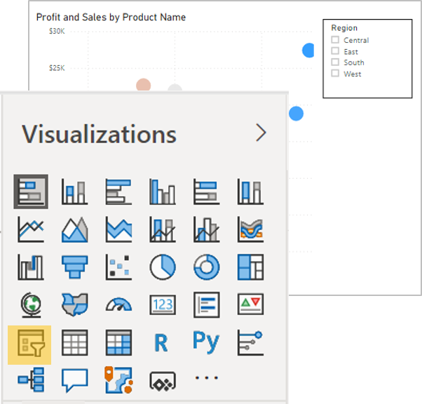
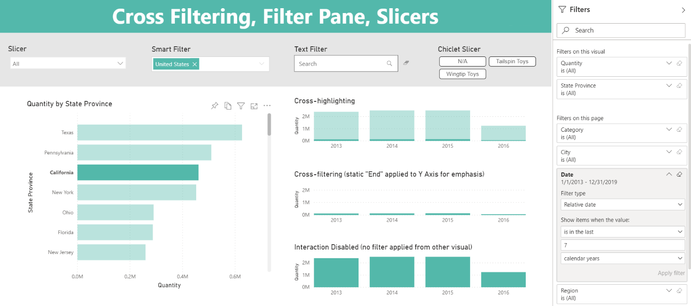
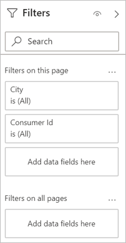

As a Tableau analyst, you're used to filtering data by manually keeping marks on the view, dragging and dropping fields in the filter shelf, and creating dashboard actions. In Power BI, there are three different filter types: slicers, interactions, and the filter pane.

## Filter your data with slicers

Slicers are similar to the standard filters in Tableau. One of the main differences is how they're presented. Instead of acting as a separate object, they're another visual type. You can also select different forms of filter visuals in the same way you pick custom visuals. This expands your ability to create new interactivity and functions with filters.

> [!div class="mx-imgBorder"]
> 

## Drill into your data with interactions

Cross visual interactions work similarly to actions in Tableau. In fact, you usually have two different flavors of interactions to pick from: filter or highlight. Filtering works as you might expect it, where the data point you pick will filter down the other visuals on the page to only associate with the dimension of that data point.

> [!div class="mx-imgBorder"]
> 

Highlighting works a bit differently in Power BI. In Tableau, you highlight related fields but in Power BI, it filters while keeping context. Instead of highlighting a data point, it will filter down the data in a related visual while fading out the original context.

## Declutter your report with the filter pane

The filter pane has many benefits; you can now declutter your report pages with scattered filters; you can now take back valuable real estate in your report; dashboards are more performant.

The filter pane allows for different levels of filtering from filters that affect the entire report all the way down to a single visual. It also gives you full flexibility to hide filters or even the whole panel from the end users to apply the filters as a backend procedure without confusing your end users.

> [!div class="mx-imgBorder"]
> 