In this lab, you'll create your first dashboard in Power BI using the standard visuals in Power BI, including the bar chart and scatter plot. You'll then add interactivity using cross filtering, bookmarks, and the Decomposition tree standard visual. At the end of this lab, you'll create a report like the one shown below.

> [!div class="mx-imgBorder"]
> [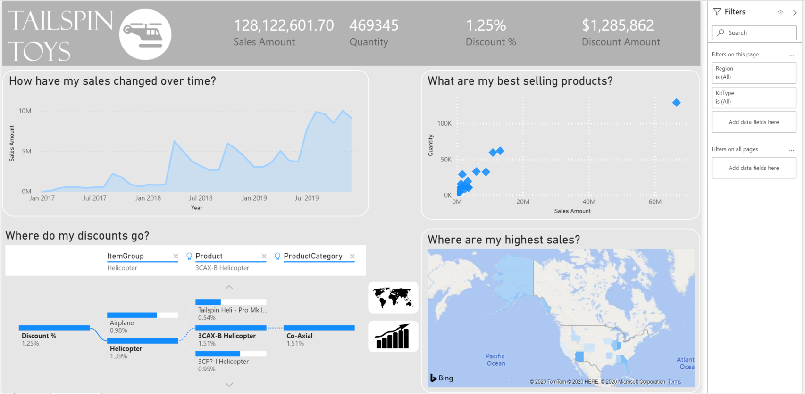](../media/final-dashboard.png#lightbox)

## Creating a dashboard

In this exercise, you'll create a dashboard and add interactivity.

### Task 1: Build a scatter chart 

In this task, you'll create a scatter chart.

1.  Create a new page by selecting the yellow "plus" sign at the bottom of the screen. Title this tab "Tailspin Toys".

1.  From the VISUALIZATIONS panel, select **Scatter chart** visual.

1.  From **FIELDS** section, drag and drop **Sales Amount** field from **Measures Table** table to **X Axis**.

1.  From **FIELDS** section, drag and drop **Quantity** field from **Sales** table to **Y Axis**.

1.  From **FIELDS** section, drag and drop **Product** field from **Product** table to **Details**.

1.  This provides a representation of the **Quantity** and **Sales Amount** by **Product**.

### Task 2: Format the scatter chart 

1.  From **FORMAT** section, under **Shapes** set the **Size** to 7 and set the **Marker shape** to diamond.

    > [!div class="mx-imgBorder"]
    > [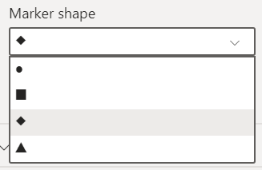](../media/marker-shape.png#lightbox)

1.  From **FORMAT** section, under **Title** set the **Text size** to 18 pt and write the following as **Title text**: What are my best selling products?

1.  *OPTIONAL* From **FORMAT** section, under **Background** set to Off.

    > [!div class="mx-imgBorder"]
    > [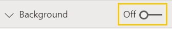](../media/background-off.png#lightbox)

1. *OPTIONAL* From **FORMAT** section, under **Border** set the **Color** to White and the **Radius** to 20.
    > [!div class="mx-imgBorder"]
    > [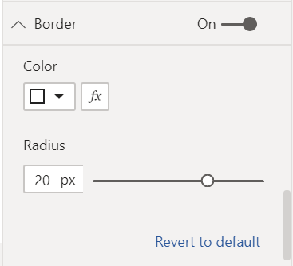](../media/format-border-color.png#lightbox)

1. *OPTIONAL* From **FORMAT** section, under **X-axis,** go down to **Gridlines** and set the **Color** to White and the **Stroke width** to 4.

    > [!div class="mx-imgBorder"]
    > [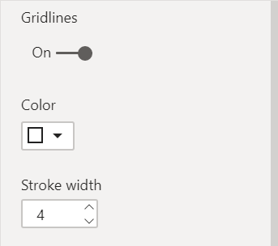](../media/format-gridlines.png#lightbox)

1. *OPTIONAL* From **FORMAT** section, under **Y-axis,** go down to **Gridlines** and set the **Color** to White and the **Stroke width** to 4.

### Task 3: Create a stacked bar chart 

1. From the **VISUALIZATIONS** panel select **Stacked bar chart** visual :::image type="icon" source="../media/stacked-bar-chart.png":::.

1. From **FIELDS** section, drag and drop **Sales Amount** field from **Measures Table** table to **Values**.

1. From **FIELDS** section, drag and drop **State** field from **Geography** table to **Axis**.

1. This provides a representation of the **Sales Amount** by **State**.

### Task 4: Format the stacked bar chart 

1. From **FORMAT** section, under **Data colors>Default color** select on :::image type="icon" source="../media/data-color-function.png":::

    > [!NOTE]
    > From this screen notice that there are a number of different methods you can create conditional formatting including Color Scale, Rules, and Field value. No additional calculations are necessary to create conditional formatting.

1. From the **DEFAULT COLORS** window, select **OK** to confirm your selections.

1. From **FORMAT** section, under **Title** set the **Text size** to 18 pt and write the following as **Title text**: Where are my highest sales?

1. *OPTIONAL* From **FORMAT** section, under **Background** set to Off.

1. *OPTIONAL* From **FORMAT** section, under **Border** set the **Color** to White and the **Radius** to 20.

### Task 5: Create an area chart 

1. From the VISUALIZATIONS panel, select **Area chart** visual :::image type="icon" source="../media/area-chart.png":::.

1. From **FIELDS** section, drag and drop **Sales Amount** field from **Measure Table** table to **Values**.

1. From **FIELDS** section, drag and drop **Order Date** field from **Sales** table to **Axis**.

1. From the **Visual Header**, select the drill-down button twice to show the chart by Year.

    > [!div class="mx-imgBorder"]
    > [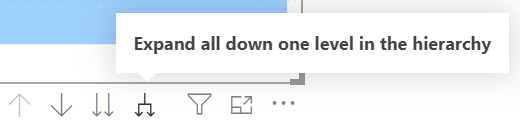](../media/drill-down.png#lightbox)

### Task 6: Format the area chart 

1. From **FORMAT** section under **Data colors>Sales Amount**, select on color selector box and select the light blue.

    > [!div class="mx-imgBorder"]
    > [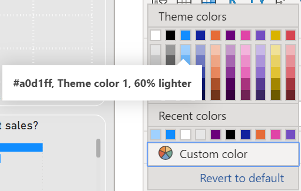](../media/color-selection-pane.png#lightbox)

1. From **FORMAT** section under **Title** set the **Text size** to 18 pt and write the following as **Title text**: How have my sales changed over time?

1. *OPTIONAL* From **FORMAT** section, under **Background** set to Off.

1. *OPTIONAL* From **FORMAT** section, under **Border** set the **Color** to White and the **Radius** to 20.

### Task 7: Add a decomposition tree

1. From the VISUALIZATIONS panel, select **Decomposition Tree** visual :::image type="icon" source="../media/decomposition-tree.png":::.

1. From **FIELDS** section, drag and drop **Discount %** field from **Measures Table** table to **Analyze**.

1. From **FIELDS** section, drag and drop **ItemGroup** field from **Product** table to **Explain by**.

1. From **FIELDS** section, drag and drop **ProductCategory** field from **Product** table to **Explain by**.

1. From **FIELDS** section, drag and drop **Product** field from **Product** table to **Explain by**.

1. Expand out the fields by selecting the "plus sign" next to each dimensional group.

### Task 8: Format decomposition tree

1. From **FORMAT** section under **Title**, turn **On** and set the **Text size** to 18 pt and write the following as **Title text**: Where do my discounts go?

1. From **FORMAT** section under **Tree>Density,** set to **Dense**.

1. *OPTIONAL* From **FORMAT** section, under **Data bars>Bar background** set the **Color** to White.
    > [!div class="mx-imgBorder"]
    > [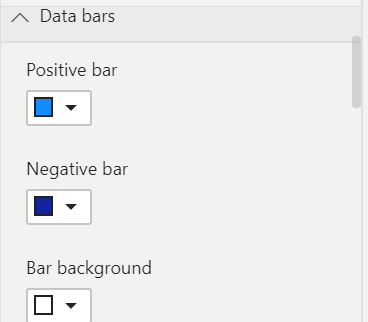](../media/data-bar-background-color.png#lightbox)

1. *OPTIONAL* From **FORMAT** section, under **Background** set to Off.

### Task 9: Add a multi-row card

1. From the VISUALIZATIONS panel, select **Multi-row Card** visual :::image type="icon" source="../media/multi-row-card.png":::.

1. From **FIELDS** section, drag and drop **Sales Amount** field from **Measures Table** table to **Fields**.

1. From **FIELDS** section, drag and drop **Quantity** field from **Sales** table to **Fields**.

1. From **FIELDS** section, drag and drop **Discount %** field from **Measures Table** table to **Fields**.

1. From **FIELDS** section, drag and drop **Discount Amount** field from **Sales** table to **Fields**.

### Task 10: Format multi-row card

1. *OPTIONAL* From **FORMAT** section under **Data Labels** set the **Color** to White and the **Text Size** to 21 pt.

    > [!div class="mx-imgBorder"]
    > [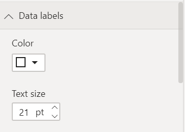](../media/data-labels.png#lightbox)

1. *OPTIONAL* From **FORMAT** section under **Category Labels** set the **Text Size** to 14 pt.

    > [!div class="mx-imgBorder"]
    > [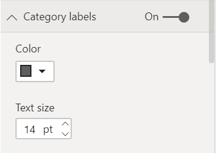](../media/category-labels.png#lightbox)

1. *OPTIONAL* From **FORMAT** section, under **Background** set to Off.

### Task 11: Set page background

1. *OPTIONAL* Select anywhere on the background of the **Page** to deselect visuals.

1. *OPTIONAL* From **FORMAT** section under **Page background>Color** set the color to the lightest gray available and set **Transparency** to 0.

    > [!div class="mx-imgBorder"]
    > [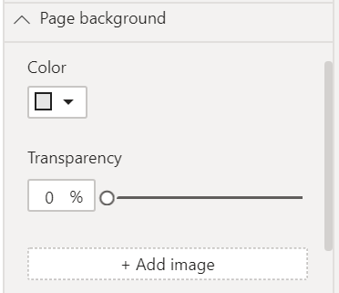](../media/page-background-color.png#lightbox)

### Task 12: Add a header (optional)

1. From the **RIBBON** under **Insert>Elements>Shapes**, select the **Rectangle** icon.

1. From **Format Shape>General**, set the **Width** and **Height** to be 1280 and 120 respectively.

1. From **FORMAT SHAPE** section under **Line>Weight**, set it to **0**.

1. From **FORMAT SHAPE** section under Fill set, it to **Off**.

1. From **FORMAT SHAPE** section under **Background** set it to **On**.

1. From **FORMAT SHAPE** section under **Background>Color**, set it to a medium gray.

    > [!div class="mx-imgBorder"]
    > [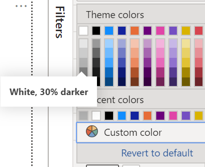](../media/shape-format-background-color.png#lightbox)

### Task 13: Add a logo

1. From the **RIBBON** under **Insert>Elements**, select the **Image** icon. Navigate to the "Toys of Tomorrow Icon" and select **Open**.

### Task 14: Add page filters

1. Expand the **FILTERS** pane, if it's closed.

    > [!div class="mx-imgBorder"]
    > [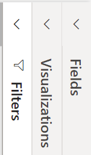](../media/expand-filters.png#lightbox)

1. From **FIELDS** section, drag and drop **KitType** field from **Product** table to **Filters on this page**.

1. From **FIELDS** section, drag and drop **Region** field from **Geography** table to **Filters on this page**.

### Task 15: Add cross filtering 

1. Select on one of the visuals you've created.

1. From the **Ribbon** under **Format>Interactions**, select **Edit interactions**.

1. For each of the *other* visuals you've created, select the **Filter** icon from the **Visual Header**.

    > [!div class="mx-imgBorder"]
    > [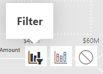](../media/apply-action-filter.png#lightbox)

1. Repeat the steps in **Task 15** with each of the others visuals you created.

### Task 16: Create two bookmark actions with icons 

In this task, we'll make a copy of the bar chart you've already made, convert it to a map, and give the user the option to pick between the two.

1. Select the bar chart you've already create and copy (CTRL + C) and paste it (CTRL + P).

1. Select the new copy of your bar chart and, from the **VISUALIZATIONS** panel, select **Filled Map** visual :::image type="icon" source="../media/filled-map.png":::.

1. Place the bar chart and map that you've created on top of each other.

1. Open the **Selection Pane** and **Bookmarks Pane** by going to the **Ribbon** under **View>Show Panes** select **Selection Pane** and **Bookmarks Pane**.

1. From the **Selection Pane**, hide the map visual by selecting on the **Show/Hide** icon next to it. You'll know you've selected the correct visual by selecting on the name in the **Selection Pane** will result in highlighting the visual in the report canvas.

1. Create your first bookmark by going to the **Bookmarks Pane** and selecting **Add**. Rename this bookmark to "Bar".

1. Using the **Selection Pane** unhide the map visual and hide the bar chart visual.

1. Create another bookmark by going to the **Bookmarks Pane** and selecting **Add**. Rename this bookmark to "Map".

1. From the **RIBBON** under **Insert>Elements**, select the **Image** icon. Navigate to the "Map Icon" and select **Open**.

1. Select the "Map Icon" and, under the **Format image** section, set **Action** to On.

1. From **Format image** section, select **Action>Type** as "Bookmark" and select **Action>Bookmark** as "Map".

1. From the **RIBBON** under **Insert>Elements**, select the **Image** icon. Navigate to the "Bar Chart Icon" and select **Open**.

1. Select the "Bar Chart Icon" and, under the **Format image** section, set **Action** to On.

1. From **Format image** section, select **Action>Type** as "Bookmark" and select **Action>Bookmark** as "Bar".

    You can now CTRL select on either of these two icons to swap between the bar chart and map.

### Task 17: Arrange and style

Now that you have the building blocks, use the remaining time to arrange the visuals in a way that tells a story. Here's a couple of tips to get you going:

-   From the **RIBBON** under **View>Themes**, pick a theme to set your colors/font. Then customize the theme to fit your style.

    > [!div class="mx-imgBorder"]
    > 

-   Select anywhere on the empty canvas to reveal options to alter the size, color, or even insert an image into the background

    > [!div class="mx-imgBorder"]
    > [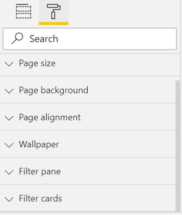](../media/format-pane.png#lightbox)

-   CTRL + Select multiple items to format them at the same time.

In this lab, you created your first dashboard in Power BI using the standard visuals in Power BI, including the bar chart and scatter plot. You added interactivity using cross filtering, bookmarks, and the Decomposition tree standard visual. Ultimately you created a report like the one shown below.