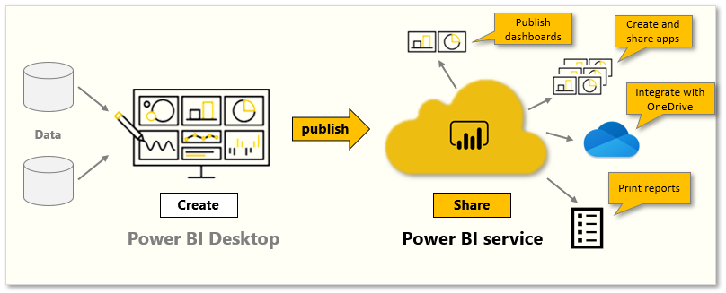

Likely, you will want to share your reports and dashboards with your coworkers and friends at some point. With Power BI, publishing and sharing your reports and dashboards is straightforward.

Tasks in this module:
- Publish reports
- Print and export reports
- Build apps
- Integrate with OneDrive
- Publish to the web

> [!VIDEO https://www.microsoft.com/videoplayer/embed/RE3oQm3]

## Share and collaborate with colleagues in Power BI

Power BI offers various ways of sharing and collaborating with colleagues on your dashboards, reports, and data including:

 - Publish your reports from Power BI Desktop to the Power BI service.
 - Create *Apps* that package a dashboard, report, and dataset to send to your colleagues, who can use the content pack as a starting point and further enhance it.
 - Create *Groups*, which you can use as a security model to identify a subset of users who have access to dashboards, reports, and datasets that you create.
 - Publish to the web so that live reports can be embedded in a webpage. 

