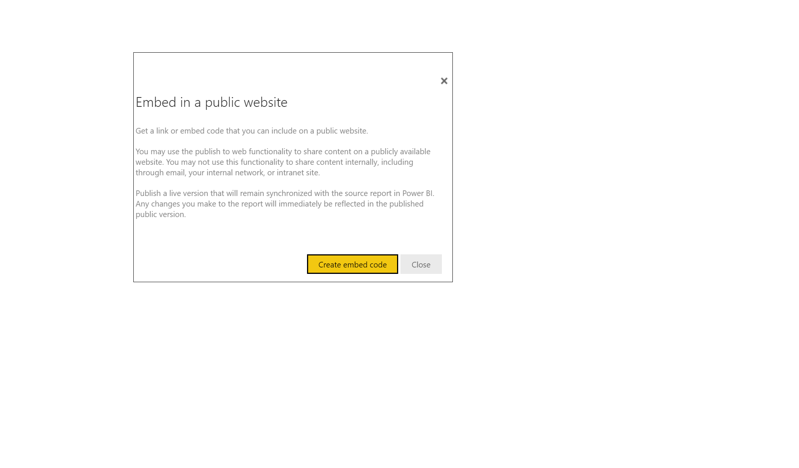

In this lesson, you're going to share a Power BI report on a webpage or share it through email. This feature of Power BI is often referred to as **Publish to web**.

> [!VIDEO https://www.microsoft.com/videoplayer/embed/RE3oSXA]

In the Power BI service, select the report that you want to share so that it's displayed on the canvas. Then from the menu, select **File > Publish to web**. A dialog box will appear, explaining that you'll receive an *embed code* that will allow you to include the report on a website or in an email.

When you select **Create embed code**, Power BI presents another dialog box stating that you're about to share your data with everyone on the Internet. Verify that sharing publicly is acceptable before moving ahead.

Power BI presents a dialog with two links:

 - A link that you can share in an email, which shows the report as a webpage

 - HTML code (a link plus within an iframe) so that you can embed the report directly into a webpage

For the HTML link, you can choose from predefined sizes for the embedded report, or you can modify the iframe code and customize its size.

You can paste the email link into a browser and see your report as a webpage. You can interact with that webpage just as you would if you were viewing the report in Power BI. The following image shows a **Publish to web** page when its link was copied directly from that dialog box into a browser.

You can also embed that iframe link into a blog post, website, or Sway.

If you want to delete an embedded code that you created, Power BI can help. In Power BI, select the gear icon in the upper-right corner and then select **Manage embed codes**.

The Power BI workspace shows the embed codes that you've created. 

For more information, see [Publish to web from Power BI](https://docs.microsoft.com/power-bi/service-publish-to-web).
