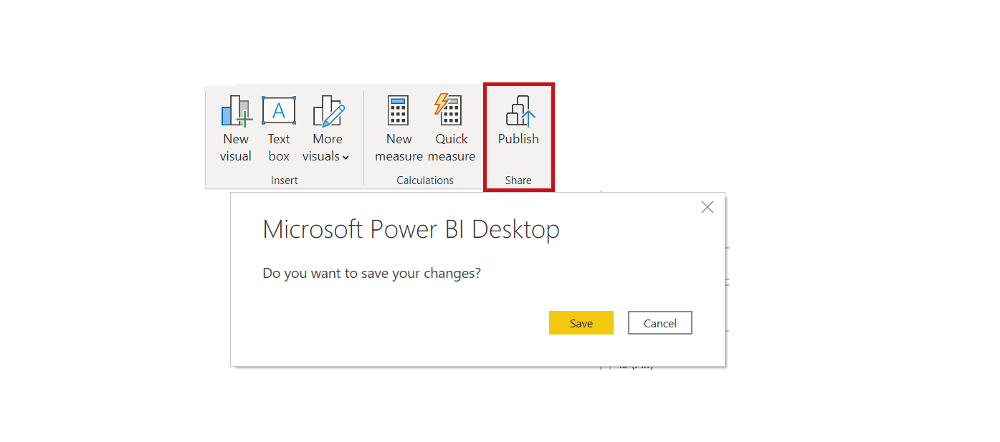

Publishing your reports to the Power BI service is fast and simple.

> [!VIDEO https://www.microsoft.com/videoplayer/embed/RE3oNL6]

After you've completed writing your report, select the **Publish** button on the **Home** tab.

Power BI packages your report and data, including visualizations, queries, and custom measures, and uploads them to the Power BI service.

 > [!NOTE]
 > It's common to refer to Power BI Desktop reports as .pbix files, which is the extension that they're given in Microsoft Windows.

When the upload is complete, a dialog box appears, informing you that the publishing process succeeded, and provides a link to your report in the Power BI service.
