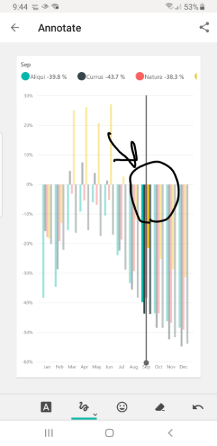

To keep track of your data while you're on the move, you can use one of Power BI's touch-friendly mobile applications for iOS, Android, or Windows devices.

**Video**: Introducing Power BI mobile apps
> [!VIDEO https://www.microsoft.com/videoplayer/embed/RE3oYa4]

Sign in to your account by using your Power BI service account information. The first screen displays all the content to which you have access, including reports, dashboards, and groups. The workspace also includes sample dashboards that you can explore for inspiration.

Tap any dashboard to open it. Within a dashboard, you can tap a dashboard tile to focus on it in a larger view. Note any insights that you discover by tapping the **Annotate** button in the top-right corner. The Annotate feature allows you to draw on a focused tile to highlight areas of interest. The annotation tools are along the bottom of the screen.

Share your annotated tile by tapping the **Share** link in the top right-hand corner.

For more information, see [What are the Power BI mobile apps?](https://docs.microsoft.com/power-bi/consumer/mobile/mobile-apps-for-mobile-devices/?azure-portal=true).
