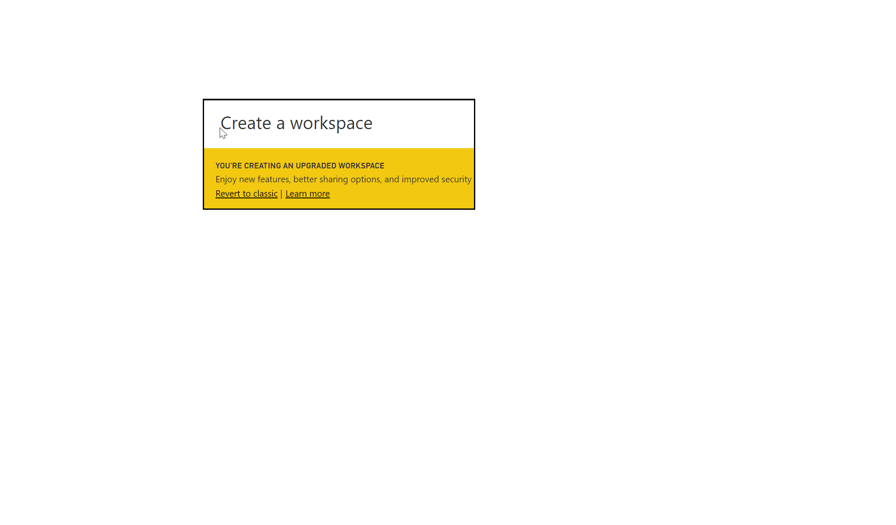

In this unit, you will create a group that defines a set of users who have access to specific dashboards, reports, and data.

**Video**: Create workspaces
> [!VIDEO https://www.microsoft.com/videoplayer/embed/RE3oNLh]

Workspaces are places to collaborate with colleagues to create and refine collections of dashboards, reports, and paginated reports. There are two types of groups in Power BI:

- **Classic workspaces** - groups are based on the groups in Office 365. If you've been using Office 365 groups to manage your group's email, calendar, and documents, then you'll find that Power BI offers the same features. When you create a group in Power BI, you're actually creating an Office 365 group.
- **New workspaces** - are now the default workspace in Power BI. 
    -Assign workspace roles to user groups: security groups, distribution lists, Office 365 groups, and individuals.
    - Create a workspace in Power BI without creating an Office 365 group.
    - Use more granular workspaces roles for more flexible permissions management in a workspace.
    - The Power BI admin can control who can create workspaces in Power BI.

## Setting up a new workspace

In **Workspace settings** in the admin portal, admins can use the Create workspaces (new workspace experience) setting to allow everybody or nobody in an organization to create new workspace experience workspaces. They can also limit creation to members of specific security groups.

## Setting up a classic workspace

Imagine setting up a new finance group. Start in **My Workspace** with the dashboards, reports, and datasets that you've created or that someone has shared with you.

Expand **My Workspace** and select **Create a group**.

Give the group a name, for example, Finance. Power BI makes sure that the name doesn't exist on the domain.

Set the privacy level by deciding whether anyone in your organization or only its members can see the contents of the group.

In the **Create a group** dialog box, type email addresses, security groups, and distribution lists. Select **Add** to make the set of users members of the group, and then select **Save** to save the group.

For more information, see [Create classic workspaces in Power BI](https://docs.microsoft.com/power-bi/service-create-workspaces/?azure-portal=true) and [Organize work in the new workspaces in Power BI](https://docs.microsoft.com/power-bi/service-new-workspaces/?azure-portal=true).
