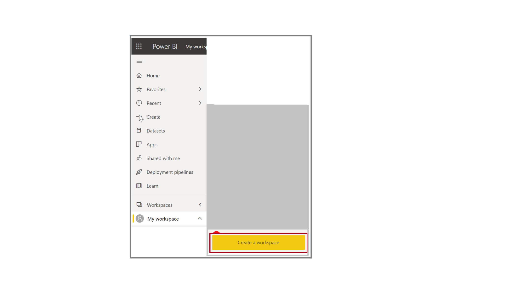
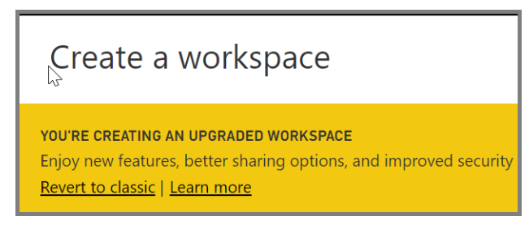

In this unit, you will create a workspace that defines a set of users who have access to specific dashboards, reports, and datasets.

Workspaces are places to collaborate with colleagues to create and refine collections of dashboards, reports, and paginated reports. There are two types of workspaces in Power BI:

- **Classic workspaces** - groups are based on the groups in Microsoft 365. If you've been using Microsoft 365 groups to manage your group's email, calendar, and documents, then you'll find that Power BI offers the same features. When you create a group in Power BI, you're actually creating an Microsoft 365 group.
- **New workspaces** - are now the default workspace in Power BI. 
    - Assign workspace roles to user groups: security groups, distribution lists, Microsoft 365 groups, and individuals.
    - Create a workspace in Power BI without creating a Microsoft 365 group.
    - Use more granular workspace roles for more flexible permissions management in a workspace.
    - The Power BI admin can control who can create workspaces in Power BI.

## Setting up a new workspace

By clicking on **Workspaces** users can Create a workspace which will allow everybody or nobody in an organization to create new workspaces. They can also limit creation to members of specific security groups.

## Setting up a classic workspace

Setting up a classic workspace has the same steps as setting up a new workspace, with one additional step.  In the workspace dialog box you need to click on **revert to classic** to set up a classic workspace

In the **Create a workspace** dialog box, under **Advanced** you can click on **Specific users and groups** and type email addresses, security groups, and distribution lists. Then select **Save** to save the group.

For more information, see [Create classic workspaces in Power BI](/power-bi/collaborate-share/service-create-workspaces/?azure-portal=true) and [Organize work in the new workspaces in Power BI](/power-bi/service-new-workspaces/?azure-portal=true).
