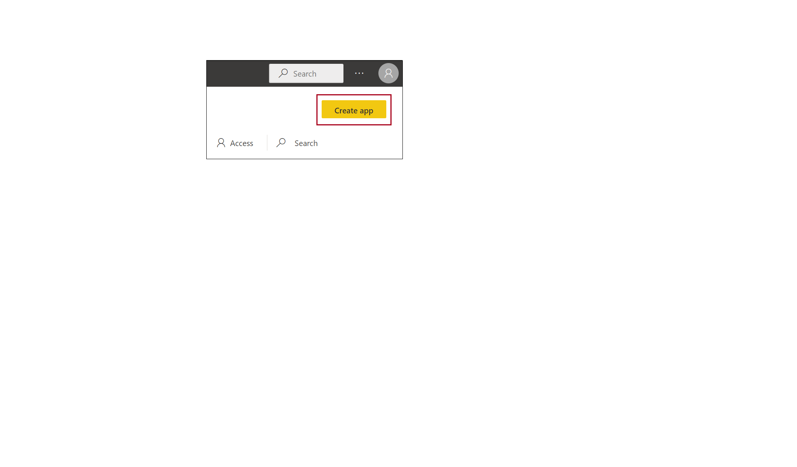
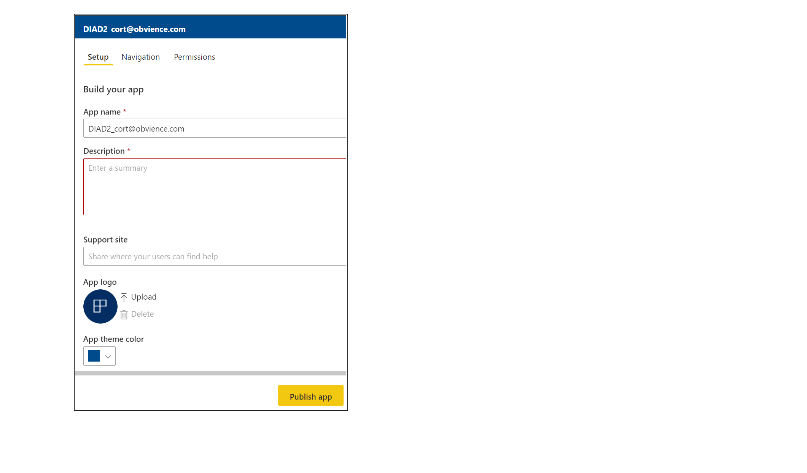

In this lesson, you will create an app with artifacts that already exist in Power BI, and then you will share the app with colleagues. 

> [!VIDEO https://www.microsoft.com/videoplayer/embed/RE3p3lN]

Start in the Power BI service. In **My Workspace**, you will create an app that includes your dashboard, the report underneath, and the dataset. Then, you will share the app with people in your organization so they can reuse the artifacts. In the workspace list view, decide which dashboards and reports you want Included in app.

Select the Publish app button in the upper right to start the process of creating and publishing an app from the workspace.

On Setup, fill in the name and description to help people find the app. You can set a theme color to personalize it. You can also add a link to a support site.

Choose whether to distribute the app to specific people or to groups, and then give the app a title. Provide a detailed description in the **Description** box so that people know what your app provides.

On the bottom of the dialog box, you can upload an image for the app and then select the dashboard to include in the app. When you publish, the app is added to the organization's content gallery.

For more information, see [Publish an app in Power BI](https://docs.microsoft.com/power-bi/service-create-distribute-apps).

