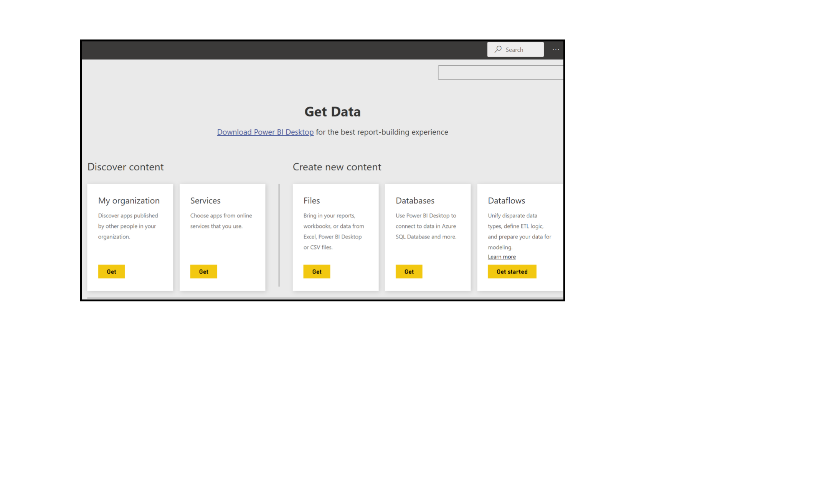
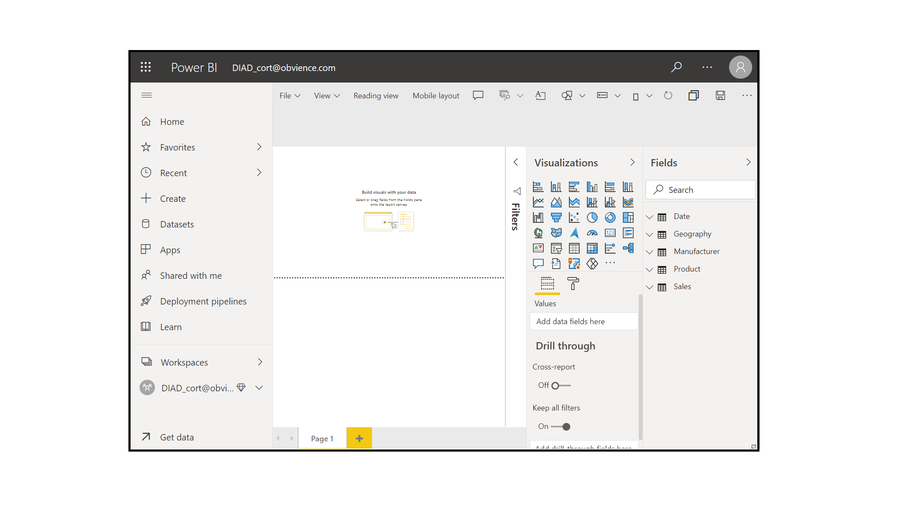
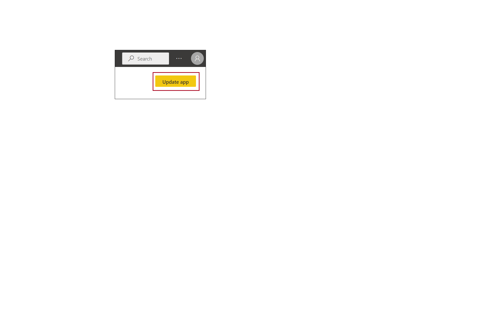
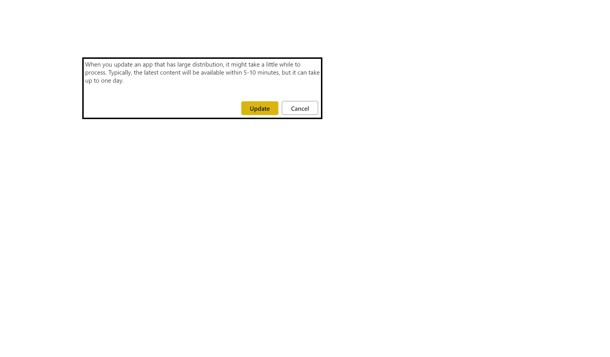

In this lesson, you will create an instance of an app for everyone in a group.

**Video**: Use apps
> [!VIDEO https://www.microsoft.com/videoplayer/embed/RE3oQm9]

Start in **My Workspace**, select the group that you previously created, select **My Organization** to browse your content packs, and then connect to your app.

Power BI imports the dashboards, reports, and datasets that are in the app.

When you select the dataset, Power BI asks if you want to personalize the app. Create a copy of the app that you can use to make changes to yet keep it disconnected from the published version of the app. By creating a copy, you won't automatically receive updates if the app creator makes changes to the published version of the app. You can edit the dashboard, the report, and even the dataset if you want.

## Update apps

To edit an app that you created previously and see how other people use your app, start in the Power BI Service in **My Workspace**. Anytime that you make changes to the dashboard, you'll get a reminder that you've changed something that you've shared with others in an app. Power BI will prompt you to update the shared version.

Return to the settings icon and select **View app** to see the apps that you've already published. When you select **Edit**, you'll return to the screen where you can edit the title and description. This time, the screen includes an **Update** button.

Power BI processes those changes and publishes the updated app to the app gallery. Anyone who has connected to your app will receive a message that the app has changed, and they will have the option to accept the changes or to keep the older version. As the app owner, you can manage the versions that your colleagues are using.

For more information, see [Change your published app](https://docs.microsoft.com/power-bi/service-create-distribute-apps#change-your-published-app).

