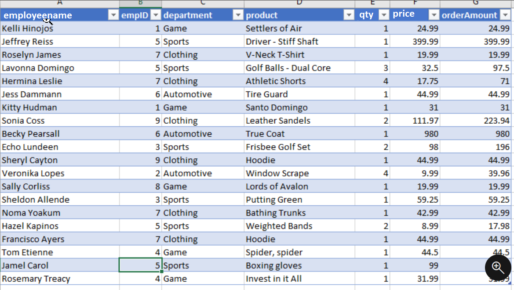
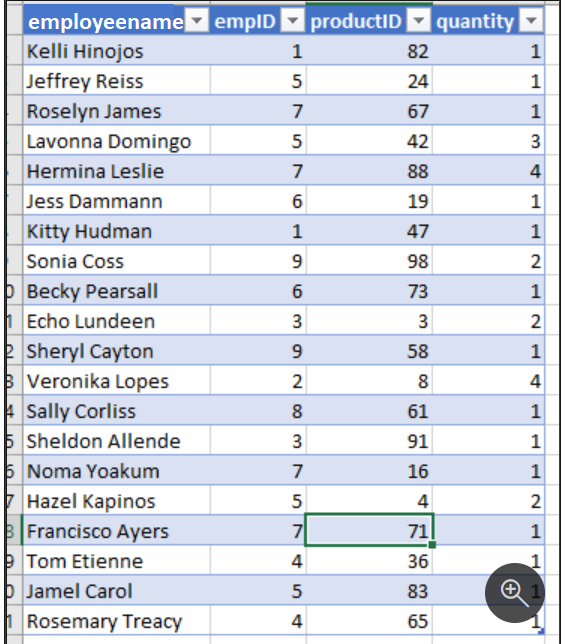
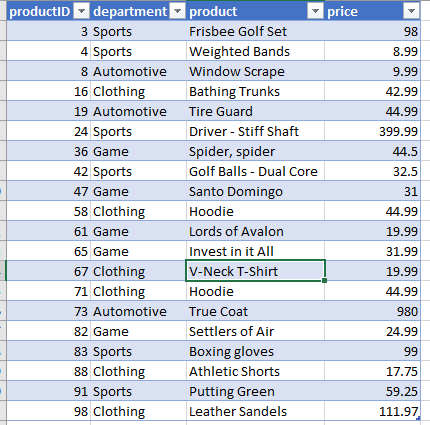
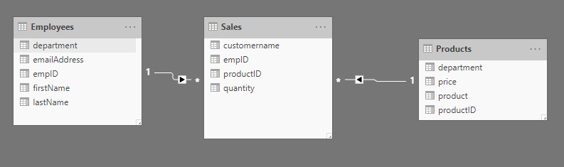

In Power BI, you can secure reports and workspaces by sharing them to active directory users and groups. It is also possible to share a single report, but have users see different data, according to their job role.

As an example, imagine you work for Tailspin Traders. You have the following table to track your sales:

> [!div class="mx-imgBorder"]
> 

You also have the following table for employee information:

> [!div class="mx-imgBorder"]
> 

This is the products table:

> [!div class="mx-imgBorder"]
> 

You would like to make one report where employees in a specific department can only see the sales for that department. For instance, Maria Cameron works in the Game department and should only see the sales from that department. She should not see the sales from Sports, Clothing, or Automotive.

This data is organized in a star schema. The sales table has all of the attributes of a fact table, while employees and products are dimension tables. The data model is in the following screenshot:

> [!div class="mx-imgBorder"]
> 

There are two ways to implement row-level security in Power BI: the static method and the dynamic method.

Row-level security (RLS) uses a DAX filter as the core logic mechanism. This module will demonstrate how you can implement row-level security in Power BI using DAX to ensure that only the appropriate person is seeing the appropriate records.
