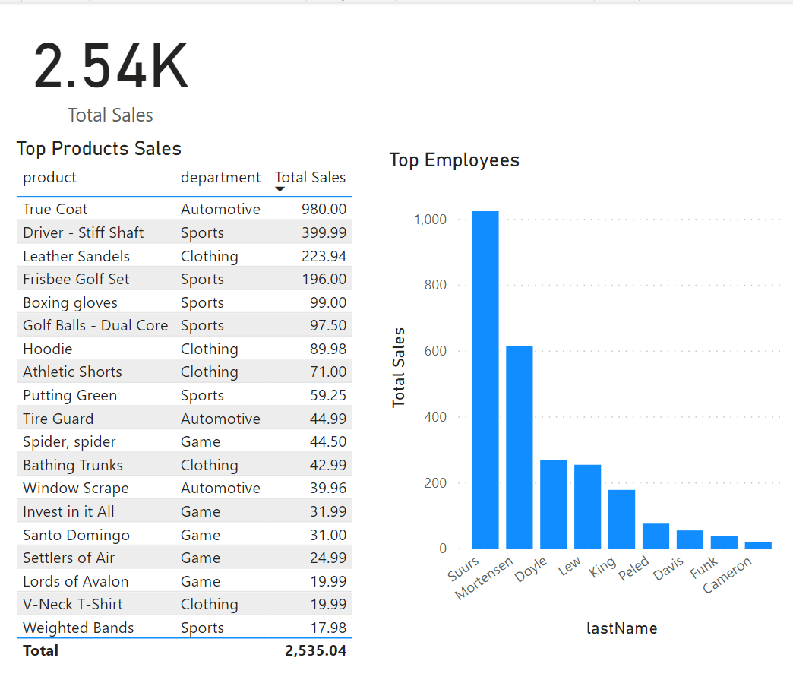
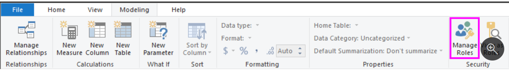
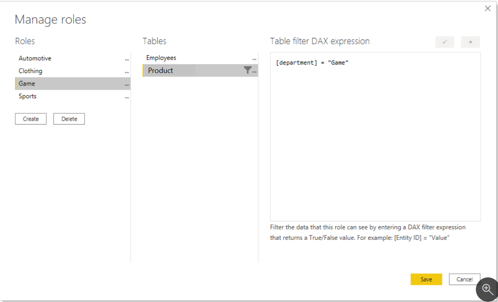
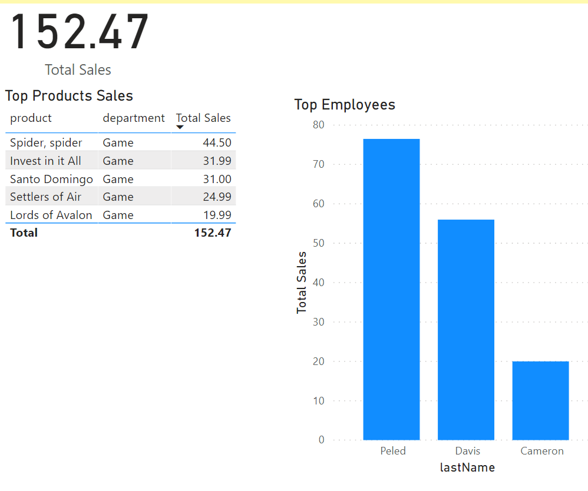
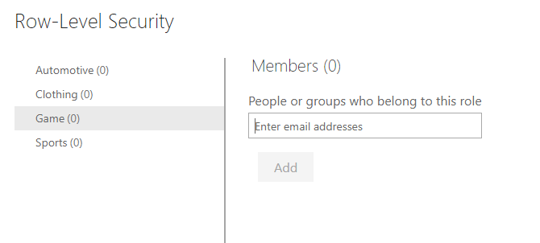
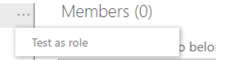

The static method in Row-level security (RLS) uses a fixed value in the DAX filter, while the dynamic method uses a DAX function. You will see this in action shortly

Row-level security (RLS) takes several steps to configure. We will perform them in this order:

1.  Create a report in Power BI Desktop.

    1.  Import the data.

    1.  Confirm the data model between both tables.

    1.  Create the report visuals.

1.  Create RLS roles in Power BI Desktop using DAX.

1.  Test the roles in Power BI Desktop.

1.  Deploy the report to the Power BI service.

1.  Add members to the role in the Power BI service.

1.  Test the roles in the Power BI Service.

## Create a report in Power BI Desktop

First, we follow the typical steps to create a report in Power BI Desktop. We use Power Query to retrieve and clean the data. Confirm that the relationship exists between the two tables using the modeling tab. It should be a 1 to many relationship on the empID column.

Then we create a Power BI report.

> [!div class="mx-imgBorder"]
> 

Notice how the table has rows for all of our sales, including all of the departments. We will limit this so that only employees of a specific department can see their own sales.

## Create RLS roles in Power BI Desktop using DAX

Select the **Modeling** tab, click **Manage Roles**.

> [!div class="mx-imgBorder"]
> 

From **Manage Roles**, click **Create**.

> [!div class="mx-imgBorder"]
> 

Power BI Row-level security (RLS) uses DAX to control who can see which data. Think of it as always adding another filter to the appropriate users, no matter what filters, slicers, or interactions they choose on a Power BI Report. Here we will create a role for each department and add a DAX expression to it. For instance, we will create a role called "Game". We will add the DAX expression [department] = "Game". Each time a member of that role interacts with the report, Power BI will add that filter to their interactions, thus limiting them what they see. Notice how you use a fixed value in the filter on the right-side of the equal sign, in this case, "Game". This means that if you ever need to add a category, you would need to create a new role with a new value in the DAX expression.

> [!div class="mx-imgBorder"]
> 

Notice how we apply the DAX filter on the dimension table. Row-level security performs better when the data is organized in a star schema. Apply the DAX filter to a dimension table, like we have done with the Products table here.

Remember that the DAX filter is applied to every interaction, slicer, and filter that the user uses. If we have a poor performing DAX filter, it will negatively impact the user experience. Keep the DAX filter as simple as possible.

## Test the roles in Power BI Desktop

You can validate that this is working by selecting the **Modeling** tab, and select **View as Roles**.

> [!div class="mx-imgBorder"]
> 

The View as roles window appears and you can select the Game role. The report now renders as if you were in that role. You will only see the records that have a department of "Game."

> [!div class="mx-imgBorder"]
> 

You can undo this by selecting view as roles again and selecting None.

## Deploy the report to the Power BI service

Deploy the report to the Power BI service by selected the **Publish** button on the **Home** tab. Choose a workspace.

## Add members to the role in the Power BI service

Navigate to your workspace in the Power BI Service. Find the dataset you created with the same name as your report. Click the ellipsis button and select Security.

> [!div class="mx-imgBorder"]
> 

The Row-Level Security screen appears. From here, you can add active directory users and security groups to the security role. When members are added to this role, they will have the DAX filter that you previously defined applied to them. If members are not added to the role, but they have access to the report, RLS will not apply to them. You can add the three people in the Game department to the Game role. Now when those members log in, they will only see the report with data that applies to them.

> [!div class="mx-imgBorder"]
> 

## Test the roles in the Power BI Service

You can also test this inside the Power BI Service. If you select the ellipsis next to the Game role on this screen, you can see Test as role.

> [!div class="mx-imgBorder"]
> 

This will display the report as if you were a member of the role, in the Power BI service.

And there you have it! We've successfully implemented row-level security in Power BI.
