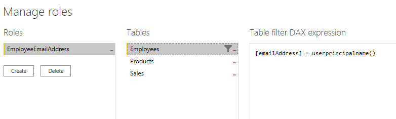

There's a way to set up row-level security only once, without the need to continue to maintain it dynamically. We would like Power BI row-level security to only show sales to the user that they individually made. In our example, Russel King has made four sales. When he visits our report, he should only see the sales he's responsible for, and no other sales. We can configure row-level security exactly the way we configured it before, with only a single change. Instead of creating four roles, we only need one role. The DAX filter for that role would look like this:

> [!div class="mx-imgBorder"]
> 

Notice that instead of the fixed string we used before like "Game" or "Clothing", we're using a DAX function in the row-level security filter. This function, userprincipalname(), will compare the email address from the Employees table with the email that the user uses to log into the Power BI service. If he uses the email address <russel@tailwindtraders.com> to sign in to the Power BI service, it will compare that value to the email address in the Employees table. Assuming there's a relationship created between Employees and Sales, Russel will only see his four sales.

