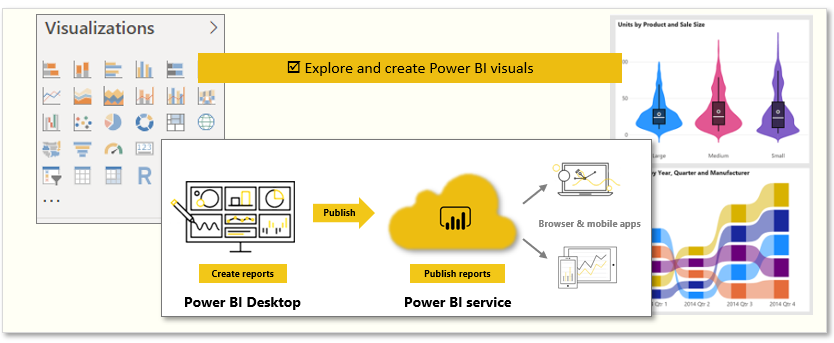
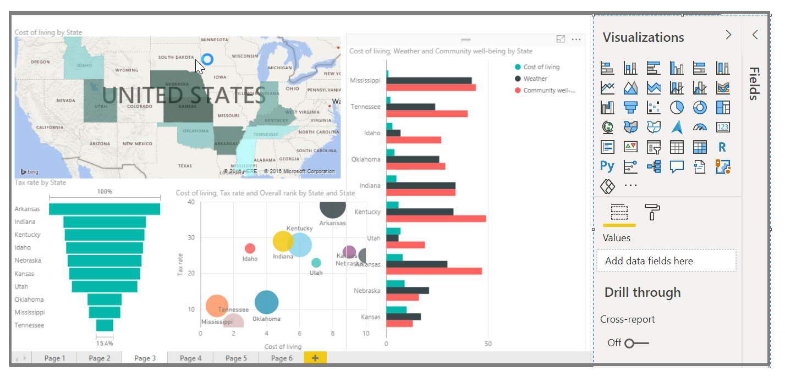

*Visuals* allow you to present data in a compelling and insightful way, and help you *show* the important components of it. Power BI has many compelling visuals and many more that are released frequently. 

The following are the tasks that you'll complete in this module:
- Explore Power BI visuals
- Create visuals

> [!VIDEO https://www.microsoft.com/videoplayer/embed/RE3kWsR]

This unit begins with the mainstays of visualizations, the simple visuals that everyone's familiar with, to make sure that you know the particulars of them. The rest of the module will provide more advanced, or at least less common, details to enhance your report-creating knowledge.

## Introduction to visuals in Power BI
Visualizing data is one of the core parts and basic building blocks of Power BI. Creating visuals is one of the most effective ways to find and share your insights.

You'll discover a wide variety of visualizations in Power BI, which offers features such as simple bar charts, pie charts, maps, and more esoteric offerings like waterfalls, funnels, and gauges. Power BI Desktop also offers extensive page formatting tools, such as shapes and images, that help bring your report to life.

