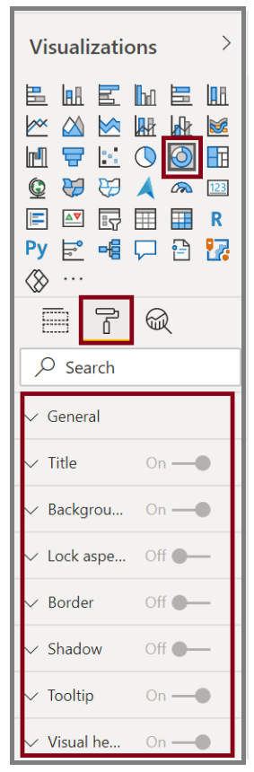
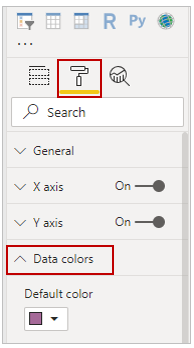
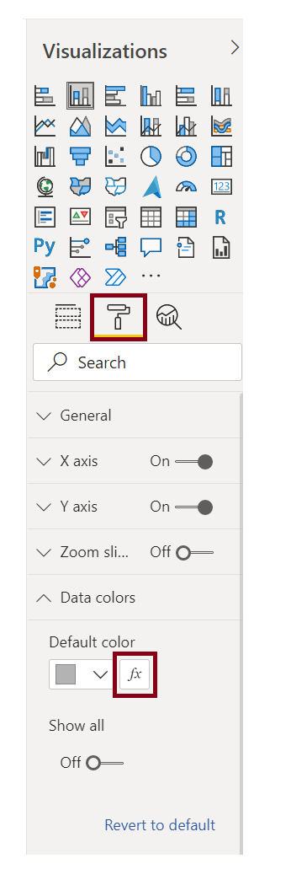
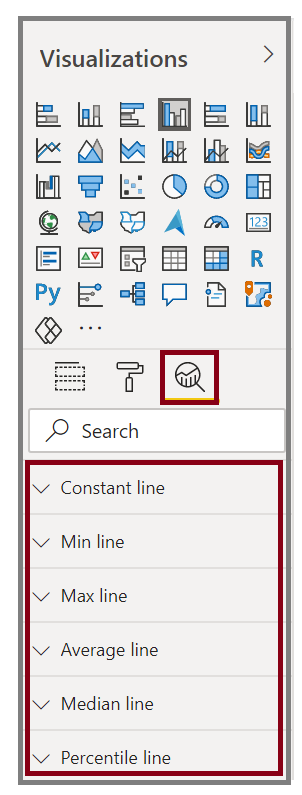

Occasionally, you might want to modify the colors that are used in charts or visuals. Power BI gives you control over how colors are displayed. To begin, select a visual and then select the paintbrush icon in the Visualizations pane.

**Video**: Modify colors
> [!VIDEO https://www.microsoft.com/videoplayer/embed/RE3oQlW]

  

Power BI provides many options for changing the colors or formatting the visual. You can change the color of all bars in a visual by selecting the color picker beside **Default color** and then selecting your color of choice.

  

You can change the color of each bar (or other element, depending on the type of visual that you selected) by turning the **Show all** slider to **On**. A color selector will then appear for each element.

## Conditional formatting

You can change the color based on a value or measure. To do so, select the vertical ellipsis next to **Default color**.

  

The resulting visuals will be colored by the gradient that you select.

  

You can use those values to create rules, for example, to set values above zero to a certain color and values below zero to another color.

In the Analytics pane, you can create many other lines for a visual, such as Min, Max, Average, Median, and Percentile lines.

  

You can create a border around an individual visualization, and like other controls, you can specify the color of that border as well.

For more information, see [Tips and tricks for color formatting in Power BI](https://docs.microsoft.com/power-bi/visuals/service-tips-and-tricks-for-color-formatting/?azure-portal=true).
