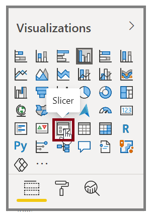
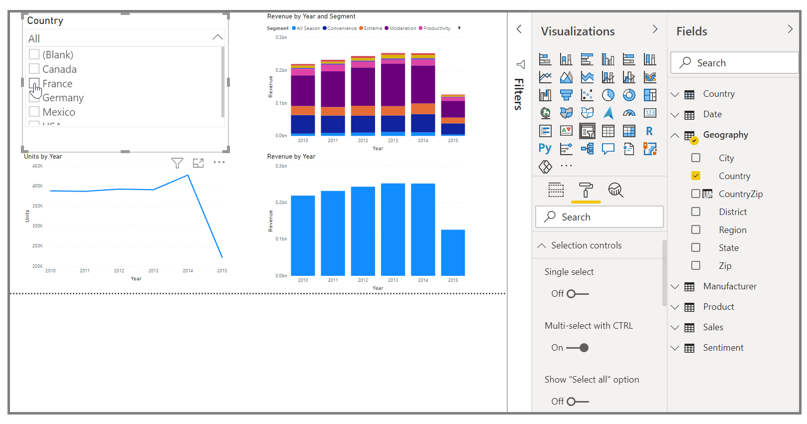
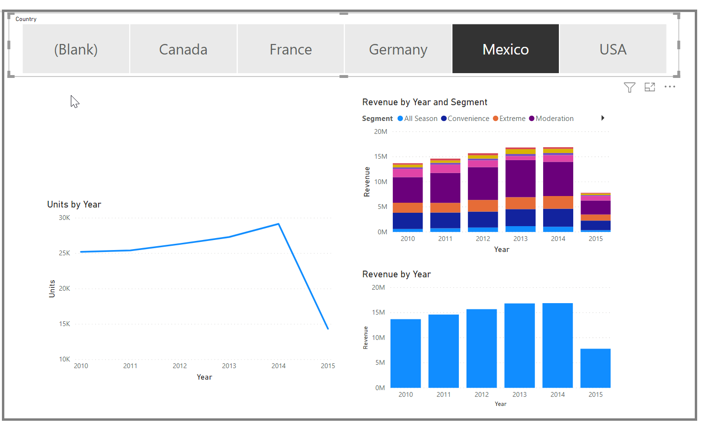

Slicers are one of the most powerful types of visualizations, particularly as part of a busy report. A *slicer* is an on-canvas visual filter that allows report users to segment the data by a specific value. Examples of filters include by year or by geographical location.

> [!VIDEO https://www.microsoft.com/videoplayer/embed/RE3oNLf]

To add a slicer to your report, select **Slicer** from the Visualizations pane.

Drag the field by which you want to slice and drop it to the top of the slicer placeholder. The visualization turns into a list of elements with check boxes. These elements are your filters. Select the box next to the one that you want to segment, and Power BI will filter, or *slice*, all other visuals on the same report page.

A few different options are available to help you format your slicer. You can set it to accept multiple inputs at once, or you can use the **Single Select** mode to use one at a time. You can also add a **Select All** option to your slicer elements, which is helpful when you have a long list. Change the orientation of your slicer from the vertical default to horizontal, and it becomes a selection bar rather than a checklist.

When you have multiple visualizations on the same report page, Power BI Desktop lets you control how interactions flow between visuals. For more information, see [Change how visuals interact in a Power BI report](https://docs.microsoft.com/power-bi/service-reports-visual-interactions).
