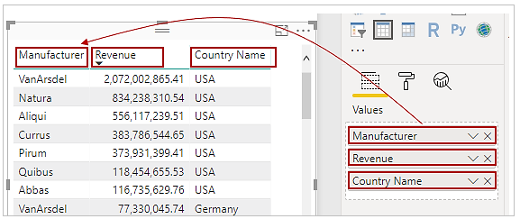
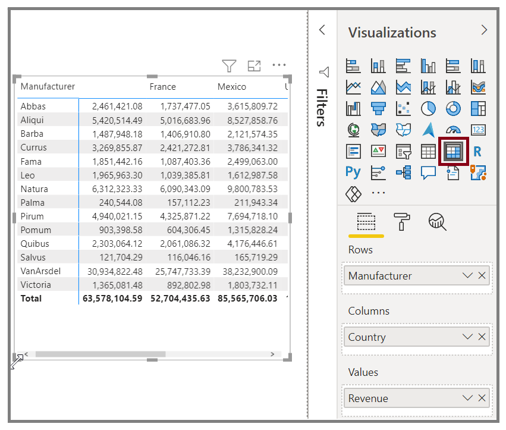

You can use Power BI Desktop to create graphical and tabular visuals.

> [!VIDEO https://www.microsoft.com/videoplayer/embed/RE3p0Lt]

If you have numerical information in a table, such as revenue, a total sum will appear at the bottom. You can manually sort by each column by selecting the column header to switch ascending or descending order. If a column isn't wide enough to display all its contents, select and drag the column header to expand it.

In the Visualizations pane, the order of the fields in the Values bucket determines the order in which they appear in your table.

A matrix is similar to a table, but it has different category headers on the columns and rows. As with tables, numerical information will be automatically totaled along the bottom and right side of the matrix.

Many cosmetic options are available for matrices, such as auto-sizing columns, switching between row and column totals, setting colors, and more. 
