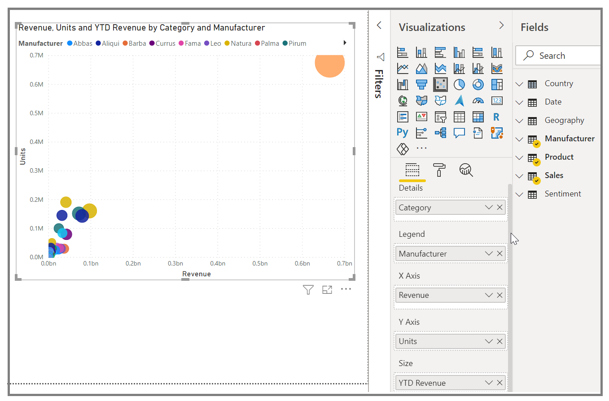
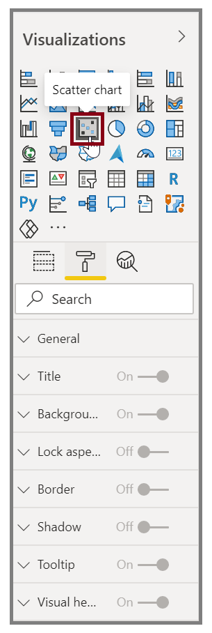
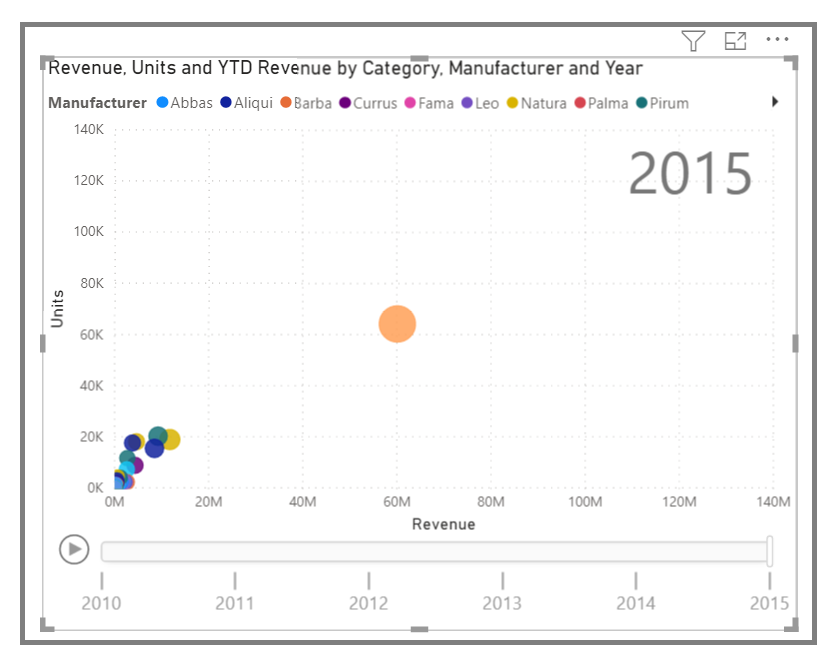
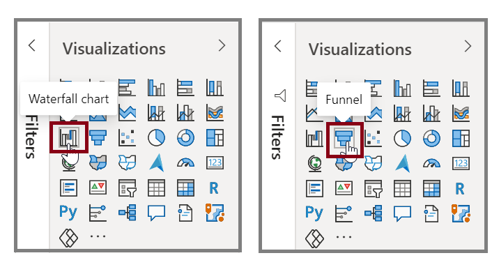
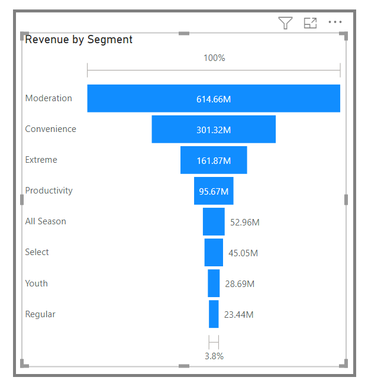

Use a scatter chart to compare two different measures, such as unit sales versus revenue.

**Video**: Create scatter charts
> [!VIDEO https://www.microsoft.com/videoplayer/embed/RE3wTTN]

To create a blank chart, select **Scatter chart** from the Visualizations pane. Drag and drop the two fields that you want to compare from the Fields pane to the *X Axis* and *Y Axis* option buckets. At this point, your scatter chart probably has a small bubble in the center of the visual. You need to add a measure to the Details bucket to indicate how you want to segment your data. For example, if you're comparing item sales and revenue, you might want to split the data by category, or manufacturer, or month of sale.

Adding another field to the Legend bucket will color-code your bubbles according to the field's value. You can also add a field to the Size bucket to alter the bubble size according to that value.

Scatter charts have many visual formatting options as well, such as turning on an outline for each colored bubble and switching between individual labels. You can change the data colors for other chart types as well.

You can create an animation of your bubble chart's changes over time by adding a time-based field to the Play Axis bucket. Select a bubble during an animation to see a trace of its path.

> [!NOTE]
> Remember, if you only see one bubble in your scatter chart, it's because Power BI is aggregating your data, which is the default behavior. To get more bubbles, add a category to the Details bucket in the Visualizations pane.

## Create waterfall and funnel charts
Waterfall and funnel charts are two of the more noteworthy (and uncommon) standard visualizations that are included in Power BI. To create a blank chart of either type, select its icon from the Visualizations pane.

**Video**: Create funnel charts and waterfall charts
> [!VIDEO https://www.microsoft.com/videoplayer/embed/RE3wZ54]

Waterfall charts are typically used to show changes in a specific value over time.

Waterfalls only have two bucket options: *Category* and *Y Axis*. Drag a time-based field, such as **Year**, to the Category bucket, and drag the value that you want to track to the Y Axis bucket. Time periods where an increase in value occurred are displayed in green by default, while periods with a decrease in value are displayed in red.

Funnel charts are typically used to show changes over a specific process, such as a sales pipeline or website retention efforts.

You can slice and customize Waterfall and Funnel charts.
