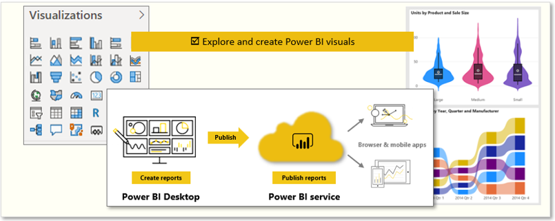
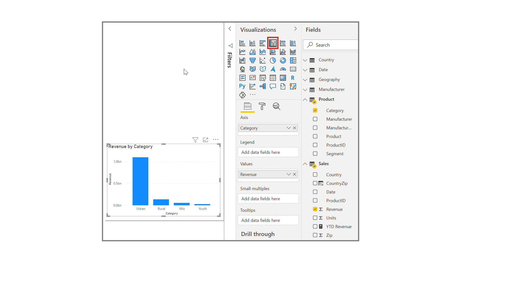

Power BI has a variety of visuals that you can use to report on the data in your data model. Visuals allow you to present the important information and insights that you discovered in the data in a compelling and insightful way. The report consumers rely on these visualizations as a gateway to the underlying data.

> [!div class="mx-imgBorder"]
> 

In Power BI Desktop, each visual is represented by an icon in the **Visualizations** pane. The types of visuals that are available include charts, maps, cards, a table, a matrix, and many more. You will learn how to select the correct visual later in this module.

In this example, you want to add a visualization to the report that displays sales data by category name. You start by selecting the **CategoryName** and **SalesAmount** fields in the **Fields** pane. Power BI Desktop then automatically selects a visualization for you, depending on the data type of the fields that you selected. In this case, the default visualization type is a table.

> [!div class="mx-imgBorder"]
> 

While the visual is selected, you can change the visualization type by selecting a different visual from the **Visualizations** pane.

> [!div class="mx-imgBorder"]
> 

