Power BI Desktop offers a range of out-of-the-box visualization options that are available directly from the **Visualizations** pane. When you select the fields that you want to display in a visualization, you can experiment with all the different visualization types to find the one that best suits your needs. If you can't find a visual that meets your needs, you can download other visuals from Microsoft AppSource or import your own custom visuals.

Depending on the type of data in your selected fields, one or more visualizations might not be suitable. For example, geographic data will not display well as a funnel chart or line chart visualization.

It is important that you choose an effective visualization to ensure that you display the data in the best way possible. The following sections outline the different types of visualizations that are available within Power BI Desktop, using the same data source for illustration purposes.

## Table and Matrix visualizations

In the previous example, the **Table** visualization was selected by default. The table is a grid that contains related data in a logical series of rows and columns. The table supports two dimensions and the data is flat, which means that duplicate values are displayed and not aggregated. It can also contain headers and a row for totals.

> [!div class="mx-imgBorder"]
> 

The **Matrix** visualization looks similar to the table visualization; however, it allows you to select one or more elements (rows, columns, values) in the matrix to cross-highlight other visuals on the report page. In the following image, notice that a new field called **Product** **Color** was added to the columns, and the available colors are now spanning across the table, with the categories listed in rows.

> [!div class="mx-imgBorder"]
> [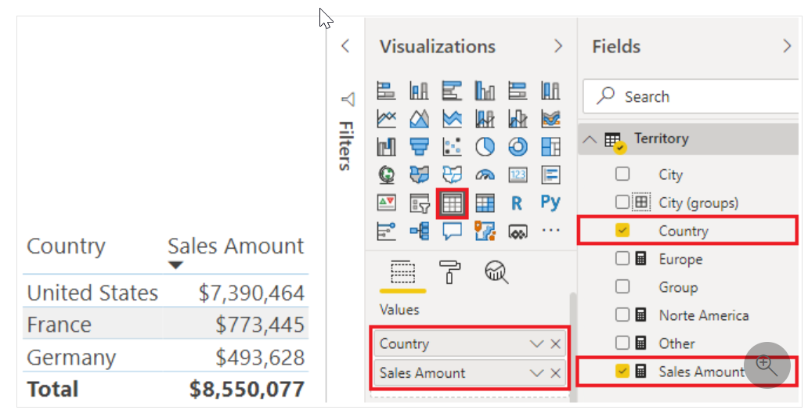](../media/3-table-visualization-ssm.png#lightbox)

## Bar and column charts

Power BI Desktop has a variety of bar and column chart visualizations that present specific data across different categories in a stacked or clustered format. The stacked format will stack the information items on top of each other.

For example, the following clustered column chart shows a single column with total sales for each country, whereas the stacked column chart shows data for sales by country, by product name. All sales data is stacked into one column to show you the total sales by country, broken down by how much each product contributed to the overall total sales.

> [!div class="mx-imgBorder"]
> [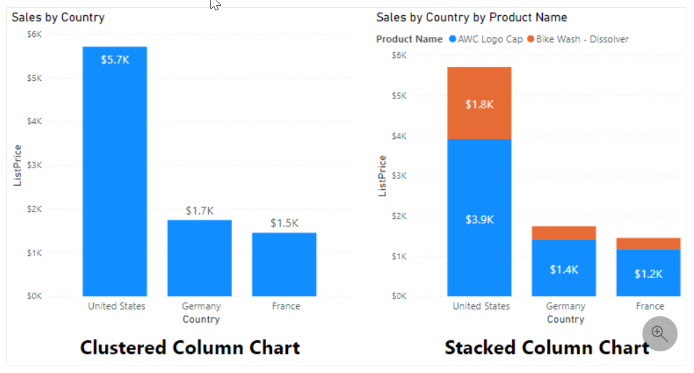](../media/3-stacked-bar-column-chart-visualization-ss.png#lightbox)

## Line and area charts

The **line chart** and **area chart** visualizations are beneficial in helping you present trends over time. The basic area chart is based on the line chart, with the area between axis and line filled in. The main difference between these two chart types is that the area chart highlights the magnitude of change over time.

> [!div class="mx-imgBorder"]
> [!Line and area chart visualization type](../media/3-area-chart-visualization-ss.png)](../media/3-area-chart-visualization-ss.png#lightbox)

## Pie chart, donut chart, and Treemaps

The **pie chart**, **donut chart**, and **Treemap** visualizations show you the relationship of parts to the whole by dividing the data into segments. From a data analysis perspective, these charts are not useful because interpreting the data that they present can be difficult. However, these charts are often used for aesthetic reasons due to the colorful segments that they display. These charts are best suited for illustrating percentages, such as the top five sales by product or country, or any other available categories.

The pie chart is a solid circle, whereas the donut chart has a center that is blank and allows space for a label or icon.

> [!div class="mx-imgBorder"]
> [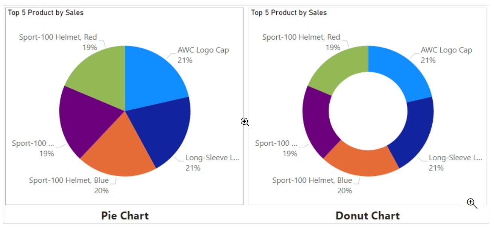](../media/3-pie-doughnut-chart-visualization-ss.png#lightbox)

When using pie charts, donut charts, and **Treemaps**, try to avoid presenting too many categories because it results in thin slices (or rectangles) that provide no added value to the user. If you do need to present all categories in your dataset, it's better to use another type of visual, such as a column chart.

Pie charts and donut charts present data by dividing it into slices, while the **Treemap** visualization displays data as a set of nested rectangles. Each level of the hierarchy is represented by a colored rectangle (branch) containing smaller rectangles (leaves). The space inside each rectangle is allocated based on the value that is being measured. The rectangles are arranged in size from top left (largest) to bottom right (smallest).

> [!div class="mx-imgBorder"]
> [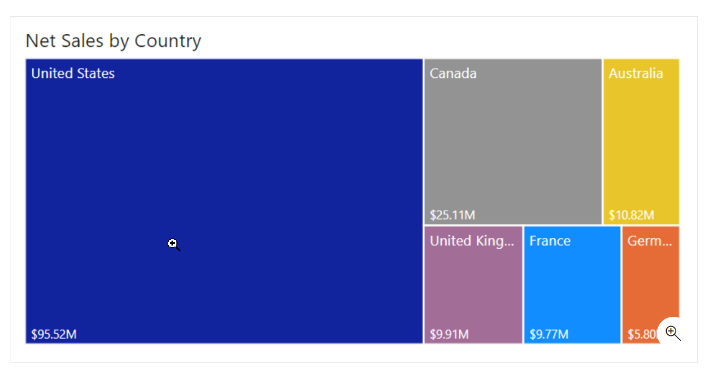](../media/3-treemap-visualization-ss.png#lightbox)

A **Treemap** is ideal to visualize:

-   Large amounts of hierarchical data when a bar chart can't effectively handle the large number of values.

-   Proportions between each part and the whole.

-   The distribution pattern of the measure across each level of categories in the hierarchy.

-   Attributes, by using size and color coding.

-   Spot patterns, outliers, most-important contributors, and exceptions.

## Combo charts

The **combo** chart visualization is a combination of a column chart and a line chart that can have one or two Y axes. The combination of the two charts into one lets you:

-   Compare multiple measures with different value ranges.

-   Illustrate the correlation between two measures in one visual.

-   Identify whether one measure meets the target that is defined by another measure.

-   Conserve space on your report page.

> [!div class="mx-imgBorder"]
> [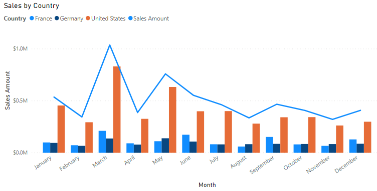](../media/3-line-clustered-column-chart-visualization-ss.png#lightbox)

## Card visualization

The **card** visualization displays a single value: a single data point. This type of visualization is deal for visualizing important statistics that you want to track on your Power BI dashboard or report, such as total value, YTD sales, or year-over-year change.

The **multi-row** card visualization displays one or more data points, with one data point for each row.

> [!div class="mx-imgBorder"]
> [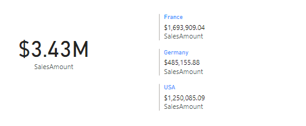](../media/3-card-visualizations-ss.png#lightbox)

## Funnel visualization

The **funnel** visualization displays a linear process that has sequential connected stages, where items flow sequentially from one stage to the next.

Funnel charts are most often seen in business or sales contexts. For example, they are useful for representing a workflow, such as moving from a sales lead to a prospect, through to a proposal and sale.

> [!div class="mx-imgBorder"]
> [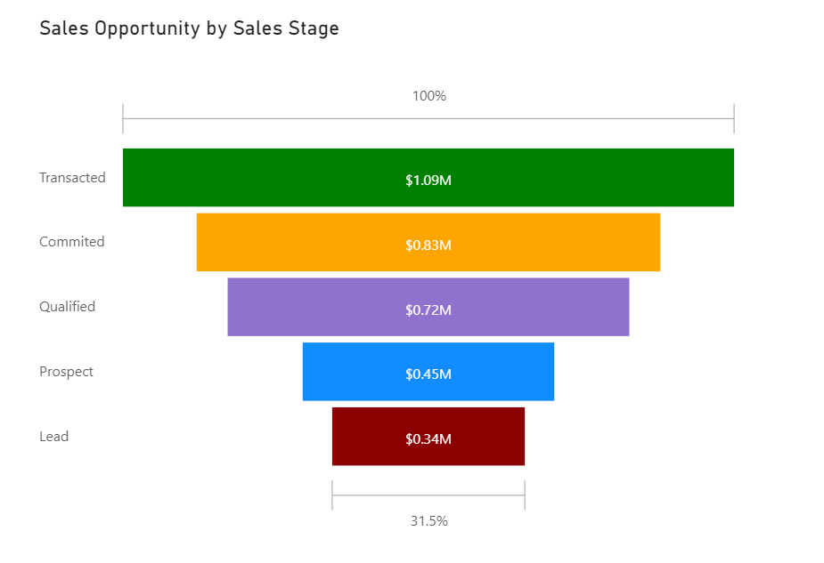](../media/3-funnel-visualization-ss.png#lightbox)

Funnel charts are great options in the following contexts:

-   When the data is sequential and moves through at least four stages.

-   When the number of items in the first stage is expected to be greater than the number of items in the final stage.

-   To calculate a potential outcome (revenue, sales, deals, and so on) by stages.

-   To calculate and track conversion and retention rates.

-   To reveal bottlenecks in a linear process.

## Gauge chart

A radial gauge chart has a circular arc and displays a single value that measures progress toward a goal or target.

The value at the end of the arc represents the defaulted maximum value, which will always be double the actual value. To create a realistic visual, you should always specify each of the values. You can accomplish this task by dropping the correct field that contains an amount into the **Target value**, **Minimum value**, and **Maximum value** fields on the **Visualization** pane.

The shading in the arc represents the progress toward that target. The value inside the arc represents the progress value. Power BI spreads all possible values evenly along the arc, from the minimum (left-most value) to the maximum (right-most value).

> [!div class="mx-imgBorder"]
> [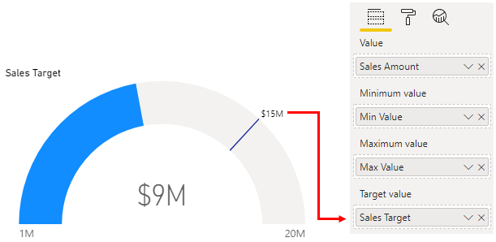](../media/3-gauge-visualization-ss.png#lightbox)

Radial gauges can be used to show the progress that is being made toward a goal or target, or they can show the health of a single measure. However, radial gauges do take up a lot of space in comparison to the insights that they provide. It is more effective to use a pair of gauges with a spark line so users can see the trend and know what to do about it.

## Waterfall visualization

The **waterfall** visualization (also known as a bridge chart) shows a running total as values are added or subtracted, which is useful in displaying a series of positive and negative changes. The chart consists of color-coded columns, so you can quickly identify increases and decreases. The initial and the final value columns often start on the horizontal axis, while the intermediate values are floating columns.

> [!div class="mx-imgBorder"]
> [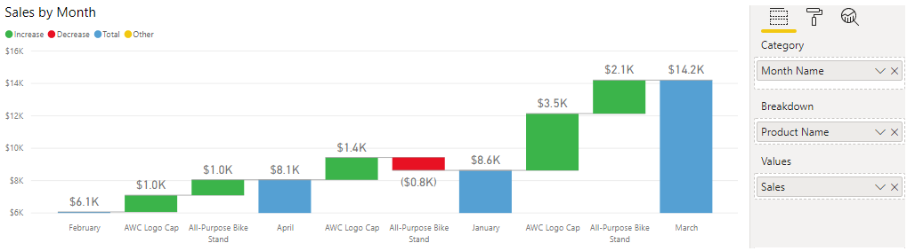](../media/3-waterfall-visualization-ss.png#lightbox)

Waterfall charts can be used to:

-   Visualize changes over time or across different categories.

-   Audit the major changes that contribute to the total value.

-   Plot your organization's annual profit by showing various sources of revenue to help determine the total profit (or loss).

-   Illustrate the beginning and ending headcount for your organization in a year.

-   Visualize how much money you earn and spend each month and the running balance for your account.

## Scatter chart

The **scatter** chart visualization is effective when you are comparing large numbers of data points without regard to time. The scatter chart has two value axes to show: one set of numerical data along a horizontal axis and another set of numerical values along a vertical axis. The chart displays points at the intersection of an X and Y numerical value, combining these values into single data points. These data points might be distributed evenly or unevenly across the horizontal axis, depending on the data. You can set the number of data points, up to a maximum of 10,000.

You might want to use a scatter chart instead of a line chart because it allows you to change the scale of the horizontal axis. Scatter charts also allow you to:

-   Show relationships between two numerical values.

-   Plot two groups of numbers as one series of x and y coordinates.

-   Turn the horizontal axis into a logarithmic scale.

-   Display worksheet data that includes pairs or grouped sets of values.

-   Show patterns in large sets of data, for example, by showing linear or non-linear trends, clusters, and outliers.

-   Compare large numbers of data points without regard to time. The more data that you include in a scatter chart, the better the comparisons that you can make.

The following example shows a scatter chart that displays outliers (anomalies) with a trendline going up. The chart clearly shows that most products were sold at the same quantity, and only some products were sold in larger quantities. By identifying those outliers, you can run further analysis and break them down by country and region, which can help to improve logistics, decrease costs, and increase customer satisfaction.

> [!div class="mx-imgBorder"]
> [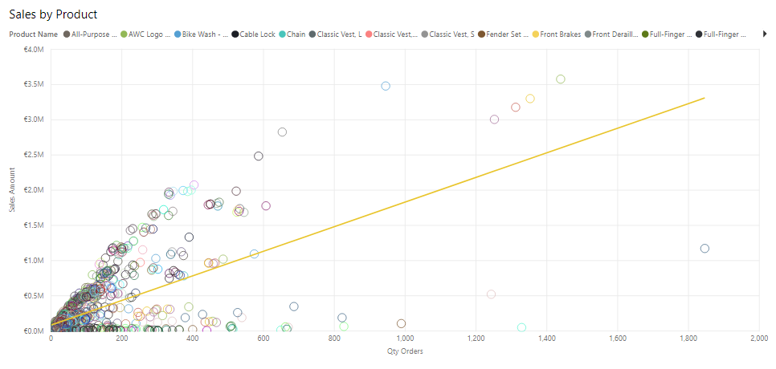](../media/3-scatter-chart-visualization-ss.png#lightbox)

## Maps

Power BI integrates with Bing Maps to provide default map coordinates (a process called geocoding), so you can create maps. Together, they use algorithms to identify the correct location; however, sometimes, it's a best guess.

A *basic* map (*bubble* map) is used to associate categorical and quantitative information with spatial locations. This type of map visual displays precise geographical locations of data points on a map, as illustrated in the following image. A *fill* map uses shading, tinting, or patterns to display how a value differs in proportion across a geographical region. Similarly, *shape* maps use colors to display relative comparisons of geographical regions. You can also use an ArcGIS map to display graphical information in a more interactive way.

> [!div class="mx-imgBorder"]
> [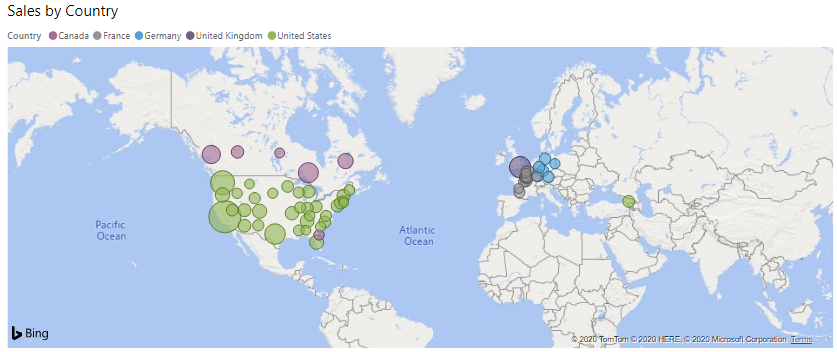](../media/3-map-visualization-ss.png#lightbox)

## Slicer visualization

The **slicer** visualization is a standalone chart that can be used to filter the other visuals on the page. Slicers provide a more advanced and customized way of filtering, in comparison to the **Filters** pane, which is suited to more basic filtering operations. You can learn more about these two filtering options in another module.

Slicers come in many different formats, including list, drop-down, and buttons, and they can be formatted to allow the selection of only one, many, or all available values.

Slicers are ideal to:

-   Visualize commonly used or important filters on the report canvas for easier access.

-   Simplify your ability to see the current filtered state without having to open a drop-down list.

-   Filter by columns that are unneeded and hidden in the data tables.

-   Create more focused reports by putting slicers next to important visuals.

> [!TIP]
> Using a slicer that is set to a drop-down format will defer the queries that are being sent to the dataset and can help improve performance.

> [!div class="mx-imgBorder"]
> [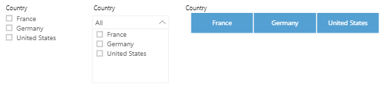](../media/3-slicer-visualization-ss.png#lightbox)

## Q&A visualization

The **Q&A** visualization allows you to ask natural language questions and get answers in the form of a visual. This ability to ask questions is valuable to consumers and to you, the report author. This visualization type can help you create visuals in the report, and it can also be used as a tool for consumers to get answers quickly.

The Q&A visualization consists of the following four core components:

-   The question box, where users enter their question and are shown suggestions to help them complete the question.

-   A pre-populated list of suggested questions.

-   An icon that users can select to convert the Q&A visual into a standard visual.

-   An icon that users can select to open Q&A tooling, which allows designers to configure the underlying natural language engine. When entering natural language queries with Power BI Q&A, you can specify the visual type in your query. The following example illustrates how to implement **Net sales by country**.

> [!div class="mx-imgBorder"]
> [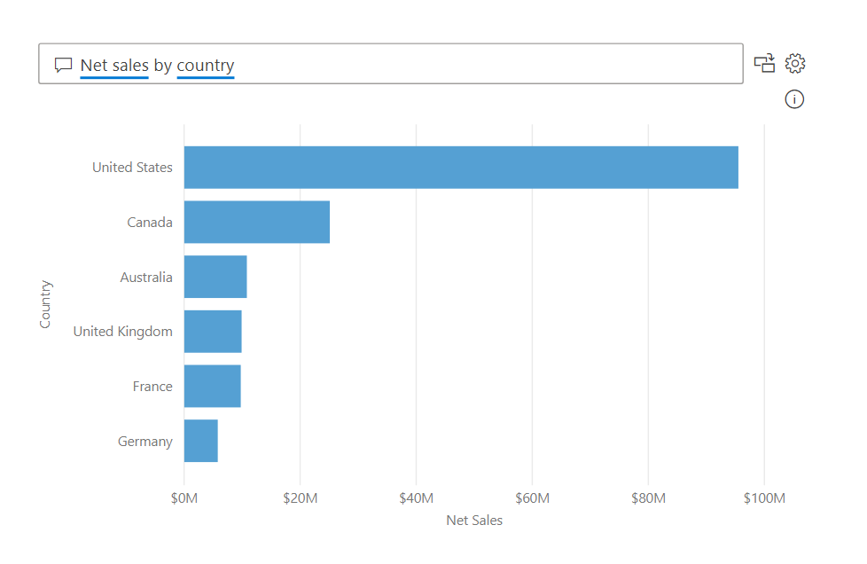](../media/3-question-answer-visualization-ss.png#lightbox)

