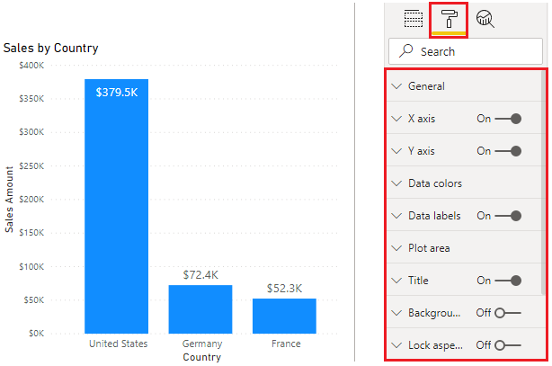
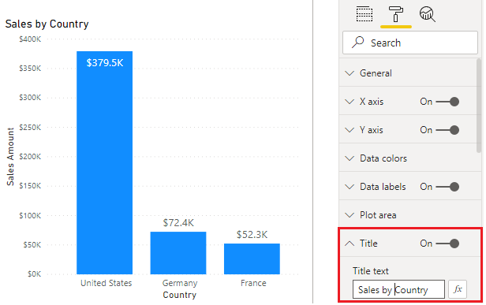
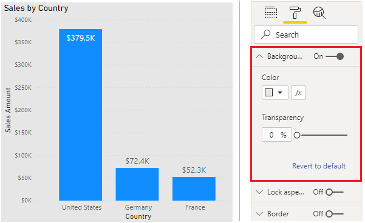
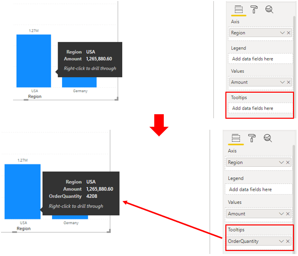
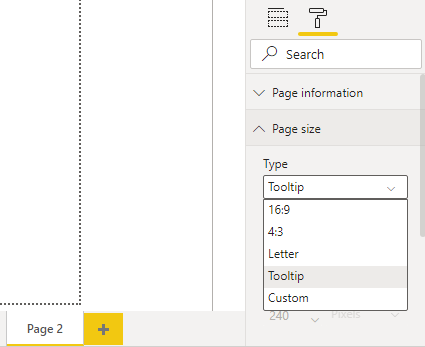
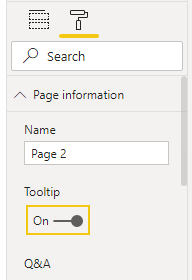
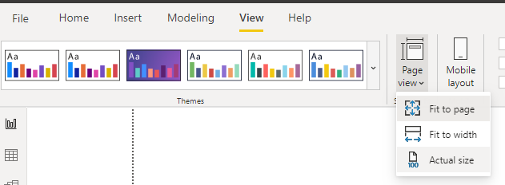
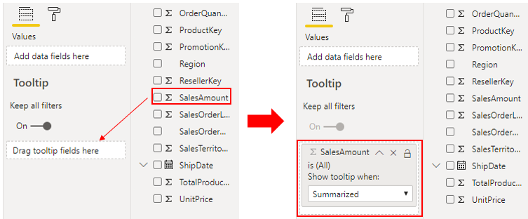
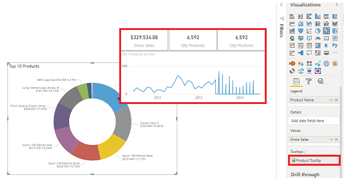

Power BI Desktop gives you a variety of options for customizing how your selected visualizations look, such as the colors and format of the text that they contain. You should take time to explore the options to determine what impact they each have on a visual.

In this example, you will format and configure the default clustered column chart visualization to better meet the needs of your report requirements.

Start by selecting the visualization on the canvas, and then select the **Format** button (paint roller icon) to display the **Format** pane.

> [!div class="mx-imgBorder"]
> 

The formatting options that are available will depend on the type of visualization that you selected.

Common formatting options include the **Title**, **Background**, and **Border**. In the **Title** section, you can add a title to the visual, if it does not have one, or edit the title, if it has one already. The aim of the title is to clearly describe what data is being presented in the visual. You can format the title by changing the text, text size, font, color, background, and alignment. The subsequent section shows an example of customizing a title.

In the **Background** section, you can set any color or image as the background for the visual. If you plan to use an image as a background, try to select an image that won't have lines or shapes that would make it difficult for the user to read the data. It is best to keep a white background so the presented data can be clearly seen. The subsequent section shows an example of customizing a background.

In the **Border** section, you can set a border around the visual to isolate the visual from other elements on the canvas, which helps make it easier for the user to read and understand the data. You can change the border color and radius to be consistent with your color scheme.

If a **General** section is available, you'll be able to set the precise size and place for your visual on your canvas. This option might be suitable if the drag-and-drop feature is not placing the visual exactly where you want it to be. It can also be useful to ensure that you have aligned specific visuals consistently.

You might also be able to format the colors and labels for specific data values. In the **Data colors** section, you can set the colors that you want to use for the data values in the visual. You can use different colors for different fields, but always try to be consistent when it comes to selecting those colors. It is best to use the same color scheme throughout the report. In the **Data labels** section, you can change fonts, size, and colors for all labels in the visual. Try to use solid colors so the labels are clearly visible. For example, if the background is white, use a black or dark grey color to display your labels.

The **Tooltips** section allows you to add a customized tooltip that appears when you hover over the visual, based on report pages that you create in Power BI Desktop. Tooltips is a great feature because it provides more contextual information and detail to data points on a visual. The default tooltip displays the data point's value and category, but your custom tooltips can include visuals, images, and any other collection of items that you create in the report page. The subsequent section shows an example of customizing a tooltip.

As you make changes in the **Format** pane, notice that the visualization updates immediately to reflect those changes. If you need to revert the changes that you make, select the **Revert to default** option at the bottom of each section in the **Format** pane.

In the following examples, you will edit the title, change the background, and add a tooltip.

## Title

You can edit a default title and add a title, if you don't have one. In this example, you will select the column chart visualization and then, in the **Format** pane, scroll down and expand the **Title** section. Edit the current title by changing it to **Total Sales by Country**, and then increase the font size to 16 points.

> [!div class="mx-imgBorder"]
> 

## Background

It is best practice to keep the default white background so the presented data can be clearly seen. However, you can change the default background color to make a visualization more colorful and easier to read or to match a particular color scheme. In this example, continue with the column chart that is selected and then, in the **Format** pane, expand the **Background** section and change the color to light grey.

> [!div class="mx-imgBorder"]
> 

## Tooltip

Using tooltips is a clever way of providing more contextual information and detail to data points on a visual. When you add a visual, the default tooltip displays the data point's value and category, but you can customize this information to suit your needs. For example, you might want to provide your report users with additional context and information, or specify additional data points that you want users to see when they hover over the visual.

To expand on the data points that are displayed in the default tooltip, you can drag a field from the **Fields** panel into the **Tooltips** bucket. However, you should not add many more fields to the tooltips because adding too many fields can introduce performance issues and slow down your visuals.

The following image shows the default tooltip first and then the customized tooltip that displays additional data.

> [!div class="mx-imgBorder"]
> 

Another way to use tooltips is to display graphical information. The process of adding this type of tooltip is not as straightforward, but it is worthwhile. You would begin by creating a new page in the report.

Open the new page and then open the **Format** pane. Expand the **Page Size** section and then select **Tooltip** from the **Type** list.

> [!div class="mx-imgBorder"]
> 

In the **Page information** section, turn the **Tooltip** slider to **On** so that Power BI registers this page as a tooltip page

> [!div class="mx-imgBorder"]
> 

Tooltips have limited canvas space, so to ensure that your visuals appear in the tooltip, on the **View** tab, set the **Page view** option to **Actual size**.

> [!div class="mx-imgBorder"]
> 

Next, add one or more visuals to the tooltip page, in the same way that you would on any other report page.

Now, you need to specify the fields for which you want the tooltip to display. Select the tooltip page and then select the **Values** tab in the **Visualizations** pane. Drag the fields from the **Fields** pane into the **Tooltip** bucket. In this example, you will drag the **SalesAmount** field into the **Tooltip** bucket.

> [!div class="mx-imgBorder"]
> 

Return to the report page and apply the tooltip to one or more visuals on that page. Select a visual and then, in the **Format** pane, scroll down to the **Tooltip** section. Turn the tooltip option **On** and then select your tooltip page from the **Page** list.

When you hover over the visual, the tooltip will display.

> [!div class="mx-imgBorder"]
> 

