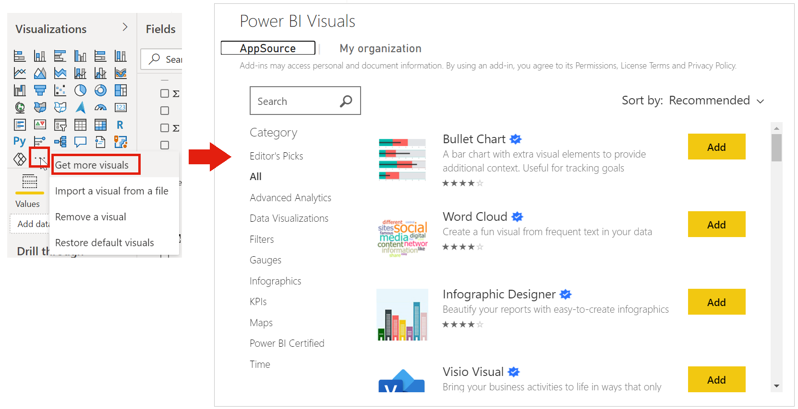
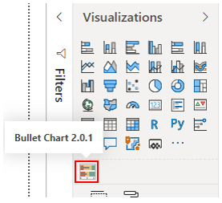
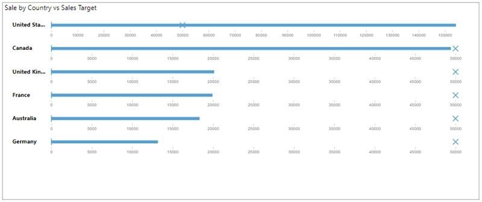

In addition to the out-of-the-box visualizations in Power BI Desktop, hundreds of other developers have created a multitude of visuals for you to choose from. If you have a specific visual in mind, you can likely find it in the marketplace. If you can't find it, Power BI makes it possible for you to build your own.

The custom visuals that are available in Microsoft AppSource are created by Microsoft and Microsoft partners. Some of these custom visuals are certified and some are not. The certified status means that the visual meets the Microsoft Power BI team code requirements; the visual is tested to verify that it doesn't access external services or resources and that it follows secure coding patterns and guidelines. The certification process is optional, so an uncertified visual is not necessarily unsafe to use.

> [!NOTE]
> Some organizations prefer not to use custom visuals for security or other reasons. Before you import custom visuals, check with your organization to see whether custom visuals are allowed or not. If they are not allowed, you can still create reports in Power BI Desktop with them, but they will not render in Power BI service.

If you want to create your own custom visual, you can use the custom visual software development kit (SDK), which is an open-source tool based on NodeJS (JavaScript programming language) that is available on GitHub. The custom visual is packaged as a single Power BI Visual Tools (.pbiviz) file that you can import into Power BI Desktop.

Creating a custom visual is beyond the scope of this unit, so in this example, you will import a custom visual from AppSource.

In the **Visualizations** pane, select the **Get more visuals** icon and then select **Get more visuals**. On the window that displays, locate and select the visual that you want to import and then select **Add**.

> [!div class="mx-imgBorder"]
> 

The new visual will appear under the other visuals in the **Visualizations** pane. To add the visual to your report, select its icon. You can then add fields to the visual and customize its formatting, just like you would for any other visual.

> [!div class="mx-imgBorder"]
> 

> [!div class="mx-imgBorder"]
> 
