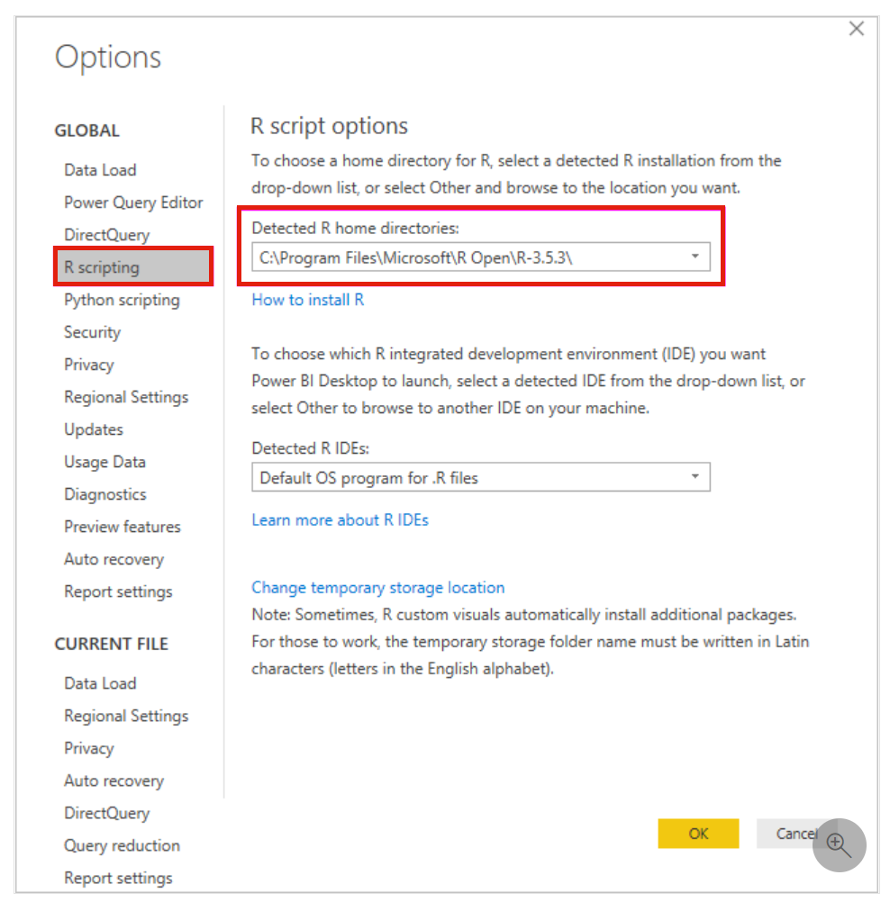
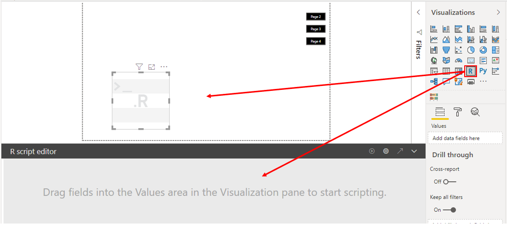
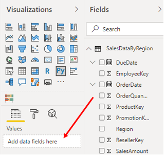
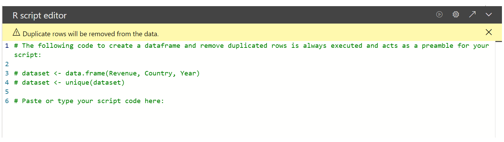
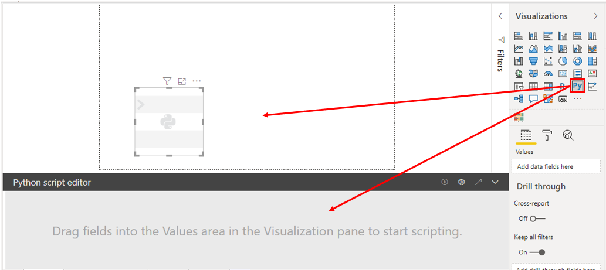
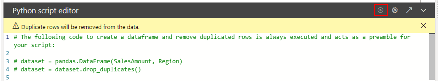
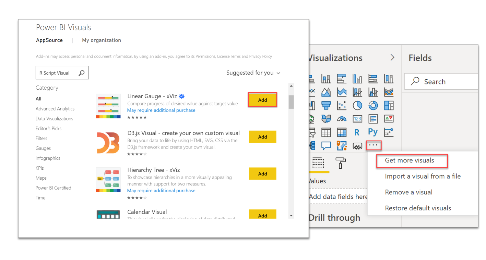

If you use the R or Python programming language, you can use them to visualize your data within Power BI Desktop. Power BI Desktop has an out-of-the-box visualization option for both R and Python that you can access on the **Visualizations** pane, and the process for creating these visuals is almost the same. You can also import a custom R or Python visual from Microsoft AppSource.

> [!NOTE]
> If you decide to use an R or Python visual, and you want to refresh the data in Power BI service, you'll need to use a personal gateway. For more information, see [Use personal gateways in Power BI](https://docs.microsoft.com/power-bi/connect-data/service-gateway-personal-mode/?azure-portal=true).

## Create an R visual

Before you create the R visual, you must install R on your local computer so that Power BI Desktop can run R scripts. You can download and install R for free from many locations, including the [Microsoft R Application Network](https://mran.revolutionanalytics.com/download/?azure-portal=true) and the [CRAN Repository](https://cran.r-project.org/bin/windows/base/?azure-portal=true).

When you have downloaded and installed R, Power BI enables it automatically, but you should verify that it has been enabled in the correct location. In Power BI Desktop, select **File** **>** **Options and settings** **>** **Options** and then select **R scripting** in the **Global** options list. Verify that your local R installation is specified in the **Detected R home directories** drop-down menu and that it properly reflects the local R installation that you want Power BI Desktop to use. In the following image, the path to the local installation of R is C:\Program Files\R Open\R-3.5.3\.

> [!div class="mx-imgBorder"]
> 

When you've verified your R installation, you can create the R visual.

Select the **R visual** icon in the **Visualizations** pane and then select **Enable** on the window that displays. You'll then see a placeholder R visual image on the report canvas, with the **R script editor** underneath.

> [!div class="mx-imgBorder"]
> 

Next, in the **Field** panel, select the fields that you want to use in your script. They will display in the **Values** section in the **Visualizations** pane. You'll use the data in these fields to create a plot.

> [!div class="mx-imgBorder"]
> 

As you select or remove fields, supporting code in the **R script editor** is automatically generated or removed. Based on your selections, the **R script editor** generates the following binding code:

-   The editor created a dataset dataframe with the fields that you added.

-   The default aggregation is: do not summarize.

-   Similar to table visuals, fields are grouped and duplicate rows appear only once.

When you have selected the fields, you're ready to write an R script that results in plotting to the R default device. When the script is complete, select **Run** from the **R script editor** title bar.

> [!div class="mx-imgBorder"]
> 

Power BI Desktop identifies the plot and presents it on the canvas.

## Create a Python visual

No prerequisites exist for creating a Python visual, so you can start right away in Power BI Desktop by selecting the **Python visual** icon in the **Visualizations** pane. Select **Enable** on the window that displays, and then you'll then see a placeholder Python visual image on the report canvas, with the **Python script editor** underneath.

> [!div class="mx-imgBorder"]
> 

You can continue creating a Python visual in the same way as you did when creating the R visual. In summary, you would select the fields, write the Python script, and then select **Run** from the **Python script editor** title bar.

> [!div class="mx-imgBorder"]
> 

## Import an R or Python visual

To import an R or Python visual from AppSource, in the **Visualizations** pane, select the **Get more visuals** icon and then select **Get more visuals**. On the window that displays, locate and select the R or Python visual that you want to import and then select **Add**.

> [!div class="mx-imgBorder"]
> 

The new visual icon will appear under the other visual icons in the **Visualizations** pane.
