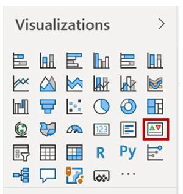
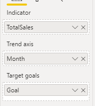
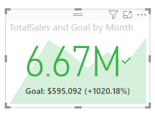
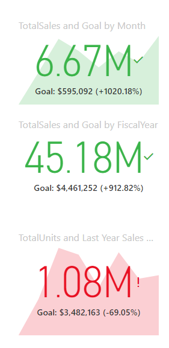

Key performance indicators (KPIs) are excellent in helping you track progress toward a specific goal over time. To use a KPI, you need three pieces of information:

-   A unit of measurement that you want to track, for instance total sales, number of employee hires, number of loans serviced, or number of students enrolled.

-   A goal for the measurement so that you can compare your progress with that goal.

-   A time series, for instance daily, monthly, or yearly.

Start by adding the KPI visual to the design service. The following screenshot shows the KPI icon in the **Visualizations** pane.

> [!div class="mx-imgBorder"]
> 

When configuring the KPI visual, enter the unit of measurement that you are tracking in the **Indicator** prompt. Then, enter the goal under **Target goals** and select the time series from the **Trend axis** drop-down list, as shown in the following screenshot.

> [!div class="mx-imgBorder"]
> 

This action will produce a KPI that looks similar to the following screenshot.

> [!div class="mx-imgBorder"]
> 

KPIs work best in a series, for instance, showing the daily, monthly, and yearly goals in the section of a Power BI report.

> [!div class="mx-imgBorder"]
> 
