In this lab, you will create a three-page report named **Sales Report**. You will then publish it to Power BI, whereupon you will open and interact with the report.

In this lab, you learn how to:

-   Use Power BI Desktop to create a live connection

-   Design a report

-   Configure visual fields and format properties

> [!IMPORTANT]
> This exercise will require you to login to Power BI service,  you can use your existing account or create a trial account before starting this lab. 

**Lab Preparation: Publishing Sales Analysis report to Power BI.** 
In this task, you will publish Power BI file Sales Analysis.pbix to Power BI. 
 
1.	To open the Power BI Desktop, on the taskbar, click the Microsoft Power BI Desktop shortcut.

1.	At the top-right corner of the welcome screen, click X.
 
1.	Click the **File** ribbon tab to open the backstage view, and then select **Open Report**. 

1.	In the **Open Report** window, click **Browse reports**, navigate to the **D:\DA100\Lab08A\Starter** folder, select **Sales Analysis.pbix file**. 

1.	Click **Open** and save the Power BI Desktop file.

1.	To publish the file, on the **Home** ribbon tab, from inside the Share group, and then click **Publish**.
 
1.	You will be prompted to login to your Power BI account. Enter your Power BI credentials and password. 

1.	In the **Publish to Power BI** window, select your workspace. 

1.	Click **Select**.
 
1.	When the file has been successfully published, click **Got it**.
 
1.	Click **X** to close the Power BI Desktop and select **Save to the file**. 

## Create a report

In this exercise, you will create a three-page report named **Sales Report**.

### Create a new file

In this task, you will create a live connection to the **Sales Analysis** dataset.

1.  To open the Power BI Desktop, on the taskbar, click the Microsoft Power BI Desktop shortcut.

1.  At the top-right corner of the welcome screen, click **X**.

	> [!div class="mx-imgBorder"]
	> 

1.  Click the **File** ribbon tab to open the backstage view, and then select **Save As**.
 
1.  In the **Save As** window, navigate to the **D:\DA100\MySolution** folder.

1.  In the **File Name** box, enter **Sales Report**.

	> [!div class="mx-imgBorder"]
	> [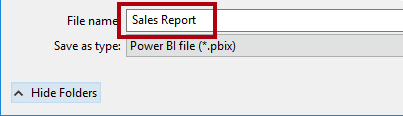](../media/lab-2-ssm.png#lightbox)

1.  Click **Save**.

### Create a live connection

In this task, you will create a live connection to the **Sales Analysis** dataset.

1.  To create a live connection, on the **Home** ribbon tab, from inside the **Data** group, click **Get Data**, down-arrow, and then select **Power BI Datasets**.

1.  In the **Select a Dataset to Create a Report** window, select the **Sales Analysis** dataset.

	> [!div class="mx-imgBorder"]
	> [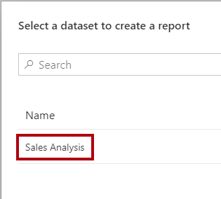](../media/lab-3-ssm.png#lightbox)

1.  Click **Create**.

1. At the bottom-right corner, in the status bar, notice that the live connection has been established.

1. In the **Fields** pane, notice that the data model tables are listed.

	Power BI Desktop can no longer be used to develop the data model; in live connection mode, it's only a report authoring tool. It is possible, however, to create measures, but they are measures that are only available within the report. You won't add any report-scoped measures in this lab.

1. Save the Power BI Desktop file.

You're the owner of the Power BI dataset, and you can see all data.

When you share reports and dashboards to non-owners of the dataset, their account (or a security group of which they're a member) must be mapped to the **Salespeople** role. You will configure this before sharing content.

### Design page 1

In this task, you will design the first report page. When you've completed the design, the page will look like the following:

> [!div class="mx-imgBorder"]
> [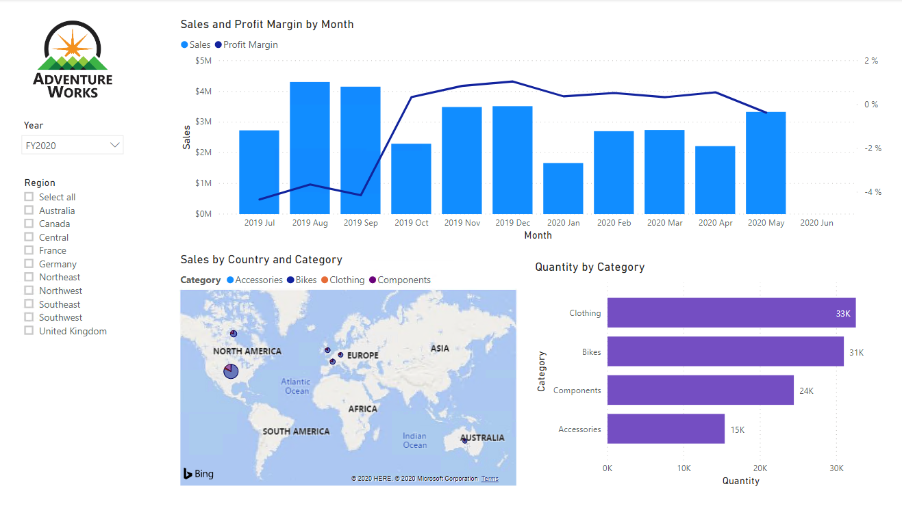](../media/lab-4-ss.png#lightbox)

1. To rename the page, at the bottom-left, right-click **Page 1**, and then select **Rename**.

	> [!div class="mx-imgBorder"]
	> [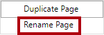](../media/lab-5-ssm.png#lightbox)

	> [!TIP]
	> You can also double-click the page name.

1. Rename the page as **Overview**, and then press **Enter**.

	> [!div class="mx-imgBorder"]
	> 

1. To add an image, on the **Insert** ribbon tab, from inside the **Elements** group, click **Image**.

1. In the **Open** window, navigate to the **D:\DA100\Data** folder.

1. Select the **AdventureWorksLogo.jpg** file, and then click **Open**.

1. Drag the image to reposition it at the top-left corner, and also drag the guide markers to resize it.

	> [!div class="mx-imgBorder"]
	> 

1. To add a slicer, first de-select the image by clicking an empty area of the report page.

1. In the **Fields** pane, select the **Date | Year** field (not the **Year** level of the hierarchy).

1. Notice that a table of year values has been added to the report page.

1. To convert the visual from a table to a slicer, in the **Visualizations** pane, select the **Slicer**.

	> [!div class="mx-imgBorder"]
	> [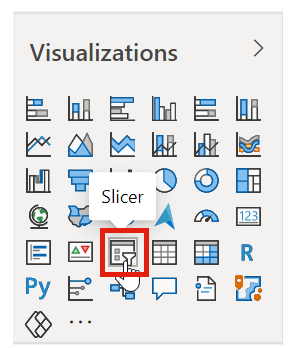](../media/lab-8-ssm.png#lightbox)

1. To see the table in expanded form, click Focus mode.

1. 1. To convert the slicer from a list to a dropdown, at the top-right of the slicer, click the down-arrow, and then select **Dropdown**.

	> [!div class="mx-imgBorder"]
	> 

1. Resize and reposition the slicer so it sits beneath the image, and so it is the same width as the image.

	> [!div class="mx-imgBorder"]
	> 

1. In the **Year** slicer, select **FY2020**, and then collapse the dropdown list.

	> [!div class="mx-imgBorder"]
	> 

	The report page is now filtered by year **FY2020**.

1. De-select the slicer by clicking an empty area of the report page.

1. Create a second slicer, based on the **Region | Region** field (not the **Region** level of the hierarch).

1. Leave the slicer as a list, and then resize and reposition the slicer beneath the **Year** slicer.

	> [!div class="mx-imgBorder"]
	> [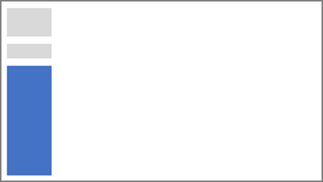](../media/lab-12-ss.png#lightbox)

1. To format the slicer, beneath the **Visualizations** pane, open the **Format** pane.

	> [!div class="mx-imgBorder"]
	> [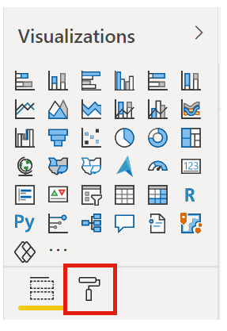](../media/lab-13-ssm.png#lightbox)

1. Expand then **Selection Controls** group.

	> [!div class="mx-imgBorder"]
	> [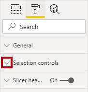](../media/lab-14-ssm.png#lightbox)

1. Set the **Show "Select All" Option** to **On**.

	> [!div class="mx-imgBorder"]
	> [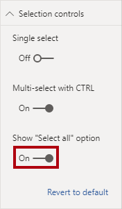](../media/lab-15-ssm.png#lightbox)

1. In the **Region** slicer, notice that the first item is now **Select All**.

	When selected, this item either selects all, or de-selects all items. It makes it easier for report users to set the right filters.

1. De-select the slicer by clicking an empty area of the report page.

1. To add a chart to the page, in the **Visualizations** pane, click the **Line and Stacked Column Chart** visual type.

	> [!div class="mx-imgBorder"]
	> [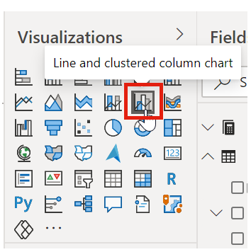](../media/lab-16-ssm.png#lightbox)

1. Resize and reposition the visual so it sits to the right of the logo, and so it fills the width of the report page.

	> [!div class="mx-imgBorder"]
	> 

1. Drag the following fields into the visual:

	-   Date | Month
	
	-   Sales | Sales

1. In the visual fields pane (not the **Fields** pane, the visual fields pane is located beneath the **Visualizations** pane), notice that the fields are assigned to the **Shared Axis** and **Column Values** wells.

	> [!div class="mx-imgBorder"]
	> 

	By dragging visuals into a visual, they will be added to default wells. For precision, you can drag fields directly into the wells, as you will do now.

1. From the **Fields** pane, drag the **Sales | Profit Margin** field into the **Line Values** well.

	> [!div class="mx-imgBorder"]
	> [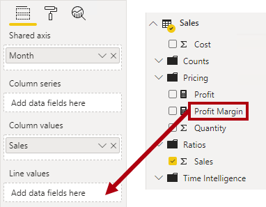](../media/lab-19-ssm.png#lightbox)

1. Notice that the visual has 11 months only.

	The last month of the year, 2020 June, does not have any sales (yet). By default, the visual has eliminated months with BLANK sales. You will now configure the visual to show all months.

1. In the visual fields pane, in the **Shared Axis** well, for the **Month** field, click the down-arrow, and then select **Show Items With No Data**.

	> [!div class="mx-imgBorder"]
	> [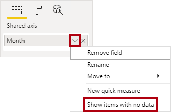](../media/lab-20-ssm.png#lightbox)

1. Notice that the month **2020 June** now appears.

1. De-select the chart by clicking an empty area of the report page.

1. To add a chart to the page, in the **Visualizations** pane, click the **Map** visual type.

	> [!div class="mx-imgBorder"]
	> [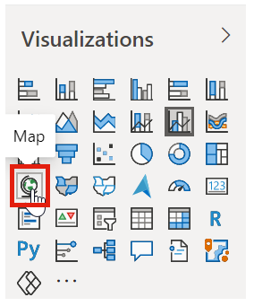](../media/lab-21-ssm.png#lightbox)

1. Resize and reposition the visual so it sits beneath the column/line chart, and so it fills half the width of the report page.

	> [!div class="mx-imgBorder"]
	> 

1. Add the following fields to the visual wells:

	-   Location: **Region | Country**
	
	-   Legend: **Product | Category**
	
	-   Size: **Sales | Sales**

1. De-select the chart by clicking an empty area of the report page.

1. To add a chart to the page, in the **Visualizations** pane, click the **Stacked Bar Chart** visual type.

	> [!div class="mx-imgBorder"]
	> [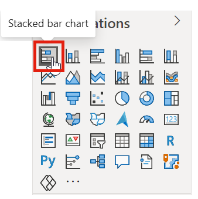](../media/lab-23-ssm.png#lightbox)

1. Resize and reposition the visual so it fills the remaining report page space.

	> [!div class="mx-imgBorder"]
	> [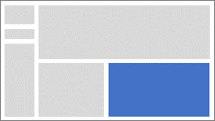](../media/lab-24-ss.png#lightbox)

1. Add the following fields to the visual wells:

	-   Axis: **Product | Category**
	
	-   Value: **Sales | Quantity**

1. To format the visual, open the **Format** pane.

1. Expand the **Data Colors** group, and then set the **Default Color** property to a suitable color (in contrast to the column/line chart).

1. Set the **Data Labels** property to **On**.

1. Save the Power BI Desktop file.

The design of the first page is now complete.

### Design page 2

In this task, you will design the second report page. When you've completed the design, the page will look like the following:

> [!div class="mx-imgBorder"]
> [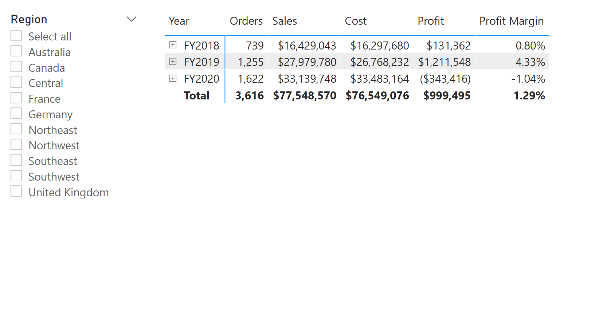](../media/lab-25-ss.png#lightbox)

1. To create a new page, at the bottom-left, click the plus icon.

1. Rename the page to **Profit**.

1. Add a slicer based on the **Region | Region** field.

1. Use the **Format** pane to enable the "Select All" option (in the **Selection Controls** group).

1. Resize and reposition the slicer so it sits at the left side of the report page, and so it is about half the page height.

	> [!div class="mx-imgBorder"]
	> 

1. Add a matrix visual, and resize and reposition it so it fills the remaining space of the report page

	> [!div class="mx-imgBorder"]
	> 

1. Add the **Date | Fiscal** hierarchy to the matrix **Rows** well.

	> [!div class="mx-imgBorder"]
	> 

1. Add the following five **Sales** table fields to the **Values** well:

	-   Orders (from the **Counts** folder)
	
	-   Sales
	
	-   Cost
	
	-   Profit
	
	-   Profit Margin

	> [!div class="mx-imgBorder"]
	> [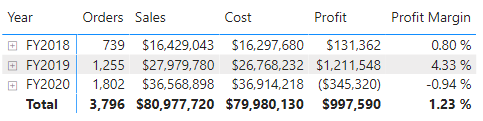](../media/lab-29-ss.png#lightbox)

1. In the **Filters** pane (located at the left of the **Visualizations** pane), notice the **Filter On This Page** well (you may need to scroll down).

1. From the **Fields** pane, drag the **Product | Category** field into the **Filter On This Page** well.

1. Inside the filter card, at the top-right, click the arrow to collapse the card.

	Fields added to the **Filters** pane can achieve the same result as a slicer. One difference is they don't take up space on the report page. Another difference is that they can be configured for more advanced filtering requirements.

1. Add each of the following **Product** table fields to the **Filter On This Page** well, collapsing each, directly beneath the **Category** card:

	-   Subcategory
	
	-   Product
	
	-   Color

	> [!div class="mx-imgBorder"]
	> 

1. To collapse the **Filters** pane, at the top-right of the pane, click the arrow.

1. Save the Power BI Desktop file.

The design of the second page is now complete.

### Design page 3

In this task, you will design the third and final report page. When you've completed the design, the page will look like the following:

> [!div class="mx-imgBorder"]
> [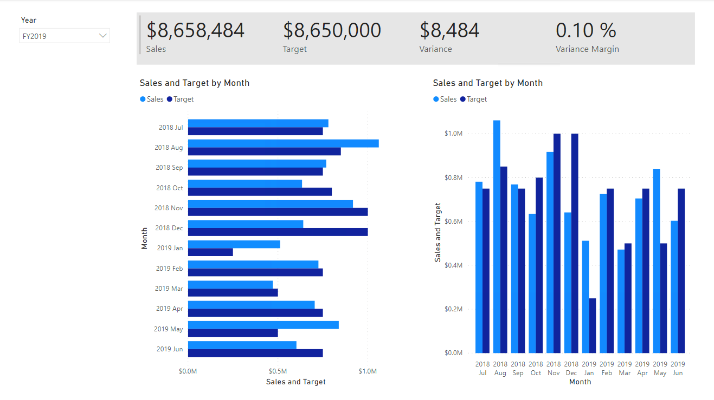](../media/lab-32-ss.png#lightbox)

1. Create a new page, and then rename it as **My Performance**.

1. Add a dropdown slicer based on the **Date | Year** field, and then resize and reposition it so it sits at the top-left corner of the page.

	> [!div class="mx-imgBorder"]
	> 

1. In the slicer, select **FY2019**.

1. Add a **Multi-row Card** visual, and then resize and reposition it so it sits to the right of the slicer and fills the remaining width of the page.

	> [!div class="mx-imgBorder"]
	> [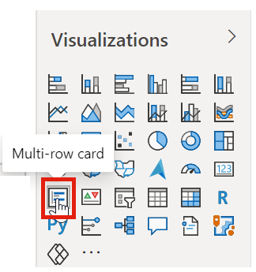](../media/lab-35-ssm.png#lightbox)

	> [!div class="mx-imgBorder"]
	> [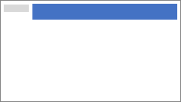](../media/lab-36-ss.png#lightbox)

1. Add the following four fields to the visual:

	-   Sales | Sales
	
	-   Targets | Target
	
	-   Targets | Variance
	
	-   Targets | Variance Margin

1. Format the visual:

	-   In the **Data Labels** group, increase the **Text Size** property to **28pt**
	
	-   In the **Background** group, set the **Color** to a light gray color

	> [!div class="mx-imgBorder"]
	> 

1. Add a **Clustered Bar Chart** visual, and then resize and reposition it so it sits beneath the multi-row card visual and fills the remaining height of the page, and half the width of the multi-row card visual.

	> [!div class="mx-imgBorder"]
	> [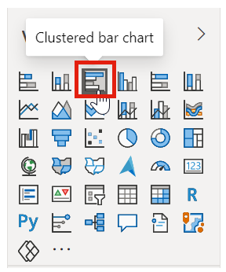](../media/lab-38-ssm.png#lightbox)

	> [!div class="mx-imgBorder"]
	> [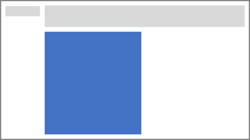](../media/lab-39-ss.png#lightbox)

1. Add the following fields to the visual wells:
	
	-   Axis: **Date | Month**
	
	-   Value: **Sales | Sales** and **Targets | Target**

	> [!div class="mx-imgBorder"]
	> [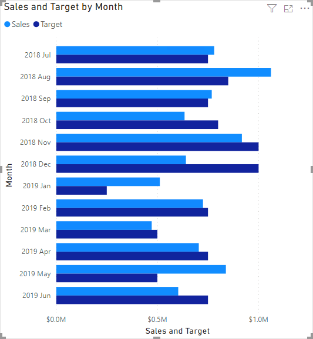](../media/lab-40-ss.png#lightbox)

1. To create a copy of the visual, press **Ctrl+C**, and then press **Ctrl+V**.

1. Position the copied visual to the right of the original visual.

	> [!div class="mx-imgBorder"]
	> 

1. To modify the visualization type, in the **Visualizations** pane, select **Clustered Column Chart**.

	> [!div class="mx-imgBorder"]
	> [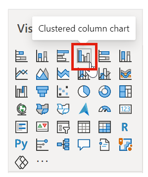](../media/lab-42-ssm.png#lightbox)

It's now possible to see the same data expressed by two different visualization types. This isn't a good use of the page layout, but you will improve it subsequent labs.

### Publish the report

In this task, you will publish the report.

1. Select the **Overview** page.

1. Save the Power BI Desktop file.

1. On the **Home** ribbon tab, from inside the **Share** group, click **Publish**.

	> [!div class="mx-imgBorder"]
	> [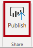](../media/lab-43-ssm.png#lightbox)

1. Publish the report to your **Sales Analysis** workspace.

1. Leave Power BI Desktop open.

In the next exercise, you will explore the report in the Power BI service.

## Explore the report

In this exercise, you will explore the **Sales Report** in the Power BI service.

> [!IMPORTANT]
> This exercise will require you to login to Power BI service,  you can use your existing account or create a trial account before starting this lab.

### Explore the sales report

In this task, you will explore the **Sales Report** in the Power BI service.

1. In the Edge, in the Power BI service, in the **Navigation** pane, review the contents of your workspace, and then click the **Sales Report** report.

	> [!div class="mx-imgBorder"]
	> [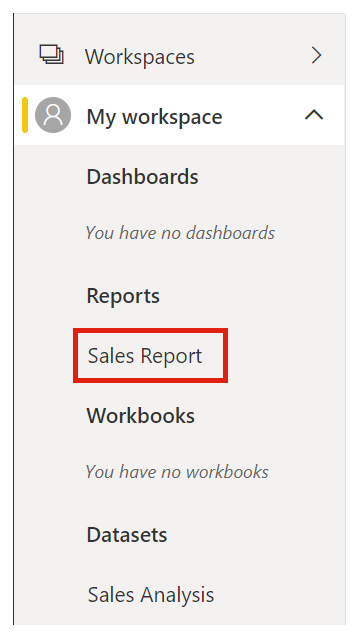](../media/lab-44-ssm.png#lightbox)

	The report publication has added a report to your workspace. If you don't see it, press **F5** to reload the browser, and then expand the workspace again.

1. In the **Regions** slicer, while pressing the **Ctrl** key, select multiple regions.

1. In the column/line chart, select any month column to cross filter the page.

1. While pressing the **Ctrl** key, select an additional month.

	By default, cross filtering filters the other visuals on the page.

1. Notice that the bar chart is filtered and highlighted, with the bold portion of the bars representing the filtered months.

1. Hover the cursor over the visual, and then at the top-right, click the filter icon.

	> [!div class="mx-imgBorder"]
	> 

	The filter icon allows you to understand all filters that are applied to the visual, including slicers and cross filters from other visual.

1. Hover the cursor over a bar, and then notice the tooltip information.

1. To undo the cross filter, in the column/line chart, click an empty area of the visual.

1. Hover the cursor over the map visual, and then at the top-right, click the **In Focus** icon.

	> [!div class="mx-imgBorder"]
	> 

	In focus mode zooms the visual to full page size.

1. Hover the cursor over different segments of the pie charts to reveal tooltips.

1. To return to the report page, at the top-left, click **Back to Report**.

	> [!div class="mx-imgBorder"]
	> [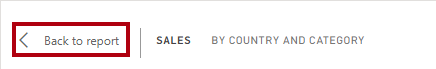](../media/lab-47-ssm.png#lightbox)

1. Hover the cursor over the map visual again, and then click the ellipsis (...), and notice the menu options.

	> [!div class="mx-imgBorder"]
	> 

1. Try out each of the options.

1. At the left, in the **Pages** pane, select the **Profit** page.

	> [!div class="mx-imgBorder"]
	> 

1. Notice that the **Region** slicer has a different selection to the **Region** slicer on the Overview page.

	The slicers are not synchronized. In the next lab, you will modify the report design to ensure they sync between pages.

1. In the **Filters** pane (located at the right), expand a filter card, and apply some filters.

	The **Filters** pane allows you to define more filters than could possibly fit on a page as slicers.

1. In the matrix visual, use the plus (+) button to expand into the **Fiscal** hierarchy.

1. Select the **My Performance** page.

1. At the top-right on the menu bar, click **View**, and then select **Full Screen**.

1. Interact with the page by modifying the slicer, and cross filtering the page.

1. At the bottom-left, notice the commands to change page, navigate backwards or forwards between pages, or to exit full screen mode.

1. Exit full screen mode.

	> [!div class="mx-imgBorder"]
	> [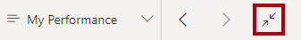](../media/lab-50-ssm.png#lightbox)

1. To return to the workspace, in the breadcrumb trail, click your workspace name.
