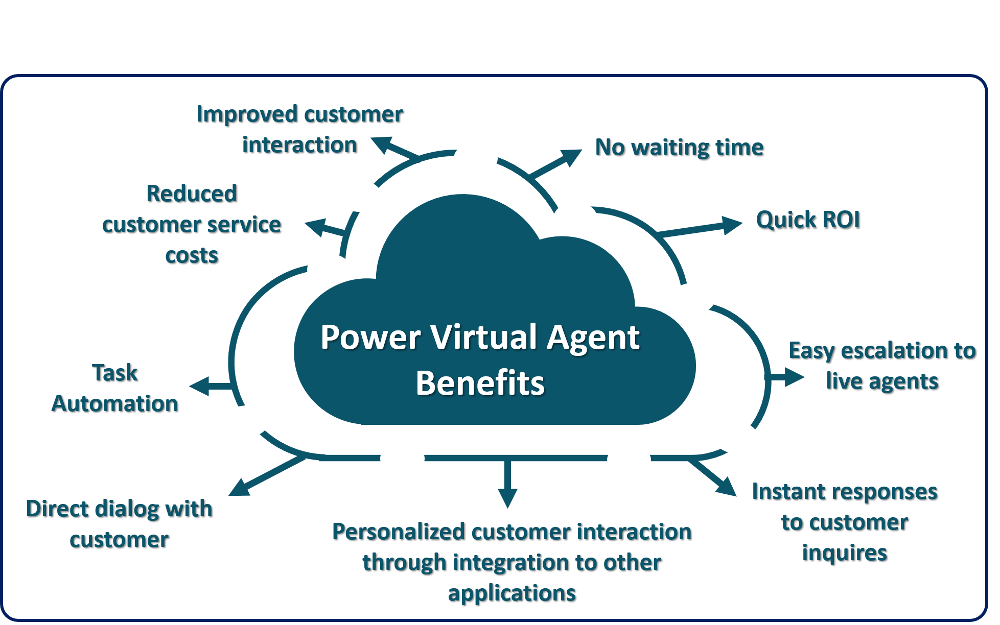

Organizations today are looking for more effective ways to deliver customer service solutions to their customers. Customers seek faster and more precise self-service support options and businesses seek to please and delight their customers with faster, better customer service. The intersection of these two needs can be met with Power Virtual Agents. Power Virtual Agents provides businesses with a way to build a library of the most easily answered questions and a user experience for customers to retrieve that information with fast and easy queries with a bot. Power Virtual Agents is easy for non-technical users to author and expand quickly and desirable to customers who are used to simply searching the internet for answers to their questions.

Bots are a form of artificial intelligence that simulates a human conversation through a chat interface. Bots listen for keywords and phrases that relate to the library of known, common customer issues (topics) stored in the bot and return answers quickly and iteratively as the customer continues the query. The bot continues to check if the customer's question has been answered and refines its selection of topics to solve the customer's problem.

Adopting bots into your organization's service structure provides many benefits including:

-   **Reducing assisted support inquiries:** Customers do not always need to connect with human agents to get answers. Simple or common issues can be easily resolved by displaying bot topics, knowledge base articles or [FAQ pages](https://blog.hubspot.com/service/faq-page?_ga=2.166730110.1354676710.1559054333-933118289.1529345498/?azure-portal=true).

-   **Seamless integrations with other systems:** Integrations with customer relationship management systems let organizations include relevant and personal information in conversations as needed. It also allows a conversation to be transferred including details about it to a human agent when needed.

-   **Task automation**: Follow-up functions and actions such as scheduling meetings, assigning cases, sending follow-up emails, surveys, and more can be easily initiated from the bot. With Power Automate, custom workflows and automated actions can be configured that the bot can execute with the customer's permission to automate resolution of the customer's issue.

## Overview of Authoring Power Virtual Agents

Power Virtual Agents (PVA) empowers your teams to easily create bots through a guided, no-code graphical interface. This allows you to leverage the benefits of bots, without having to rely on data scientists or developers. It helps to address many of the challenges in building bots that exist today. You can eliminate the gap between the subject matter experts and development teams building the bots, as well as latency between teams recognizing an issue and updating the bot to address it. Power Virtual Agents also removes the complexity of exposing teams to the nuances of conversational AI and the need to write complex code.

Through leveraging Power Virtual Agents, your organization can:

-   **Better empower your teams:** Allows them to build bots themselves without needing intermediaries, coding, or AI expertise.

-   **Reduce costs:** Automate common inquiries, which will free agents up to focus on more complex issues.

-   **Improve customer satisfaction:** Customers have access to a 24/7 self-help solution to help resolve their issues through rich personalized bot conversations.

> [!div class="mx-imgBorder"]
> 

One of the key advantages of Power Virtual Agents its ease of deployment. With just a few clicks, you can sign up, create a bot, and embed it into your organization's website. Microsoft's conversational artificial intelligence capabilities allow customers to have rich multi-turn conversations where they are guided to the right solution. Simply provide a few examples of the topic you want the bot to handle, build the conversation and your bot is ready to handle customer requests. For example, let's say your organization has analyzed its incoming support topics, and has identified that a large portion of customer issues relates to store hours and shipping issues. A Power Virtual Agent bot could be built around those topics and the customer can gain answers quickly from the bot without initiating a request to a human agent. Since Power Virtual Agents works hand-in-hand with applications like [Dynamics 365 Customer Service Insights](https://dynamics.microsoft.com/ai/customer-service-insights/?azure-portal=true), you can use Customer Service Insights to determine which support topics are trending and can be automated with Power Virtual Agents and you update your Virtual Agents with those topics.

Not only can a PVA bot converse with your customers, but it can also be designed to act on their behalf. Power Virtual Agent bots can be easily integrated with services and back-end systems out-of-the-box or through hundreds of easy-to-add custom connectors using Power Automate. For example, if a customer requires something the bot is not equipped to do, it can escalate the conversation and pass it and its details to a live agent. This ensures the live agent has the necessary details and context to avoid needing to recapture information from the customer. And for example with IoT, Power Virtual Agents and Power Automate can be orchestrated to execute IoT commands to the customer's device with the customer's permission to the virtual agent.
